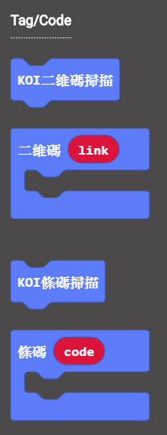
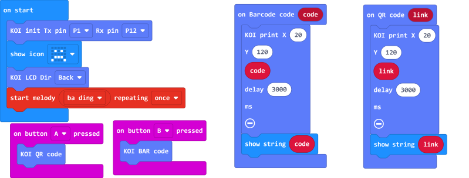
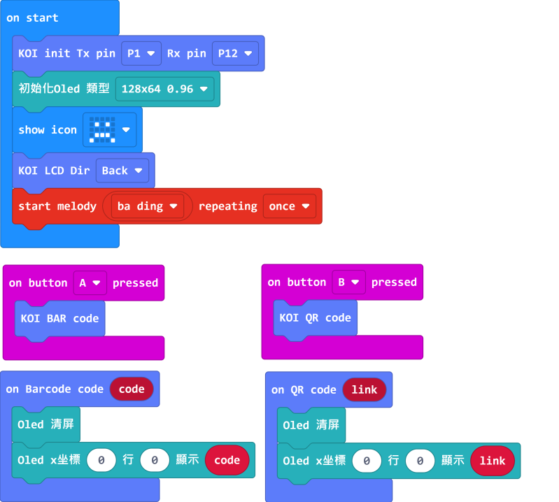

# **Scanning Barcodes and QR Codes**

·    Barcode is wide adopted in our daily lives, they are found on various products.

·    QR Codes are used for data exchange or cashless shopping.

## Scanning Barcodes and QR Codes

### Load KOI Extension: https://github.com/KittenBot/pxt-koi

### [Loading Extensions](../../../Makecode/powerBrickMC)

Blocks for reading codes:

 

### Sample Program

  

## Program Flow

Download the program to the Micro:bit.

1. Point the KOI at a Barcode and press A on the Microbit, the content of the Barcode will be shown on KOI's screen.
2. Point the KOI at a QRCode and press B on the Microbit, the content of the QRCode will be shown on KOI's screen.

## Advanced Program

There may not be enough time to read the contents if we show it on KOI, to improve readability, we can connect an OLED screen.

### Connecting an OLED

Connect an OLED panel to the I2C port of your Robotbit/Armourbit.

 

### Sample Program

### Load the extension for OLED: https://github.com/KittenBot/pxt-oled

 

## Sample Code

[1. Scanning Barcodes and QR Codes (Extension0.5.7)](https://makecode.microbit.org/_bUKY6cULX7E8)

[2. Scanning Barcodes and QR Codes /w OLED (Extension0.5.7)](https://makecode.microbit.org/_9VxF5J8Tu3kD)

[Bar Code & QR Code Sample](https://bit.ly/KOIBarAndQRCodeSample)

## Extension Version and Updates

There may be updates to extensions periodically, please refer to the following link to update/downgrade your extension.

[Makecode Extension Update](../../../Makecode/makecode_extensionUpdate)

## FAQ

### 1: There is no reaction after pressing the buttons on the Micro:bit.

·    A: This is because KOI has a longer boot time than Micro:bit. When the power is turned on, Micro:bit has already ran the code for KOI initialization before KOI is ready.

·    Solution: Reset your Micro:bit after KOI has been turned on. (The trick is to let KOI power on completely before initialization.)

### 2: Does KOI work with 3V input?

·    A: No, KOI only works with 5V.

### 3: KOI fails to recognize my Barcodes/QR Codes.

·    A: Make sure the width of the code is at least 3.5cm and the code is entirely within the camera's view.