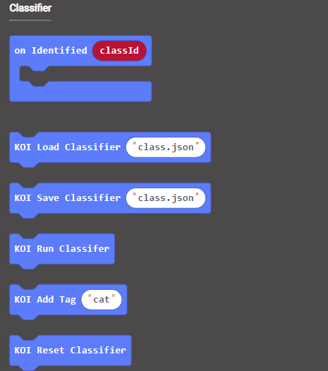
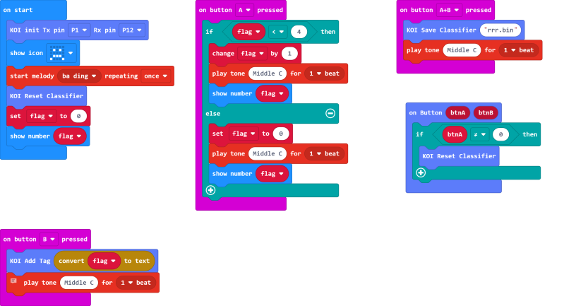

# **Classifier Model Training**

Machine Learning may seem like a farfetched concept. AI Camera is already capable of Machine Learning features in the form of object classification. KOI can be trained to recognize objects.

In this section, we will learn how to use the Machine Learning feature to easily train a object classification model.

### Install an SD Card

The trained model will be stored on an SD card, without an SD card we won't be able to save this model.

## Training a Model

### Load KOI extension: https://github.com/KittenBot/pxt-koi

### [Loading Extensions](../../../Makecode/powerBrickMC)

Blocks for machine learning:

### Sample Program

    The model can be saved in a .bin or .json file.
    e.g. aaa.json or aaa.bin

## Program Flow

1: Download the program to the Micro:bit.

2: Put the first object in front of the camera and press B, slightly change angle and repeat about 3 times.

3: Press A to start training the next object.

4: Repeat the process until all objects have been analyzed.
    
    The sample program has set the maximum number of object to 4, this can be changed to your liking.
    A maximum of 40 images and 40 objects is supported by KOI.

5: Press A and B simultaneously to save the model.

    The file name cannot include spaces, and it must be a bin or json file.

### Demo video

## Sample Code

[Classifier Training (Extension0.5.7)](https://makecode.microbit.org/_fu6daWaf1EcA)

## Extension Version and Updates

There may be updates to extensions periodically, please refer to the following link to update/downgrade your extension.

[Makecode Extension Update](../../../Makecode/makecode_extensionUpdate)

## FAQ

### 1: There is no reaction after pressing the buttons on the Micro:bit.

·    A: This is because KOI has a longer boot time than Micro:bit. When the power is turned on, Micro:bit has already ran the code for KOI initialization before KOI is ready.

·    Solution: Reset your Micro:bit after KOI has been turned on. (The trick is to let KOI power on completely before initialization.)

### 2: Does KOI work with 3V input?

·    A: No, KOI only works with 5V.

### 3: KOI gives a warning message when I try to train a classifier.

·    A: The classifier hasn't been reset.

·    Solution: Run the block for classifier reset, KOI will display a success message.