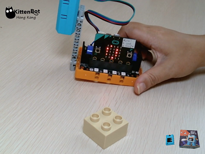

# **Classifier Model Predicting**

In the previous section, we have trained a classifier model. In this section, we will use this model to classify objects.

### Install an SD Card

The trained model will be stored on an SD card, without an SD card we won't be able to save this model.

## Running a Model

### Loading KOI extension: https://github.com/KittenBot/pxt-koi

### [Loading Extensions](../../../Makecode/powerBrickMC)

Blocks for machine learning:

### Sample Program:

    The model can be saved in a .bin or .json file.
    e.g. aaa.json or aaa.bin

## Program Flow

1: Download the program to the Micro:bit.

2: Press button A to load the classifier model.

3: Put the object in front of the camera. Press button B to run the classifier.

4: The tag of the object will be displayed on the Micro:bit.

### Demo video:

## Sample Code:

[Classifier Running (Extension0.5.7)](https://makecode.microbit.org/_a4uJT9TgVPba)

## Extension Version and Updates

There may be updates to extensions periodically, please refer to the following link to update/downgrade your extension.

[Makecode Extension Update](../../../Makecode/makecode_extensionUpdate)

## FAQ

### 1: There is no reaction after pressing the buttons on the Micro:bit.

·    A: This is because KOI has a longer boot time than Micro:bit. When the power is turned on, Micro:bit has already ran the code for KOI initialization before KOI is ready.

·    Solution: Reset your Micro:bit after KOI has been turned on. (The trick is to let KOI power on completely before initialization.)

### 2: Does KOI work with 3V input?

·    A: No, KOI only works with 5V.

### 3: KOI gives a warning message when I try to train a classifier.

·    A: The classifier hasn't been reset.

·    Solution: Run the block for classifier reset, KOI will display a success message.