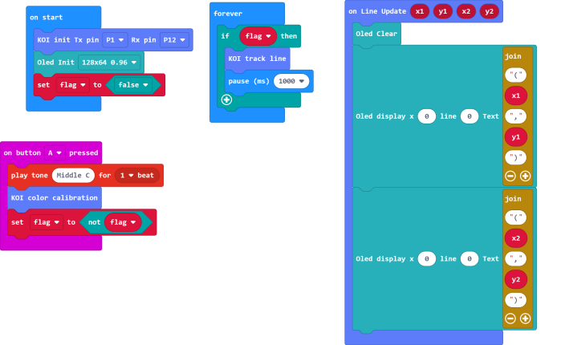
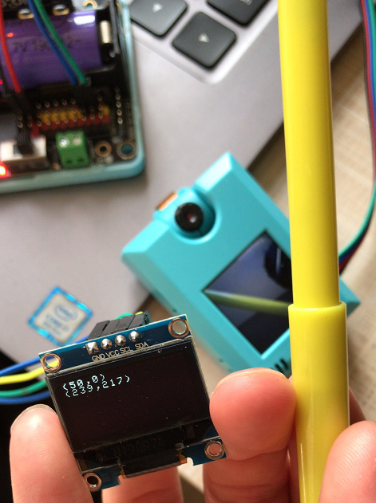

# **Line Tracing**

Line Tracing is usually used in line tracing robots, we will learn how to obtain the coordinates of the line (x1,y1) & (x2,y2 )in this tutorial.

## Getting coordinates

### Load KOI Extension: https://github.com/KittenBot/pxt-koi

### [Loading Extensions](../../../Makecode/powerBrickMC)

Blocks for Line Tracing:

### Sample Program

## Color Calibration

Line Tracing and Blob Tracing both require calibration before using.

During calibration, a small green square will appear on the screen. Aim the square at the color you intend to track. The calibration will be done automatically.

It is recommended to have a distinct difference between the color you intend to track and the background.

## Program Flow

Download the program to the Micro:bit.

Put a thin object in front of the camera and press A to calibrate color.

After calibration, the coordinates of the line will be shown on the screen.

## Advanced Program

The information becomes more easily readable if we add an OLED screen.

### Connecting an OLED

Connect an OLED panel to the I2C port of your Robotbit/Armourbit.

 

### Sample Program

The program works the same way as the normal program, but now the coordinates are displayed on the oled.

## Sample Codes

[1. Line Tracing (Extension0.5.7)](https://makecode.microbit.org/_DriAw4Hi5YDe)

[2. Line Tracing /w OLED (Extension0.5.7)](https://makecode.microbit.org/_KJXToKVxW8do)

## Extension Version and Updates

There may be updates to extensions periodically, please refer to the following link to update/downgrade your extension.

[Makecode Extension Update](../../../Makecode/makecode_extensionUpdate)

## FAQ

### 1: There is no reaction after pressing the buttons on the Micro:bit.

·    A: This is because KOI has a longer boot time than Micro:bit. When the power is turned on, Micro:bit has already ran the code for KOI initialization before KOI is ready.

·    Solution: Reset your Micro:bit after KOI has been turned on. (The trick is to let KOI power on completely before initialization.)

### 2: Does KOI work with 3V input?

·    A: No, KOI only works with 5V.

### 3: How to improve line tracing accuracy?

·    A: Keep a clean background and use a color that is significantly different from the background.