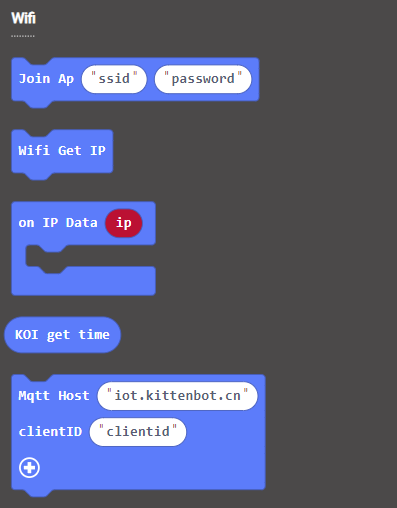

# **Internet Time (KOI v1.12.0)**

After connecting to the Wifi, KOI is able to tell the current time to function as a clock.

## Getting internet time

### Load KOI Extension: https://github.com/KittenBot/pxt-koi

### [Loading Extensions](../../../Makecode/powerBrickMC)

Blocks for IoT:

### Sample Program

    Internet time returns an array-like object that has the format of: [year, month, day, hour, minute, second]
    In the sample program, the current hour and the minute is obtained by index 3 and 4.
    
## Program Flow

1: Download the program to the Micro:bit.

2: Press A to show the current time. (Timezone: GMT+8)

## Sample Code

[1. Obtain Internet Time(Firmware1.12.0_Extension0.6.4)](https://makecode.microbit.org/_00TEM37w41MM)

## Extension Version and Updates

There may be updates to extensions periodically, please refer to the following link to update/downgrade your extension.

[Makecode Extension Update](../../../Makecode/makecode_extensionUpdate)

## FAQ

### 1: There is no reaction after pressing the buttons on the Micro:bit.

·    A: This is because KOI has a longer boot time than Micro:bit. When the power is turned on, Micro:bit has already ran the code for KOI initialization before KOI is ready.

·    Solution: Reset your Micro:bit after KOI has been turned on. (The trick is to let KOI power on completely before initialization.)

### 2: Does KOI work with 3V input?

·    A: No, KOI only works with 5V.
