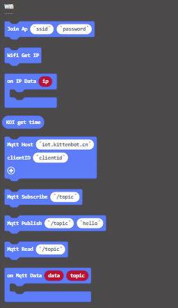

# **Internet of Things (KOI v1.9.5)**

The Wifi capabilities of KOI allows it to access IoT platforms.

## Connecting to IoT Platforms

### Load KOI Extension: https://github.com/KittenBot/pxt-koi

### [Loading Extensions](../../../Makecode/powerBrickMC)

Blocks for IoT:

### Sample Code

### This tutorial just serves as a general example for communicating with MQTT servers, different MQTT servers may require different credentials.

### ThingSpeak

Refer to this page for ThingSpeak tutorials: [ThingSpeak Tutorial](../../../Wifibrick/MakeCode/MC_TS)

### MakerCloud

[MakerCloud](../../../Wifibrick/IoTPlatform/makercloud)

For MakerCloud Users, please refer to: [MakerCloud Tutorial](../../../Wifibrick/MakeCode/makercloud)

## Program Flow

1: Download the program to the Micro:bit.

2: Press A and B at the same time and wait for KOI to connect to the Wifi network.

    KOI can store the Wifi and MQTT credentials, there is no need to run these blocks everytime we use these functions.

3: Press A to upload a random number to the MQTT.

4: Press B to read the data from the MQTT.

5: KOI will display the number on its screen.

## Sample Code

[1. IoT(Firmware1.12.0_Extension0.5.7)](https://makecode.microbit.org/_4UPgr7az71g1)

## Extension Version and Updates

There may be updates to extensions periodically, please refer to the following link to update/downgrade your extension.

[Makecode Extension Update](../../../Makecode/makecode_extensionUpdate)

## FAQ

### 1: There is no reaction after pressing the buttons on the Micro:bit.

·    A: This is because KOI has a longer boot time than Micro:bit. When the power is turned on, Micro:bit has already ran the code for KOI initialization before KOI is ready.

·    Solution: Reset your Micro:bit after KOI has been turned on. (The trick is to let KOI power on completely before initialization.)

### 2: Does KOI work with 3V input?

·    A: No, KOI only works with 5V.
