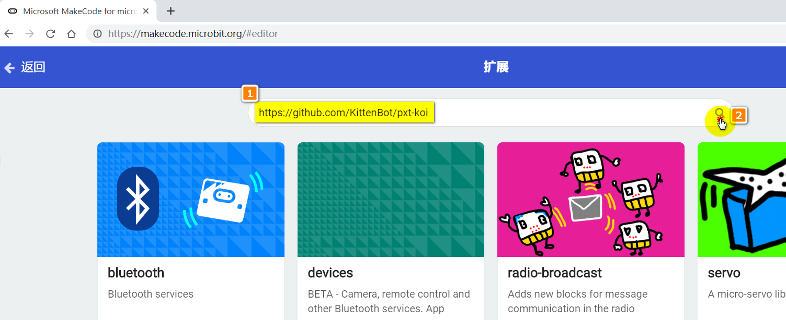
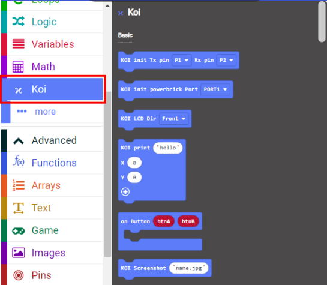
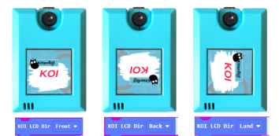
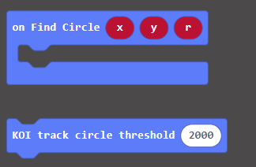
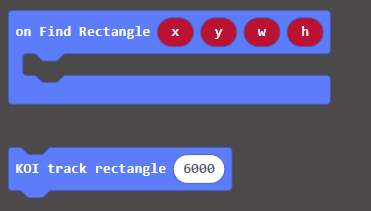
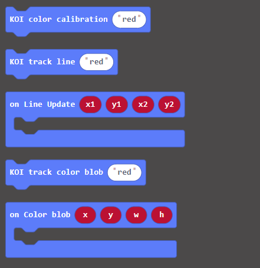
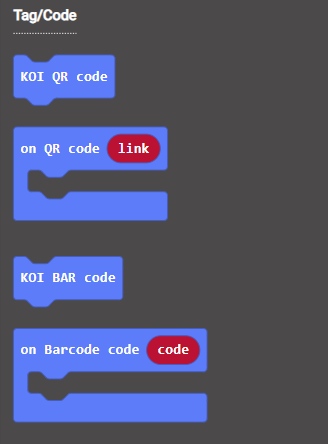
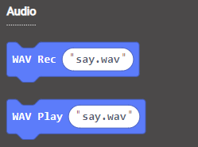
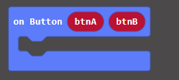

# **MakeCode Quickstart Guide**

## **Connecting to Micro:bit**

### **1. Connecting to Armourbit**

It is easier to connect to an Armourbit because they both use PH2.0 connectors.

When using KOI with an Armourbit, KOI needs an extra 5V power source.

Using the USB port on the battery box, 5V power can be supplied to KOI. (See figure below)

  

### **2. Connecting to Robotbit**

As Robotbit can supply 5V power, there is no need to power KOI with an USB cable.

Please pay attention in connecting the power wires to the Robotbit. 

##### xxx **DO NOT connect it in the wrong way.** xxx

Or KOI may not function correctly, it may even suffer damage.

Using the cable included with KOI, connect KOI to Robotbit using Dupont wires.

The Dupont wires are arranged as: Black, Red, Blue, Green

These wires correspond to: GND, 5V, P1(TX), P12(RX)

    The (Blue)TX wire must be connected to an analog pin(Pin0-Pin2).
    Remember to remove the buzzer jumper when Pin0 is used.

 

#### Do not connect Red to Ground and Black to 5V!!!

Ensure the connection is correct and switch the power on.

 

 

## **MakeCode Coding Tutorial**

[https://makecode.microbit.org](https://makecode.microbit.org/)

  

### **Loading Extensions**

  

Copy and paste the following link to the search bar.

#### **https://github.com/KittenBot/pxt-koi**

New block labelled KOI will be added.​                                                             

  

## **Blocks Explained**

This section briefly explains the functions of blocks.

Please refer to tutorials for detailed tutorial and sample codes.

### **KOI Initialization**

  

**1st Block** —— is used for Robotbit.

**2nd Block** —— is used for Armourbit.

### **Classifier**

It is easier  to understand Classifier blocks if you are already familiar with ML5 extension on Kittenblock.

Classifier is used to train and run a customized model for object/scene classification.

  

### **Screenshots and Display**

Micro SD card is required for this function to work.

The Screenshot block creates a png file and saves it onto the SD card. *The name must not contain spaces.*

The Display block finds the file on the SD Card then displays it on the screen for 1 second. *The name must not contain spaces.*

 

### **Show Text**

The print block shows a string at the specific coordinates. It shows the text for 1 second by default, this duration can be changed via delay.

  

### **Display Orientation**

Since KOI cannot detect the direction of the camera, the display orientation has to be set manually so that the image corresponds to camera direction.

There are 3 modes, Front, Back and Land. (Refer to figure below.)

 

### **Circle Tracking**

A threshold can be adjusted, a higher value can filter out more noise and interferences, but tracking difficulty increases as well.

Tracking circle returns 3 values, the coordinates of the circle as well as the radius.

 

### **Rectangle Tracking**

Similar to Circle Tracking, the threshold can be adjusted.

Rectangle Tracking returns the coordinates of the rectangle and its width and height.

 

### **Line Tracing and Color Blob Tracing**

Calibration is required before tracing lines or color blobs.

Line Tracing returns the starting and ending coordinates of the line.

Color Blob Tracing returns the coordinates of the blob and its width and height.

 

### **Barcode/QRCode Recognition**

Scans and returns the contents of the Barcode/QRCode.

The Barcode/QRCode should not be smaller than 3.5cm in width or the resoulution is too small to be recognized.

 

### **Apriltag Recognition**

Apriltags are seldomly used in Hong Kong, this tag is usually used in robots.

Apriltags Recognition returns an id and its geometric attributes.

 

### **Face Detection**

1. Load the face model before detecting faces.

2. Runs the model once to detect faces.

3. Returns the coordinates of the face.

  

### **Recording and Playing wav files**

Micro SD card is required for this function to work.

This function records and plays a wav file from the SD card.

### **Using the built-in Buttons**

When the button is pressed, it returns 1, otherwise 0 is returned.

## **Extension Version and Updates**

There may be updates to extensions periodically, please refer to the following link to update/downgrade your extension.

[Makecode Extension Update](../../Makecode/makecode_extensionUpdate)