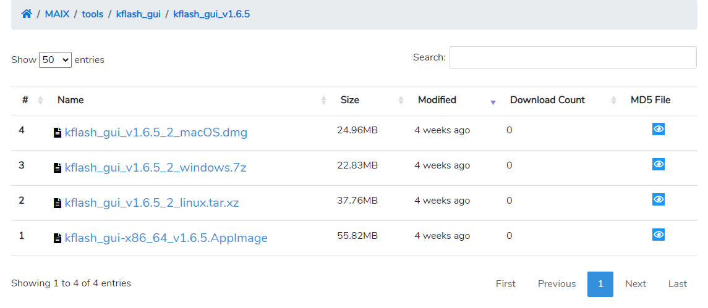
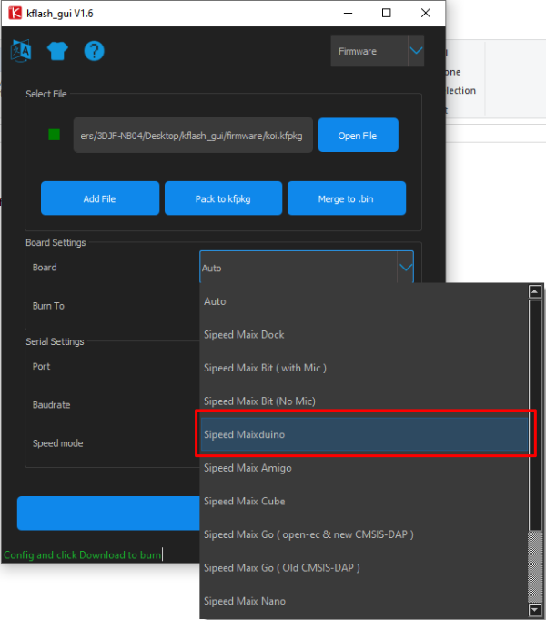
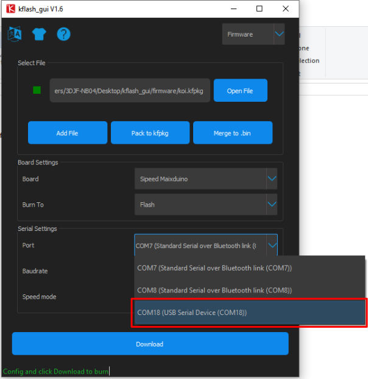

# **Updating KOI Firmware**

Kittenbot's development team releases new firmware for KOI periodically to improve KOI's functions.

Users can follow these instructions to update your KOI to the latest firmware.

## **Update Method**

Connect KOI to a computer using a USB cable.

You will need **firmware flashing tool** and a **firmware file** to update firmware. Download them using the provided link.

[Flashing tool](https://dl.sipeed.com/MAIX/tools/kflash_gui/kflash_gui_v1.6.5)

[Firmware Download](./updateHist.md)

**1. Download the version appropiate to your operating system.**

**2. Unzip the file.**

**3. Find and open kflash_gui.exe**

**4. Please allow the program to run if this message appeared.**

**5. Select the firmware file.**

**6. From Board, select Sipeed Maixduino。**

**7. Select the port that KOI is connected to.**

**8. Leave other settings as default and Download.**

**9. Wait for the update to complete.**

**10. Flashing done.**

**11. Reset KOI to check if update is successful.**

