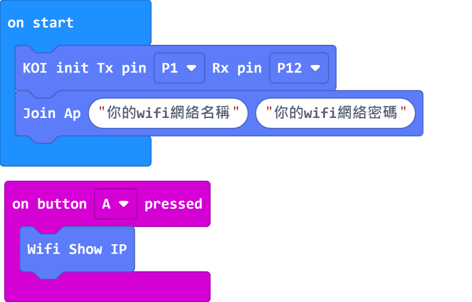
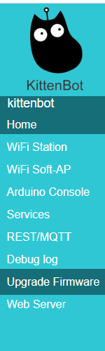
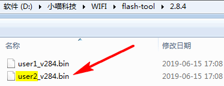

# KOI Wifi Firmware Update

Kittenbot may release Wifi firmware updates periodically to improve stability and performance.

Users can follow this guide to update their KOI Wifi firmware.

#### Load KOI Extension:

#### https://github.com/KittenBot/pxt-koi

### [Loading Extensions:](../makecodeQs.md)

## Checking firmware version:

Build the following program.

Extension Version: 0.6.4 or above

[Sample Link Download](https://makecode.microbit.org/_07dVj25FFJCy)

Extension Version: 0.5.7 or below

[Sample Code Download](https://makecode.microbit.org/_YAiLoH9XoPta)

Upload the program to Micro:bit and wait for KOI to connect to the internet.

Press A to show the IP address of KOI, write the address down.

    If you have administrator rights to your network, you can go to your router's homepage and see the IP address directly.

Use a web browser and type in the IP address, then press Enter.
    

    The firmware version is shown on the homepage.
    

## Updating KOI's Wifi Firmware

Download the latest firmware: [v2.95](https://bit.ly/KOIWifiFW295)

Enter KOI's homepage using the above method.

Select Upgrade Firmware from the menu.

Select the right file according to the instructions.

The instruction tells us to upload user2.bin, so that file is selected.

The update will be done automatically.

