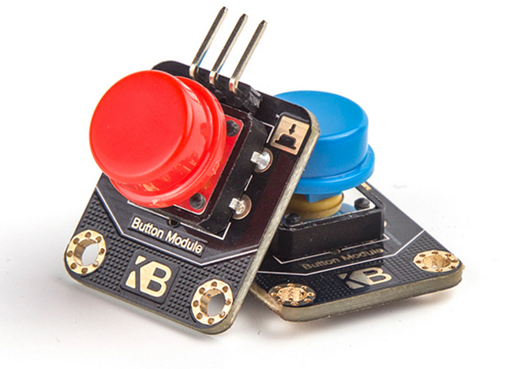
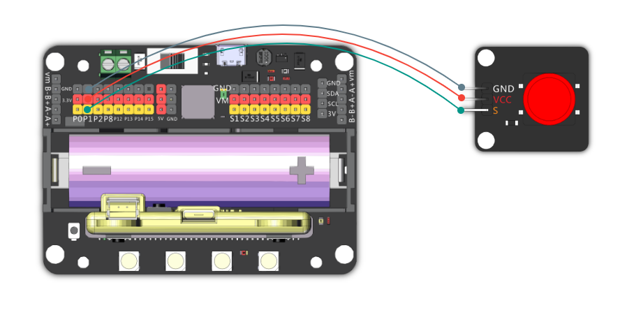
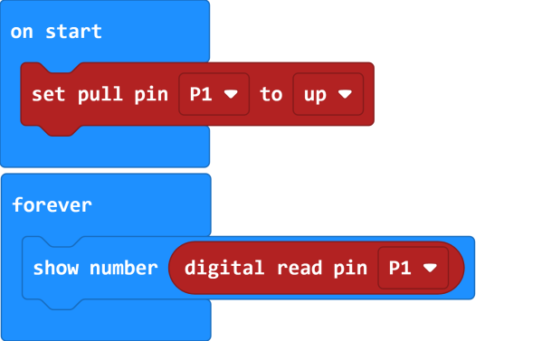
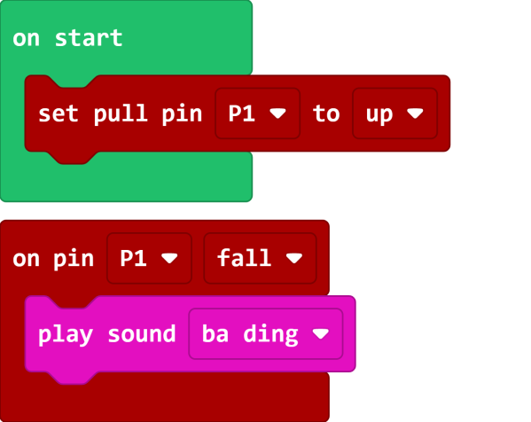
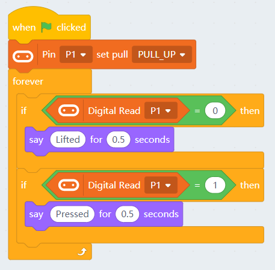

# Button Module

Button Module Red(HKBM8006A)

Button Module Blue(HKBM8006B)

This is a button, it is a digital moduele.

## Specifications

- Voltage: 3V~5V
- Interface: Dupont Cable
- Return Value: Returns 0 when pressed, 1 when unpressed

## Wiring Diagram

    This is a digital module, any pin in P1~P15 would work.

## MakeCode Coding Tutorial

### This module can be used with Microbit and Meowbit.

#### Reading the button value:

### Microbit:

[Sample Code](https://makecode.microbit.org/_RLdA6wC7i1Vd)

### Meowbit:

[Sample Code](https://makecode.com/_8uvcymfjfav0)

## KittenBlock Coding Tutorial

### Load Robotbit Extension

#### Reading the button value:

