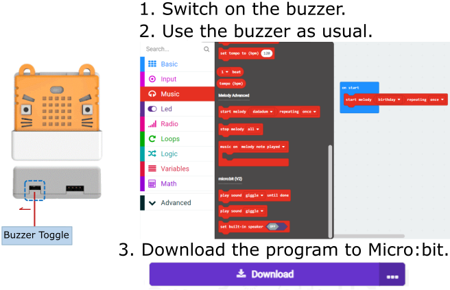

# Armourbit Expansion Box

Armourbit Expansion Box (HKBD9006A)

Similar to robotbit, Armourbit is an expansion module for Micro:bit, due to its boxy shape, it is called an expansion box.

Armourbit is the main control hub for the Powerbrick system, connecting the Micro:bit with various "bricks".

It has the following features:

1. 7 IO Ports and 1 I2C port
2. Uses 4Pin PH2.0 ports, ensures correct connection
3. Built-in buzzer and 2 motor ports
4. 8 servo ports
5. Complete encasing of the circuit board, improves safety and makes it more suiable for an education environment.

Developers at Kittenbot hopes to provide a way to expand the usability of Micro:bit while also improving safety, making teaching and learning easier for teachers and students.

## Details

## Specification

- Voltage:3.3V(No 5V output)
- Dimensions: 61mm X 61mm X 23mm
- Interface: PH2.0 4PIN Ports , follows the GVAB pinout
- DC Motor Driver: Voltage<5V, current<1A, compatible with Kittenbot's motors
- Servo Drivr： Voltage 3.7~6V, current<100mA for 1 servo, total current<1A, compatible with Kittenbot's servos

Microsoft MakeCode Programming Platform:

Makecode Online：https://makecode.microbit.org/

**Powerbrick Extension**：https://github.com/KittenBot/pxt-powerbrick

## Pin Distribution

- It is not necessary for new users to remember the corresponding pins for each port, it is sufficient to remember the 7 ports.
- Using **Port5-Port7** requires turning off the LED Matrix of the Micro:bit since these Ports are used by Micro:bit's LED Matrix(Refer to the following figure).
- Analog modules cannot use Port 4 (Moisture and Water Sensor can't be used)

## Precautions

- The Servo Interface is intended to use with 9g servos or Geekservo servos, high current servos should not be used.
- The DC motor Interface is intended to use with Kittenbot's TT motors or Geekservo motors, hight current motors should not be used.
- The built-in buzzer uses Pin 0 of the Micro:bit, please make sure the toggle switch is at the correct position when Pin 0(Port 1) is being used. (Buzzer is set to **ON** by default)
- The PowerBrick Battery Box must be connected when modules, servos or motors are being used or they may exhibit erratic behaviour.

## Installing Micro:bit onto Armourbit

1. Slot in the Micro:bit with the A and B buttons facing outwards.
2. Checking the buzzer toggle switch.

## Resetting the Micro:bit's program

1. Power on the Micro:bit.
2. Press the button on the back of the Armourbit to reset the Micro:bit.

## MakeCode Coding Tutorial

### Using the LED Matrix

Same with Micro:bit.

### Using the Buttons

Same with Micro:bit.

### **Using the Buzzer**

Same with Micro:bit.

## Extension Version and Updates

There may be updates to extensions periodically, please refer to the following link to update/downgrade your extension.

[Makecode Extension Update](../../../Makecode/makecode_extensionUpdate)