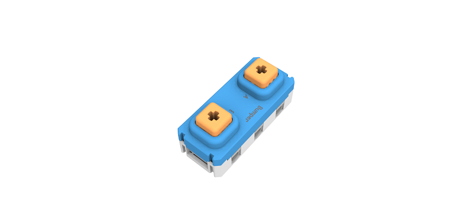
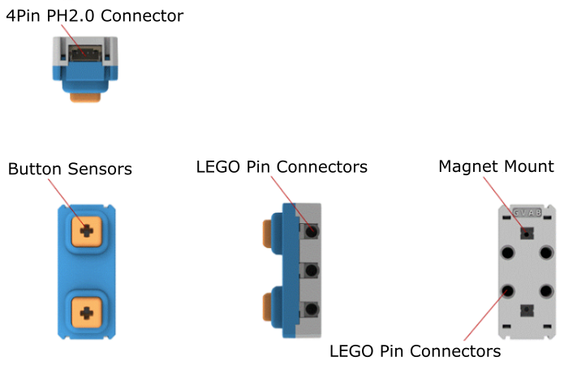
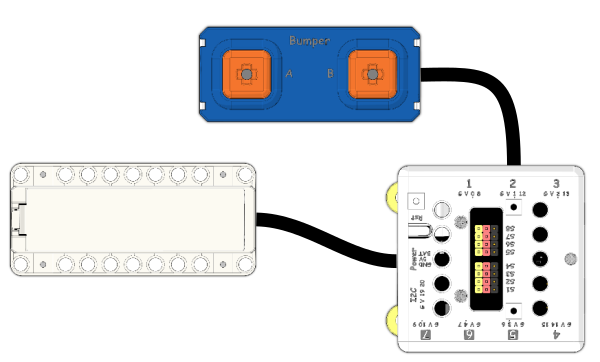
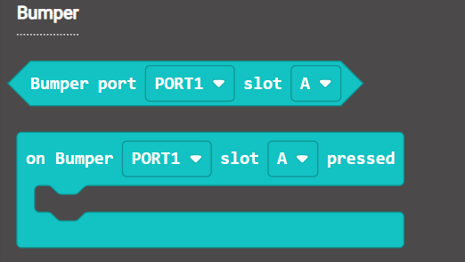
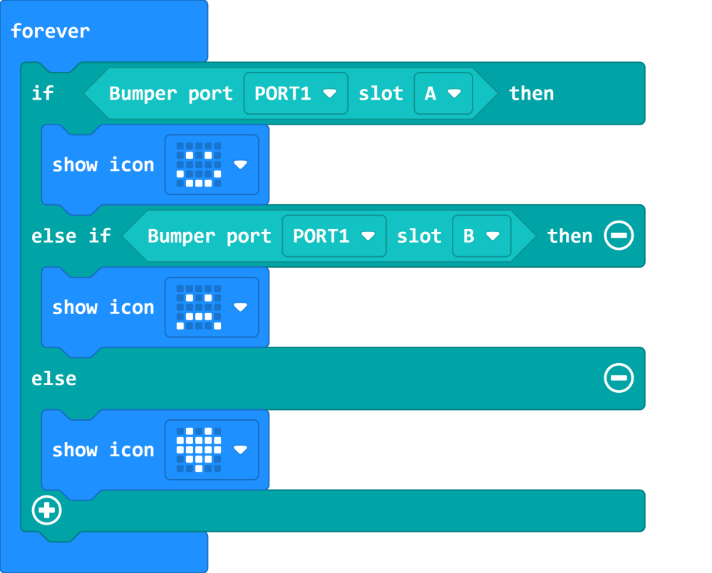
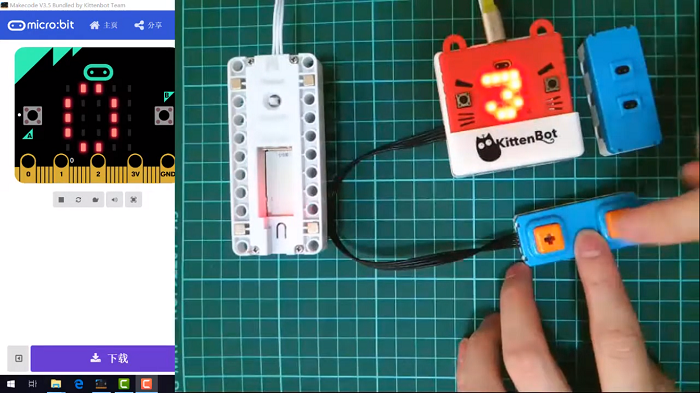
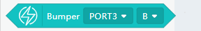
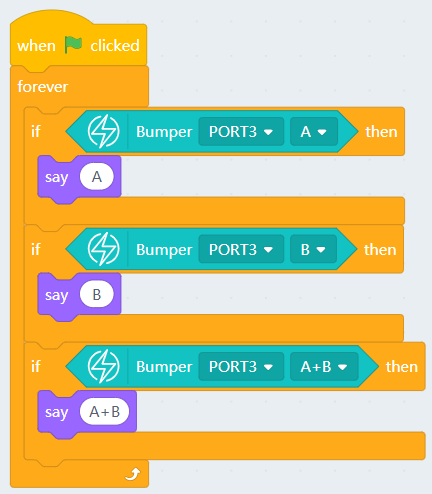

# AB Bumpers Module

AB Bumpers Modules (HKBM8012C)

This is a button module, it detects whether the buttons are pressed.

When the buttons are pressed, the corresponding LED on the back would light up. The buttons are compatible with LEGO Technic axis.

## Details

## Specifications

- Voltage; 3V-5V
- Dimensions: 56mm X 24mm X 25mm
- Connector: 4Pin PH2.0
- Type: Digital Module

## Connecting the module

Connect the module to the Armourbit using a 4Pin Cable.

## MakeCode Coding Tutorial

### Powerbrick Extension: https://github.com/KittenBot/pxt-powerbrick

### [Loading Extensions](../../Makecode/powerBrickMC)

### AB Button Module Blocks

### Buttons Detection

[Sample Code Link](https://makecode.microbit.org/_9k42wKXeaP6j)

### Makecode Tutorial Video

## Extension Version and Updates

There may be updates to extensions periodically, please refer to the following link to update/downgrade your extension.

[Makecode Extension Update](../../../Makecode/makecode_extensionUpdate)

## KittenBlock Coding Tutorial

### Load Powerbrick Extension

Select Powerbrick from the hardware column.

### AB Button Module Blocks

### Buttons Detection

[Sample Code Download](https://bit.ly/PowerbrickM6_01sb3)

## FAQ

1：Why is there no reaction when I click the blocks?

Make sure you have connected the Micro:bit correctly and flash the firmware again.