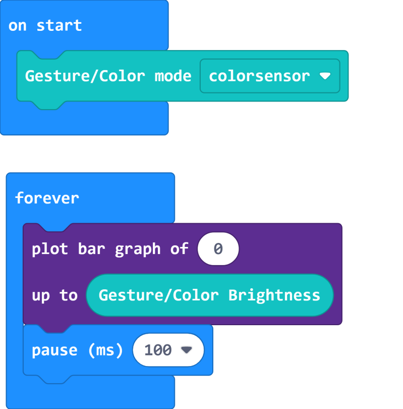
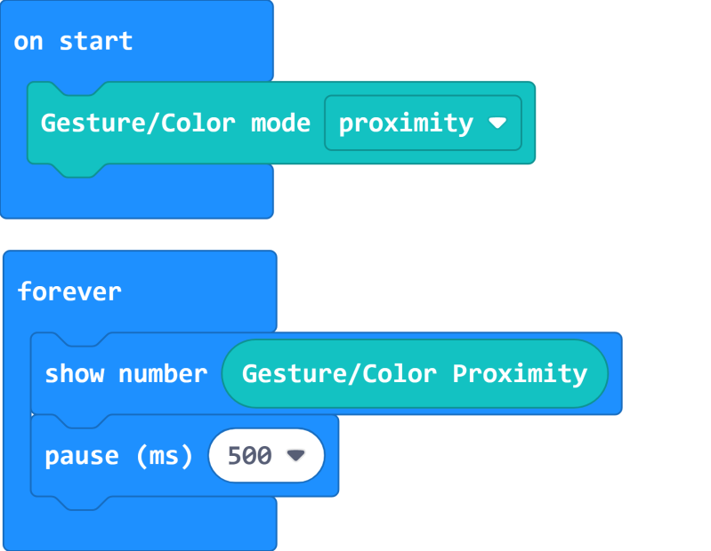

# Color & Gesture Module

Color & Gesture Module (HKBM8012F)

This is a multifunctional module, the main features are Color detection and Gesture detection.

This module has 4 modes: 

1. In Color Mode, the 4 LEDs light up. It can detect color or ambient light level.
1. In Gesture Mode, the LEDs light up corresponding to the direction of movement.
1. In Proximity Mode, it can detect objects with a 3cm range. The LEDs brightness are determined by the proximity of the object.
1. In LED Mode, the 4 LEDs can be controlled.

## Details

## Specifications

- Voltage: 3V-5V
- Dimensions: 56mm X 24mm X 16mm
- Connector: 4Pin PH2.0
- Color Mode Return Value: 0-360, corresponding to hue
- Gesture Mode Return Value: 0-4, corresponding to None, Up, Right, Down, Left
- Proximity Mode Return Value: 0-255, with a range of approximately 3cm
- Brightness Return Value: 0-255

## Precautions

- This module must be connected to I2C port.
- The module defaults to Proximity Mode if mode has not been set.
- For gesture detection, practice maybe needed to get the correct distance and speed for successful detection.
- For color detection, the return value is a Hue value from HSV format.
- Color detection has the best effects when the object is about 1cm away.
- The LEDs can only be controlled in the LED Mode.

## Connecting the module

### Armourbit

---

Connect the module to the I2C Port of Armourbit using a 4Pin Cable.

### Robotbit

--- 
Connect the module to the I2C Port of Robotbit.

    Blue(A)->SCL, Green(B)->SDA

## MakeCode Coding Tutorial

### Powerbrick Extension: https://github.com/KittenBot/pxt-powerbrick

### [Loading Extensions](../../Makecode/powerBrickMC)

### Color Gesture Module Blocks

### Detecting Color

[Sample Code Link](https://makecode.microbit.org/_LLbfYx40CEdX)

HSV Color Wheel:

### Detecting Ambient Brightness

[Sample Code Link](https://makecode.microbit.org/_LTt5ugP2f00K)

### Detecting Proximity

[Sample Code Link](https://makecode.microbit.org/_RhKfYUJwu0AK)

### Detecting Gesture

[Sample Code Link](https://makecode.microbit.org/_4eiKzMXot5Vy)

### Controlling LEDs

[Sample Code Link](https://makecode.microbit.org/_c5s6sFH3mgXY)

### Makecode Tutorial Video

## Extension Version and Updates

There may be updates to extensions periodically, please refer to the following link to update/downgrade your extension.

[Makecode Extension Update](../../../Makecode/makecode_extensionUpdate)

## KittenBlock Coding Tutorial

### Load Powerbrick Extension

Select Powerbrick from the hardware column.

### Color Gesture Module Blocks

### Detecting Color

[Sample Code Download](https://bit.ly/PowerbrickM7_01sb3)

### Detecting Ambient Brightness

[Sample Code Download](https://bit.ly/PowerbrickM7_02sb3)

### Detecting Proximity

[Sample Code Download](https://bit.ly/PowerbrickM7_03sb3)

### Detecting Gesture

[Sample Code Download](https://bit.ly/PowerbrickM7_04sb3)

### Controlling LEDs

[Sample Code Download](https://bit.ly/PowerbrickM7_05sb3)

## FAQ

1：Why is there no reaction when I click the blocks?

Make sure you have connected the Micro:bit correctly and flash the firmware again.