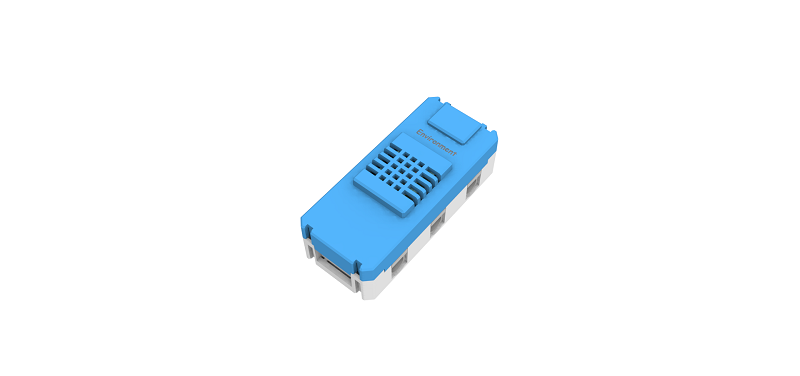
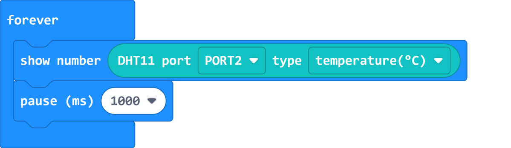

# Environment Temperature and Humidity Module

Environment Temperature and Humidity Module (HKBM8012D)

This module is used to get the temperature and humidity of the nearby environment. It can be used with the Soil Moisture or Water Level Sensors.

## Details

## Specifications

- Voltage: 3V-5V
- Dimensions: 56mm X 24mm X 19mm
- Connector: 4Pin PH2.0, 3Pin PH2.0
- Temperature Range: 0-50°C, Accuracy ±2°C
- Humidity Range: 20-90%RH, Accuracy ±5%RH
- Sensor Value Return Range: 0-1023

## Precautions

- This module cannot be placed underwater, doing so would cause a short circuit.

## Connecting the module

Connect the Environment Module to Armourbit with a 4Pin cable.

## MakeCode Coding Tutorial

### Powerbrick Extension: https://github.com/KittenBot/pxt-powerbrick

### [Loading Extensions](../../Makecode/powerBrickMC)

### Environment Module Blocks:

### Reading the temperature

[Sample Code Link](https://makecode.microbit.org/_7iaJkbDr3H0J)

### Reading the relative humidity

[Sample Code Link](https://makecode.microbit.org/_iwp6isU4hLRR)

### Makecode Tutorial Video

## Extension Version and Updates

There may be updates to extensions periodically, please refer to the following link to update/downgrade your extension.

[Makecode Extension Update](../../../Makecode/makecode_extensionUpdate)

## KittenBlock Coding Tutorial

### Load Powerbrick Extension

Select Powerbrick from the hardware column.

### Environment Module Blocks

### Reading the temperature

[Sample Code Download](https://bit.ly/PowerbrickM1_01sb3)

### Reading the relative humidity

[Sample Code Download](https://bit.ly/PowerbrickM1_02sb3)

## FAQ

1：Why is there no reaction when I click the blocks?

Make sure you have connected the Micro:bit correctly and flash the firmware again.