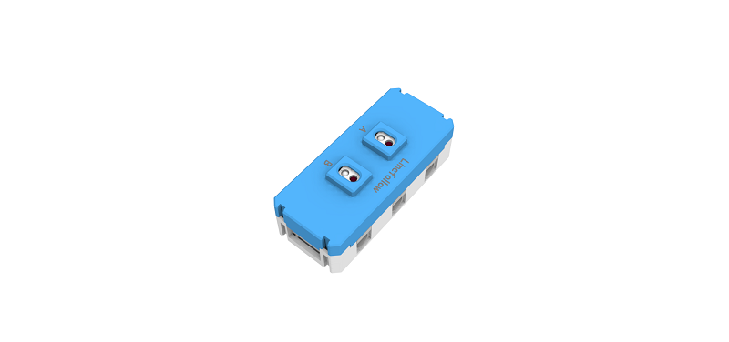
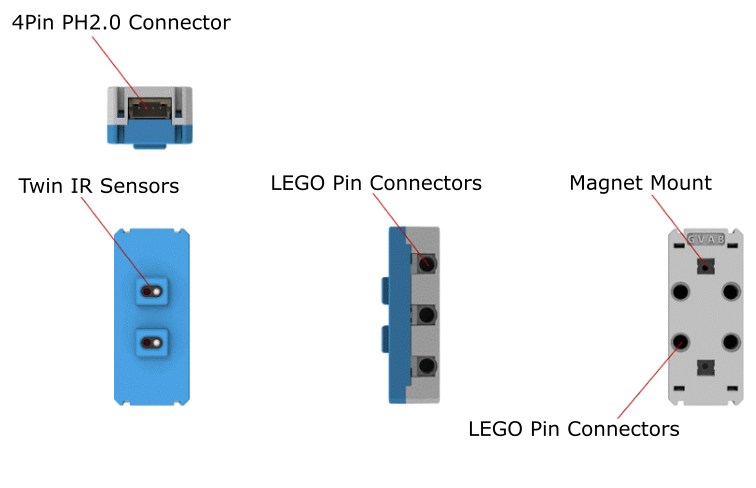
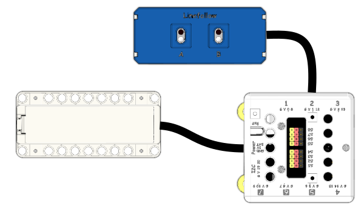
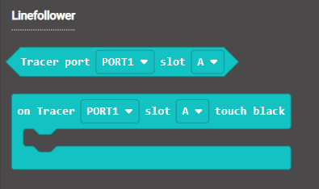
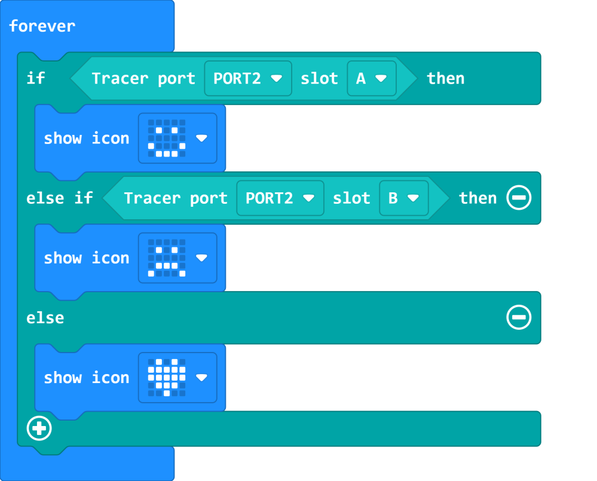
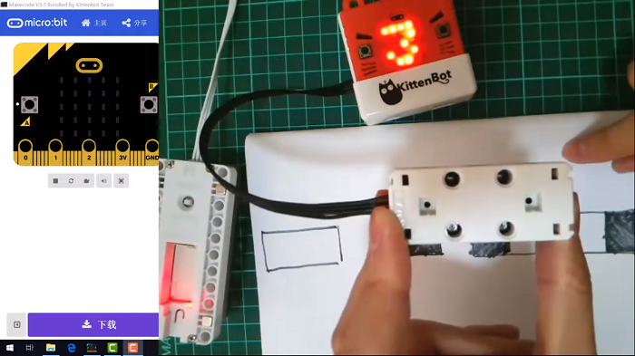
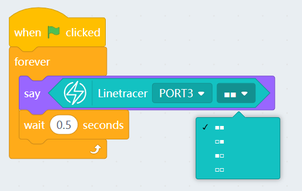

# IR Line Trace Module

IR Line Trace Module (HKBM8012B)

This is an infra red line tracing module, it has 2 line tracing sensors.

The LEDs on the back turn off when a black line is detected.

## Details

## Specification

- Voltage: 3V-5V
- Dimensions: 56mm X 24mm X 16mm
- Connector: 4Pin PH2.0

## Precautions

- The module should be as close to the ground as possible.
- The ground or table must have a non-reflective surface.

## Connecting the module

Connect the Line Trace Module to Armourbit with a 4Pin cable.

## MakeCode Coding Tutorial

### Powerbrick Extension: https://github.com/KittenBot/pxt-powerbrick

### [Loading Extensions](../../Makecode/powerBrickMC)

### Line Trace Module Blocks

### Tracing black lines

[Sample Code Link](https://makecode.microbit.org/_3tj8kdf8jhft)

### Makecode Tutorial Video

## Extension Version and Updates

There may be updates to extensions periodically, please refer to the following link to update/downgrade your extension.

[Makecode Extension Update](../../../Makecode/makecode_extensionUpdate)

## KittenBlock Coding Tutorial

### Load Powerbrick Extension

Select Powerbrick from the hardware column.

### Line Trace Module Blocks

### Tracing black lines

[Sample Code Download](https://bit.ly/PowberbrickM5_01sb3)

## FAQ

1：Why is there no reaction when I click the blocks?

Make sure you have connected the Micro:bit correctly and flash the firmware again.
