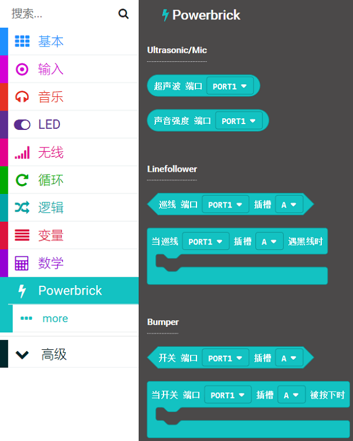

# Loading Extensions on MakeCode

## Quick Start

The recommended programming platform for PowerBrick is Microsoft MakeCode.

MakeCode is available in Online and Offline versions.

MakeCode Online: https://makecode.microbit.org/

MakeCode Offline: https://www.kittenbot.cn/software

## PowerBrick Coding on MakeCode

Navigate to MakeCode's homepage and start a new project.

### Load PowerBrick Extension

Click "Extensions" under Settings, or open the "Advanced" tab in the blocks column.

Copy and paste the following link onto the search bar.

### https://github.com/KittenBot/pxt-powerbrick

Click the extension to load.

## Extension Version and Updates

There may be updates to extensions periodically, please refer to the following link to update/downgrade your extension.

[Makecode Extension Update](../../../Makecode/makecode_extensionUpdate)