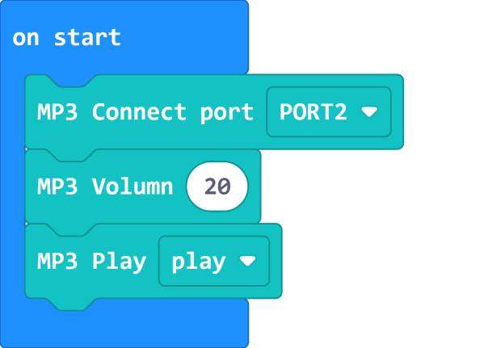

# MP3 Music Module

MP3 Music Module (HKBM8012E)

This is a music module with a speaker and a microSD card slot, it is able to play MP3 files. It can be used as an MP3 player with the built-in buttons, or be used with an Armourbit.

## Details

## Specifications

- Voltage: 3V-5V
- Dimensions: 56mm X 24mm X 16mm
- Connector: 4Pin PH2.0
- Flash Card: microSD card, up to 32G, supports FAT32
- File Formates: MP3, WAV
- Buttons: Play, Previous, Next
- Uploading: Put the files onto the microSD card with a computer.

## Precautions

- PowerBrick Kit set does not come with an SD Card.
- Music can only be played if there are music files on the SD Card.
- When installing the SD Card, push it into the slot until there is a click.
- Do not pull out the SD Card directly, the SD Card can be removed by pushing the SD Card to unlock it.

## Connecting the module

Connect the Music Module to Armourbit with a 4Pin cable.

## MakeCode Coding Tutorial

### Powerbrick Extension: https://github.com/KittenBot/pxt-powerbrick

### [Loading Extensions](../../Makecode/powerBrickMC)

### MP3 Module Blocks

### Playing an MP3 file

[Sample Code Link](https://makecode.microbit.org/_1zuJ9JUkK3WT)

### Choosing an MP3 file with a number

[Sample Code Link](https://makecode.microbit.org/_PqF5VqYgp6Yu)

### Choosing an MP3 file with a name

    File name can only contain alphabets and numerics, length cannot exceed 8 letters.

[Sample Code Link](https://makecode.microbit.org/_2uChE8PtC8fT)

### Makecode Tutorial Video

## Extension Version and Updates

There may be updates to extensions periodically, please refer to the following link to update/downgrade your extension.

[Makecode Extension Update](../../../Makecode/makecode_extensionUpdate)

## KittenBlock Coding Tutorial

### Load Powerbrick Extension

Select Powerbrick from the hardware column.

### MP3 Module Blocks

### Playing an MP3 file

[Sample Code Download](https://bit.ly/PowerbrickM10_01sb3)

### Choosing an MP3 file with a number

[Sample Code Download](https://bit.ly/PowerbrickM10_02sb3)

### Choosing an MP3 file with a name

    File name can only contain alphabets and numerics, length cannot exceed 8 letters.

[Sample Code Download](https://bit.ly/PowerbrickM10_03sb3)

## FAQ

1：Why is there no reaction when I click the blocks?

Make sure you have connected the Micro:bit correctly and flash the firmware again.