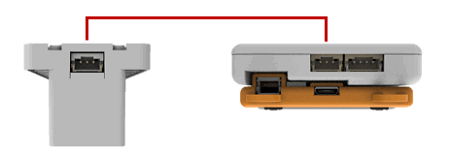
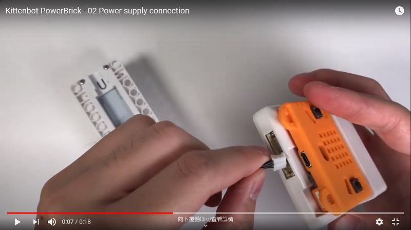
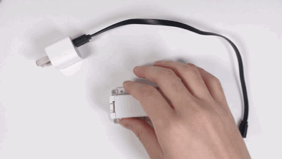

# Battery Box

Battery Box (HKBM8012A)

This is the Battery Box for PowerBrick, it is used to supply power for the Armourbit and its modules, motors and servos. 

It has capacity for 1 18650 Li-ion battery and uses a 3Pin PH2.0 connector for output. Comes with a built-in Micro USB port with short circuit protection for charging.

Also comes with a USB Type A output port to power other modules such as Robotbit, KOI AI Camera.

## Precautions

- Install the battery before turning on the power.
- Beware of the polarity when installing the battery, refer to the polarity labelled inside the battery compartment.
- Remove the insulation wrapping of the 18650 Li-ion battery before using.
- Take out the battery when not in use for a long time. Keep it in a suitable place.
- Do not short the battery connectors with a metal object.
- Avoid over charing or discharging of the battery, charging should only be done under supervision.
- In case of over current or short circuit, the protection circuit would activate and switch off the power. Troubleshoot and fix the problem before restarting.

## Details

## Using the Connectors

### Powering the Armourbit

### Powering USB devices

### Installing the 18650 Li-ion Battery

1. Check the polarity
2. Press the battery reset switch
3. Press the power button

### Power Supply Connection

### Charging the Battery Box

The Battery Box can be charged with a **5V Power Supply** (5V Phone Chargers or PC USB Ports)

### Powering other USB Devices

The USB Port can power devices like Arduino, KOI AI Camera.

