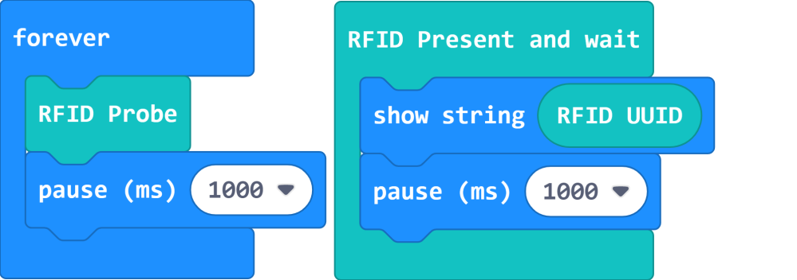

# RFID Reader Module

RFID Reader Module (HKBM8012L) + RFID Card (HKBM8012M)

This is an RFID module that can read or write RFID cards.

The included RDID card has 1K memory, it has 16 sections with 3 blocks each.

## Details

## Specifications

- Voltage: 3V-5V
- Dimensions: 56mm X 56mm X 16mm
- Connector: 4Pin PH2.0
- Sensing Distance: Approximately 3cm

## Precautions

- Do not use the module in an environment with strong magnetic fields.
- Any metal between the reader and the card will cause it to fail to write or read.
- It may take sometime when writing a large amount of data into the RFID Card, please wait until the light goes off.
- Cards like Octopus Cards or ID Cards have encrypted data, the reader can only read the UUID of these cards.

## Connecting the module

### Armourbit

---

Connect the RFID Module to the I2C port of Armourbit with a 4Pin cable.

### Robotbit

--- 
Connect the RFID Module to the I2C port of Robotbit.

    Blue(A)->SCL, Green(B)->SDA

## MakeCode Coding Tutorial

### Powerbrick Extension: https://github.com/KittenBot/pxt-powerbrick

### [Loading Extensions](../../Makecode/powerBrickMC)

### RFID Module Blocks

### Writing data onto RFID Card

[Sample Code Link](https://makecode.microbit.org/_XdP0Pye1rFA0)

### Reading Data from RFID card

[Sample Code Link](https://makecode.microbit.org/_TEz6D45qgDaa)

### Reading the UUID

Every RFID card has an unique ID.

[Sample Code Link](https://makecode.microbit.org/_a6wiKdUqWaXL)

### Identification with UUID

We can use UUID to identify indicviduals.

[Sample Code Link](https://makecode.microbit.org/_c4rcrE76Tc6Y)

### Makecode Tutorial Video

## Extension Version and Updates

There may be updates to extensions periodically, please refer to the following link to update/downgrade your extension.

[Makecode Extension Update](../../../Makecode/makecode_extensionUpdate)

## KittenBlock Coding Tutorial

### Load Powerbrick Extension

Select Powerbrick from the hardware column.

### RFID Module Blocks

### Writing data onto RFID Card

[Sample Code Download](https://bit.ly/PowerbrickM8_01sb3)

### Reading Data from RFID card

[Sample Code Download](https://bit.ly/PowerbrickM8_02sb3)

### Reading the UUID

[Sample Code Download](https://bit.ly/PowerbrickM8_03sb3)

### Identification with UUID

    
[Sample Code Download](https://bit.ly/PowerbrickM8_04sb3)

## FAQ

1：Why is there no reaction when I click the blocks?

Make sure you have connected the Micro:bit correctly and flash the firmware again.