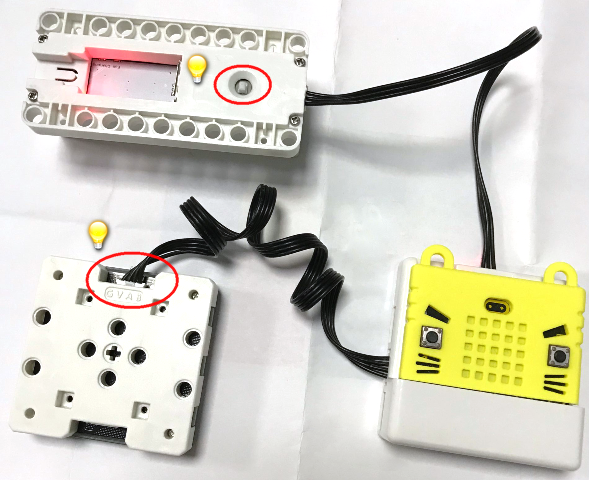
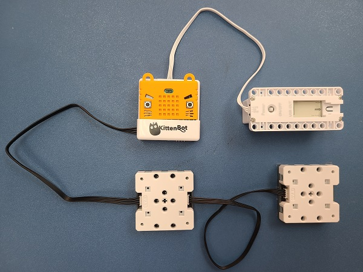
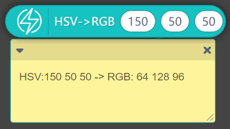

# RGB LED Matrix

RGB LED Matrix (HKBM8012J)

This is a 8x8 RGB LED Matrix, each LED can be controlled individually. Supports daisy chaining to create larger screens, making the display even more appealing.

## Details

## Specifications

- Voltage: 3V-5V
- Dimensions: 56mm X 56mm X 16mm
- Connector: 4Pin PH2.0
- Resolution: 8x8 RGB

## Precautions

- There are 2 ports on the module, one for input and one for output. Connect the input port to the Armourbit.
- When connecting more than 1 modules, connect the output port of the first module to the input of the second module.
- The battery box supports up to 4 modules in daisy chain. Connect an external power supply or lower the brightness if more is needed.
- Beware of cooling when using the module for long periods of time.

## Connecting the module

Connect the RGB Module to Armourbit with a 4Pin cable.

## MakeCode Coding Tutorial

### Powerbrick Extension: https://github.com/KittenBot/pxt-powerbrick

### [Loading Extensions](../../Makecode/powerBrickMC)

### RGB Matrix Blocks

### Lighting up with a single color

[Sample Code Link](https://makecode.microbit.org/_dgdfa73fb6jr)

### Lighting up with a rainbow color

[Sample Code Link](https://makecode.microbit.org/_VDtaD6AVjfdd)

### Lighting up a pixel

[Sample Code Link](https://makecode.microbit.org/_iv6MHWEkDMjr)

### Showing a pattern

[Sample Code Link](https://makecode.microbit.org/_2cF73496m8p1)

### Makecode Tutorial Video

## Tutorial for daisy chaining and graphical editor

Daisy chaining creates a bigger screen.

### Daisy Chaining

Connect the out of matrix A to the in of matrix B.

NeoMatrix Graphical editor is supporting for daisy chaining.

[NeoMatrix Tutorial](../../../accessories/LEDMatrix/LEDMatrixDaisyChain.md)

#### Daisy Chaining Showcase

## Extension Version and Updates

There may be updates to extensions periodically, please refer to the following link to update/downgrade your extension.

[Makecode Extension Update](../../../Makecode/makecode_extensionUpdate)

## KittenBlock Coding Tutorial

### Load Powerbrick Extension

Select Powerbrick from the hardware column.

### RGB Matrix Blocks

### Lighting up pixels

[Sample Code Download](https://bit.ly/PowerbrickM9_01sb3)

The module uses RGB color, you can convert HSV to RGB using this block.

## FAQ

1：Why is there no reaction when I click the blocks?

Make sure you have connected the Micro:bit correctly and flash the firmware again.
