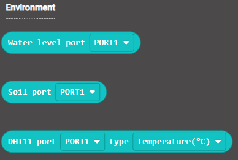
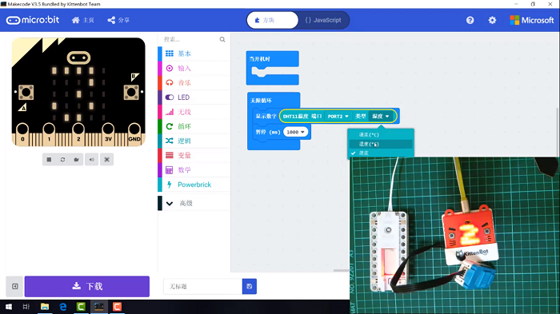

# Soil Moisture Sensor

Soil Moisture Sensor (HKBM8012H)

This is a soil moisture sensor that detects the moisture level in soil, the reading is high when the soil is dry.

## Precautions

- If the sensor is not in use for a long time, please store in a dry container to prevent oxidation due to moisture.
- A warning line is printed on the module, do not insert the sensor deeper than this line as this may cause damage to the circuitry.

## Connecting the module

Connect the Environment Module to Armourbit with a 4Pin cable first, then connect the sensor to the module with a 3Pin cable.

## MakeCode Coding Tutorial

### Powerbrick Extension: https://github.com/KittenBot/pxt-powerbrick

### [Loading Extensions](../../Makecode/powerBrickMC)

### Environment Module Blocks:

### Detecting soil moisture

[Sample Code Link](https://makecode.microbit.org/_i33W9gCyueDr)

### Makecode Tutorial Video

## Extension Version and Updates

There may be updates to extensions periodically, please refer to the following link to update/downgrade your extension.

[Makecode Extension Update](../../../Makecode/makecode_extensionUpdate)

## KittenBlock Coding Tutorial

### Load Powerbrick Extension

Select Powerbrick from the hardware column.

### Environment Module Blocks

### Detecting Soil Moisture

[Sample Code Download](https://bit.ly/PowerbrickM3-01sb3)

## FAQ

1：Why is there no reaction when I click the blocks?

Make sure you have connected the Micro:bit correctly and flash the firmware again.