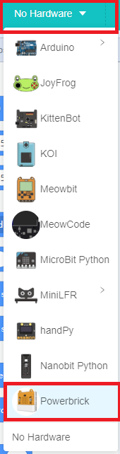

# Ultrasound and Sound Module

Ultrasound and Sound Module (HKBM8012K)

This module combines ultrasound sensor and a microphone into the same module. 

The ultrasound sensor is used to measure the distance of objects, the microphone is used to measure the loudness.

## Details

## Specifications

- Voltage: 3V-5V
- Dimensions: 56mm X 24mm X 16mm
- Connector: 4Pin PH2.0
- Ultrasound Detection Range: 4cm-200cm(Recommended)
- Analog Return Value Range: 0-1023

## Precautions

- Ultrasound works better on items with smooth surfaces, the smooth surface should be perpendicular to the module.
- Ultrasound emits signal in the shape of an arc, makesure there is no obstacle in the signal range.
- The microphone only detects whether a sound is loud or not, it can't measure decibels. Measuring decibels require professional equipment.

## Connecting the module

Connect the Ultrasound Module to Armourbit with a 4Pin cable.

## MakeCode Coding Tutorial

### Powerbrick Extension: https://github.com/KittenBot/pxt-powerbrick

### [Loading Extensions](../../Makecode/powerBrickMC)

### Ultrasound Module Blocks:

### Measuring distance

[Sample Code Link](https://makecode.microbit.org/_VUTJ1xDtzVfR)

### Measuring ambient noise

[Sample Code Link](https://makecode.microbit.org/_RKL0iE4iP63i)

## Extension Version and Updates

There may be updates to extensions periodically, please refer to the following link to update/downgrade your extension.

[Makecode Extension Update](../../../Makecode/makecode_extensionUpdate)

### Makecode Tutorial Video

## KittenBlock Coding Tutorial

### Load Powerbrick Extension

Select Powerbrick from the hardware column.

### Ultrasound Module Blocks:

### Measuring distance

[Sample Code Download](https://bit.ly/PowerbrickM4_01sb3)

### Measuring ambient noise

[Sample Code Download](https://bit.ly/PowerbrickM4_02sb3)

## FAQ

1：Why is there no reaction when I click the blocks?

Make sure you have connected the Micro:bit correctly and flash the firmware again.