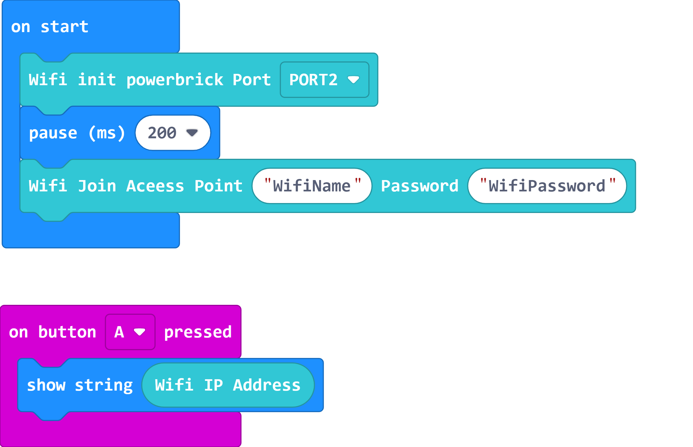
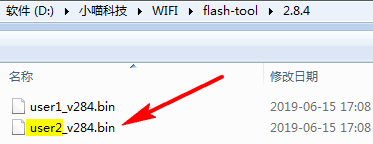

# WifiBrick Firmware Update

Updates may be available to the Wifibrick periodically to improve stability or add new functions.

This page includes the tutorial to check and update the firmware.

---

#### Load the Wifibrick Extension:

#### https://github.com/KittenBot/pxt-kittenwifi

[Loading Extensions](../../Makecode/powerBrickMC)

## Checking the firmware version

Write the following code to connect Wifibrick to your router.

[Sample Code Link](https://makecode.microbit.org/_VmD9sTTXrYH1)

Upload the program to Micro:bit and wait for the Wifibrick to connect to the internet.

The LED on the Wifibrick will light up green after a successful connection.

Press the A button on Micro:bit to show the IP Address of the Wifibrick, write down the IP Address.

    If you have the Adminstrator rights to the Network, you can find the IP address in the router's homepage.

Open the internet browser and type the IP Address of the Wifibrick, and then press Enter.

    

    
The firmware version is displayed on the page.
    

## Update Wifibrick Firmware

Download the latest firmware: [v2.88]()

Enter Wifibrick's interface using the above method.

Select Upgrade Firmware from the menu.

Select the right file accoring to the instruction.

The instruction tells us to upload user2.bin, so that file is selected.

The update will be done automatically.

