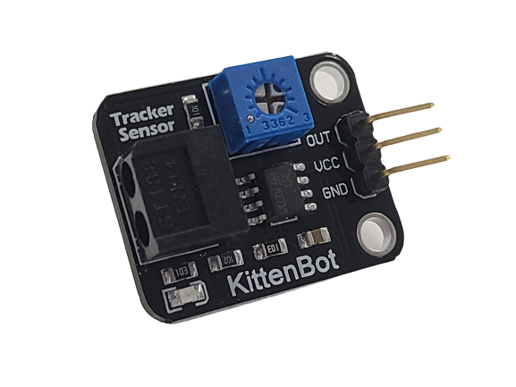
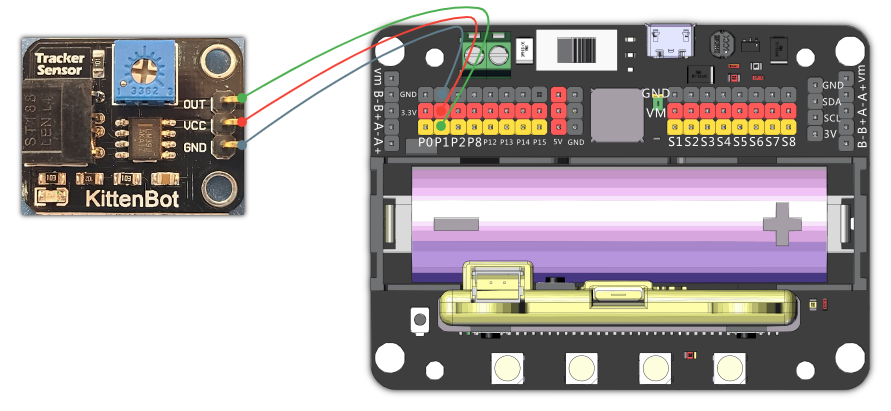
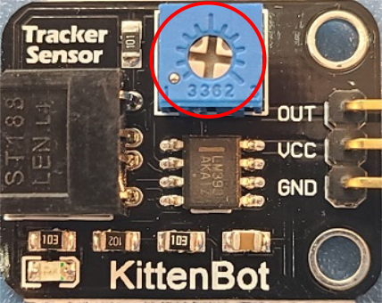

# Infra Red Tracker Sensor

This is an infra red tracker sensor, it can detect when an object is close, it returns an analog value.

The range of the return value is 0-1023, a higher value means the object is closer to the sensor.

## Specifications

- Voltage: 3.3V~5V
- Type: Analog Module
- Interface: 3Pin Dupont Cable
- Detection Distance: 10-60mm

## Wiring Diagram

    This is an analog module, it can only use P0-P2.(Remove the buzzer jumper when P0 is in use.)
    
Connect the sensor to Robotbit's pin and 3V pin.

## Adjust Sensitivity

The sensor's sensitivity can be adjusted via this potentialmeter. Use a screwdriver to turn.(Turn left to increase, turn right to decrease)

## MakeCode Coding Tutorial 

### This module can be used with Microbit and Meowbit.

#### Read the IR sensor value

### Microbit:

### Meowbit:

## KittenBlock Coding Tutorial 

### Load the Robotbit extension

#### Read the IR sensor value

## Mu Editor Coding Tutorial 

#### Read the IR sensor value

