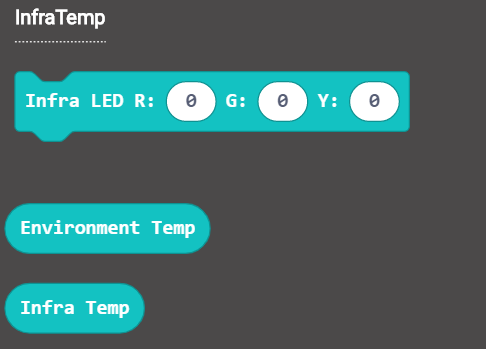

# Contactless Infra Red Temperature Sensor

Contactless Infra Red Temperature Sensor (HKBM6002A)

This is a contactless infra red temperature sensor, it can detect temperature.

## Specification

- Voltage: 3.3V~5V
- Sensor: MRT-311
- Working Temperature: -30°C~100°C
- Sensitive Area: 0.35x0.35mm

## Wiring Diagram

Connect the temperature sensor to the i2c port.

## MakeCode Coding Tutorial

### Powerbrick extension：https://github.com/KittenBot/pxt-powerbrick

### [Loading Extensions:](../Makecode/powerBrickMC)

### Temperature sensor blocks

### Temperature sensor coding

#### Detecting the temperature.

[Sample Code Download](https://bit.ly/ContactlessIRSampleHex)

[Sample Code Link](https://makecode.microbit.org/_1EDarvXwJ3bA)

#### Controlling the LED.

[Sample Code Download](https://bit.ly/ContactlessIRSampleHex)

[Sample Code Link](https://makecode.microbit.org/_2F4YLsCpF9fd)

## Extension Version and Updates

There may be updates to extensions periodically, please refer to the following link to update/downgrade your extension.

[Makecode Extension Update](../Makecode/makecode_extensionUpdate)
