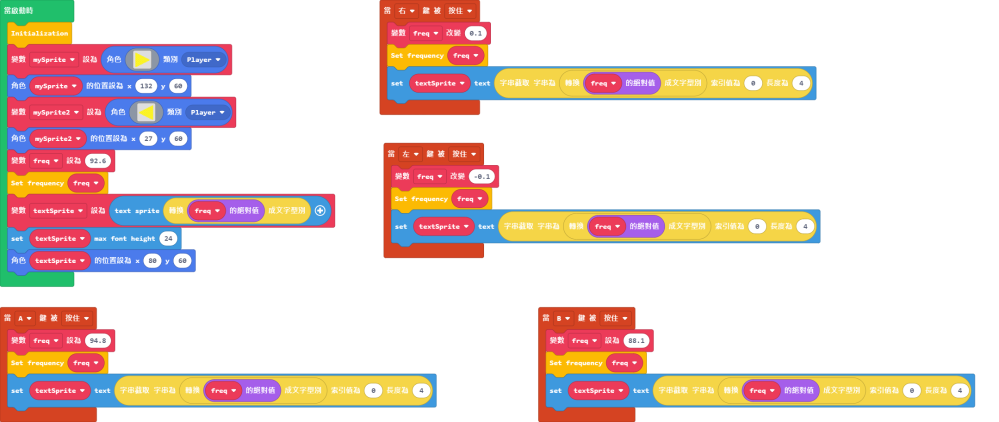

# KittenRadio

This is a radio module capable of receiving FM radio signals.

It has a standard 3.5mm audio plug for audio out and pin holes for use with plastic building bricks.

## Product Specifications

- Voltage: 2.5V~5V
- Type: I2C Module
- Connector: 4Pin PH2.0
- Frequency Range: 76MHz~108MHz
- Antenna Connector: 3.5mm
- Audio Connector: 3.5mm
- Size: 43mm x 43mm x 24mm

## Product Showcase

## Wiring

First connect the antenna and speakers to the respective connector.

    Speakers/earphones are not included with this product.
    

## Robotbit

Connect the supplied cable to the module.

Connect the Dupont connectors to the I2C port on Robotbit.

    White to SCL, Green to SDA.
    

## Armourbit
    
Connect the supplied cabl to the module.

 

Connect the other end of the cable to the I2C port of Amorbit.

 

## MakeCode Programming Tutorial

### This module can be used with Micro:bit or Meowbit.

### Import KittenRadio Extension for MakeCode: https://github.com/kittenbothk/pxt-KittenRadio

### [Importing Extensions](../Makecode/powerBrickMC)

### Programming Blocks for KittenRadio

#### Microbit Sample Program:

[Sample Program](https://makecode.microbit.org/_7toH1mcCwcyb)

#### Meowbit Sample Program:

[Sample Program](https://makecode.com/_YYiLzY5t5X2s)

## Demonstration Video

## Extension Version and Updates

There may be updates to extensions periodically, please refer to the following link to update/downgrade your extension.

[Makecode Extension Update](../../../Makecode/makecode_extensionUpdate)