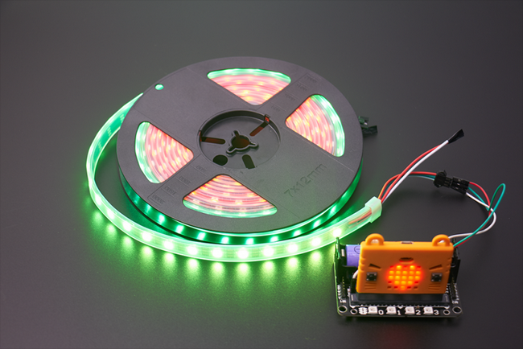

# RGB LED Strip

An RGB LED strip.

## Specifications

- Dimensions: 1000 x 10 x 2 mm
- Voltage: 5V
- Current: 1A
- Wattage: 0.3W
- No. of LEDs: 60

## Wiring Diagram

This product is recommended for use with Robotbit.

- Connect Red wire to 5V
- Connect White wire to GND
- Connect Green wire to Signal Pin

## MakeCode Coding Tutorial

### Import Robotbit Extension: https://github.com/KittenBot/pxt-robotbit

### Or search Robotbit in the search bar

### [Importing Extensions](../Makecode/powerBrickMC)

### Neopixel Coding Blocks

## Neopixel Coding

### Lighting Up a Single Colour

[Sample Program](https://makecode.microbit.org/_d7zDwY5y2hcd)

### Lighting Up a Rainbow Effect

[Sample Program](https://makecode.microbit.org/_KzCiXvWoa0Jo)

### Adjusting Brightness

[Sample Program](https://makecode.microbit.org/_2J41HRa54XyU)

### Controlling Individual LED

[Sample Program](https://makecode.microbit.org/_7YTa05AFf55A)

    Use the show block to update the effects.

### LED Marquee

[Sample Program](https://makecode.microbit.org/_HDFCiPMs2fsj)

[Sample Program](https://makecode.microbit.org/_2dcCTHCrm1k4)

    For shift, the effect will end after the pixel moves past the end(60 LEDs).
    For rotate, the pixel will restart at 0 after moving past the end(60 LEDs).

### Lighting Up a Selection of LEDs

[Sample Program](https://makecode.microbit.org/_azhb2aX4UPhm)

### Custom Colours

[Sample Program](https://makecode.microbit.org/_aYHK4Jax8h6x)

## Extension Version and Updates

There may be updates to extensions periodically, please refer to the following link to update/downgrade your extension.

[Makecode Extension Update](../Makecode/makecode_extensionUpdate)

## FAQ

Q: Why does the LED strip only lights up RED no matter what colour I chose?
A: There is not enough power.

Solution: Switch on the power of the Robotbit or connect an external power supply or lower the brightness.

## Precautions
- Do not apply a voltage more than 5V.
- Connect an external power supply such as an USB power bank for extended periods of use.
- Lower the brightness when lighting up a large number of LEDs.
- This product is designed for users 14 years or older, please seek parental assistance for users under 14.
- Please refer to official product guidelines before using. Only connect wires according to the instructions.
- Do not place this product on top of metal or conductive surfaces when using to prevent short circuits.
- Do not use this product near water or wet areas to prevent short circuits.
- Do not touch exposed contacts or wires.
