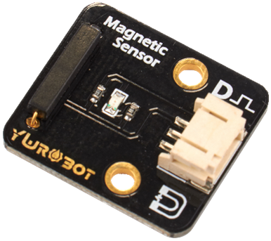
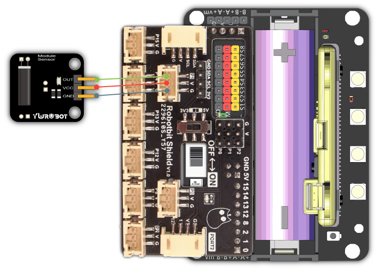
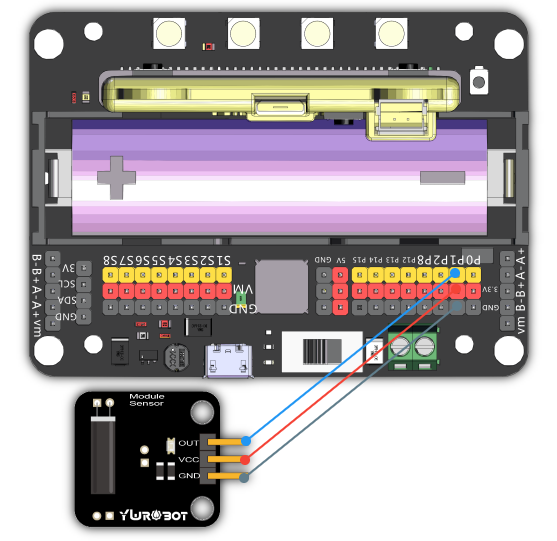
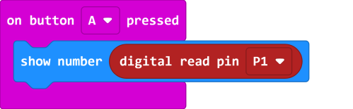
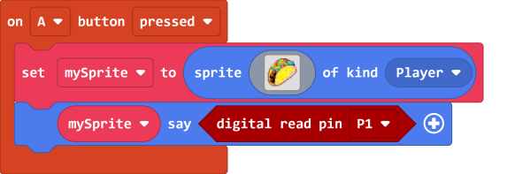
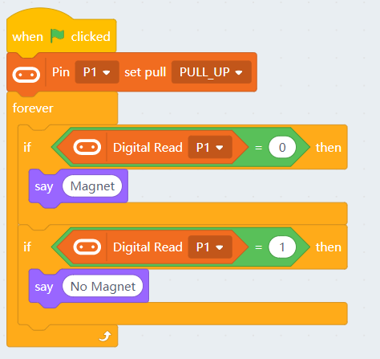
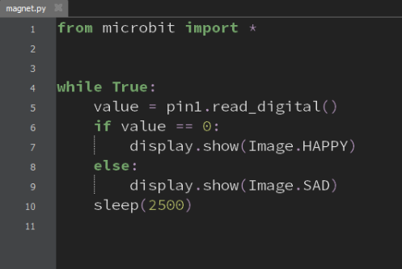

# Magnetic Sensor

This sensor can detect magnetic field, it returns a digital value,

Returns 0 when a magnetic field is detected, otherwise returns 1.

## Specifications

- Voltage: 3.3V~5V
- Type: Digital Module
- Interface: 3Pin PH2.0

## Wiring Diagram

### Robotbit Shield

Connect the sensor to Robotbit Shield's 3Pin port.

### Robotbit

Connect the sensor to Robotbit's pin and 3V pin.

## MakeCode Coding Tutorial

### This module can be used with Microbit and Meowbit.

#### Reading the sensor value

### Microbit:

### Meowbit:

## KittenBlock Coding Tutorial

### Load Robotbit Extension

#### Reading the sensor value

## Mu Editor Coing Tutorial

#### Reading the sensor value

