# NekoUltraSound Sensor

NekoUltraSound Sensor (HKBM8014A)

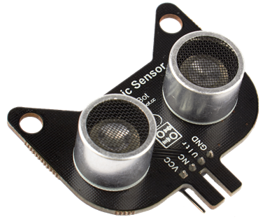

This is an ultra sound distance sensor.

## Specification

- Voltage: 5V
- Working Tempeature: -25 ~ +80°C
- Signal Span: 30° Arc
- Detection Range: 5~300cm (Error<1cm)
- Interface: 4Pin Dupont Cable

## Wiring Diagram

The Ultra Sound sensor must connect to 5V.

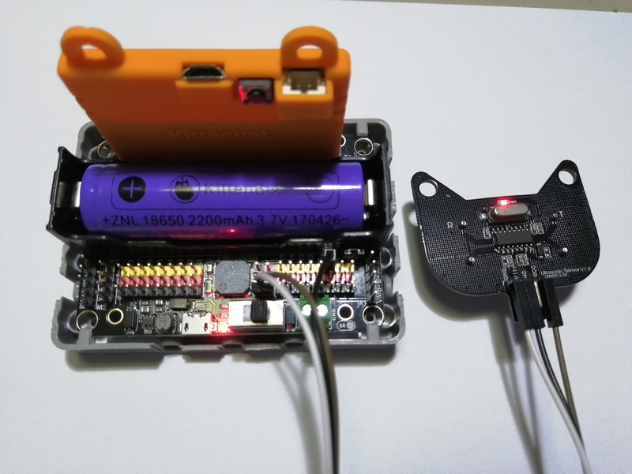

### Ultra Sound Sensor V2

Connect the A(RGB LED) and D(Sensor) pin of Ultra Sound Sensor V2.

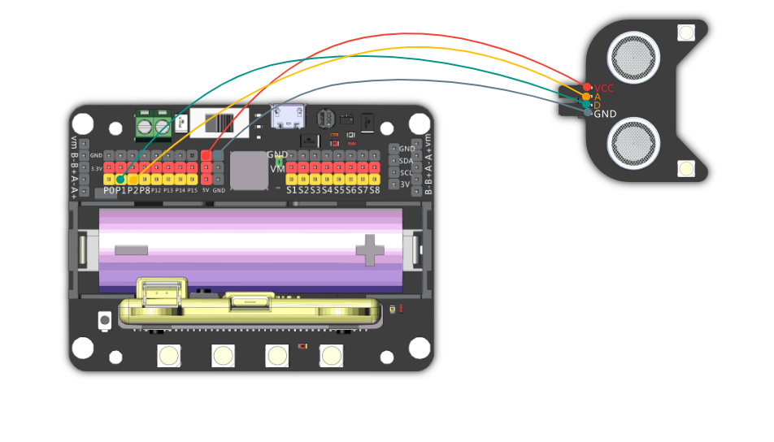

### Ultra Sound Sensor V1

Connect the Ultr pin of Ultra Sound Sensor V1.

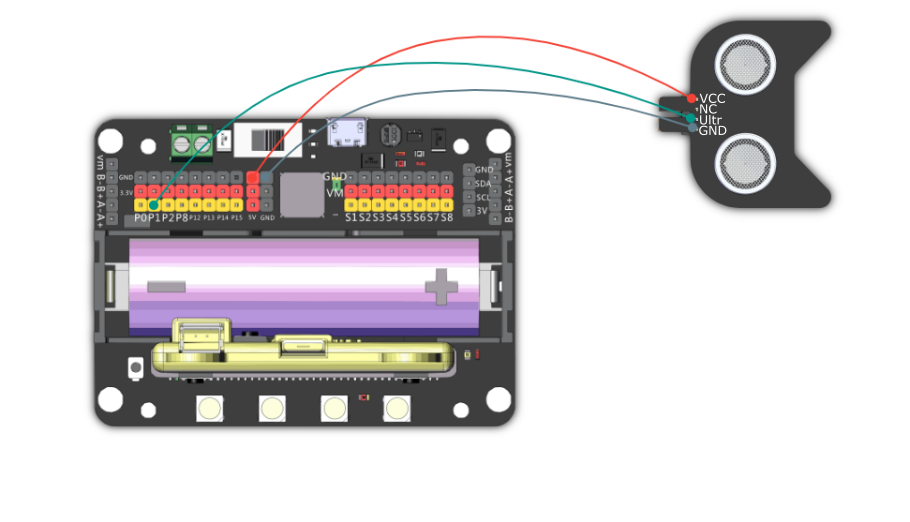

## MakeCode Coding Tutorial

### This module can be used with Microbit and Meowbit.

### Microbit:

### Load Robotbit Extension: https://github.com/KittenBot/pxt-robotbit

### [How to load extension?](../Makecode/powerBrickMC)

### Ultra Sound Sensor blocks:

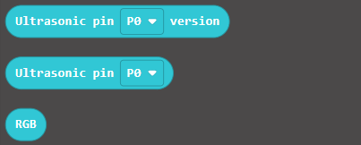

#### Reading the distance:

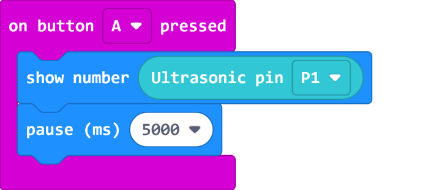

[Sample Code Link](https://makecode.microbit.org/_Lt021WgXuWfz)

### Controlling the RGB LED(only for V2)：

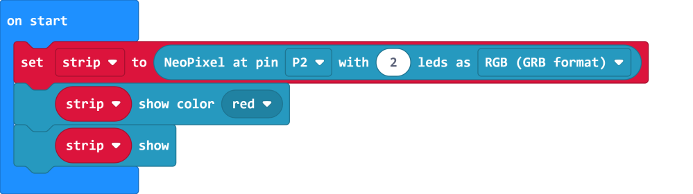

[Sample Code Link](https://makecode.microbit.org/_J9R5xhCwgJqH)

### Demo Case:

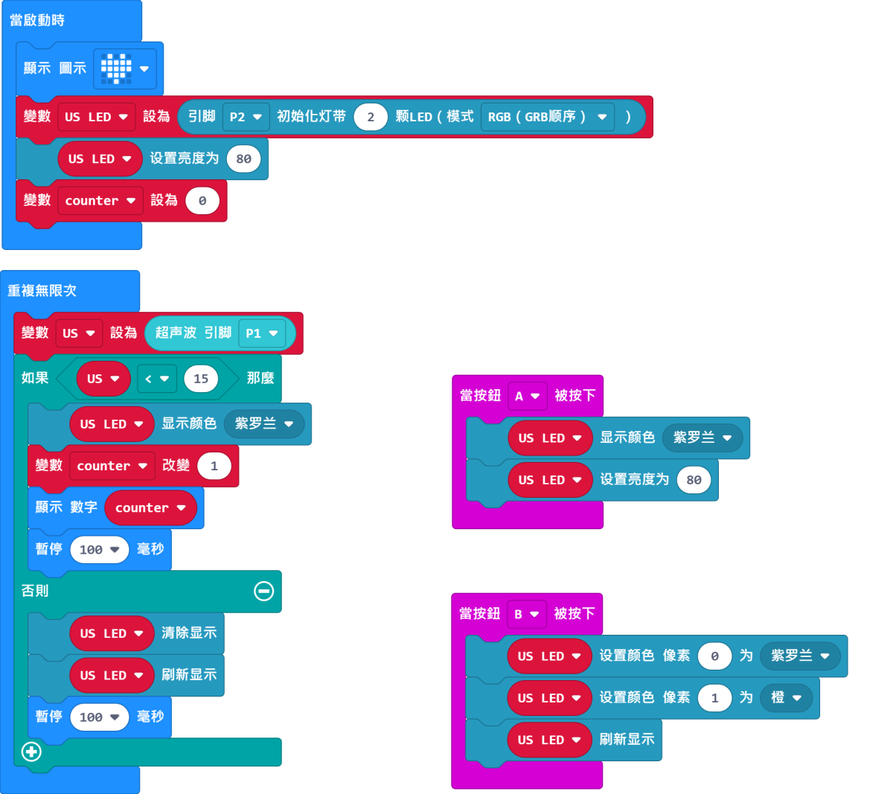

[Sample Code Link](https://makecode.microbit.org/_5vf48tf6xdVc)

### Meowbit:

### Load Robotbit Extension: https://github.com/KittenBot/meow-robotbit

### [How to load extension?](../Makecode/powerBrickMC)

### Load NeoPixel Extension:

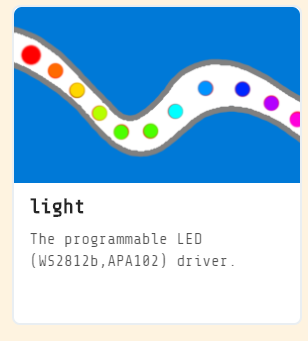

### Ultra Sound Sensor Blocks:

#### Reading the distance:

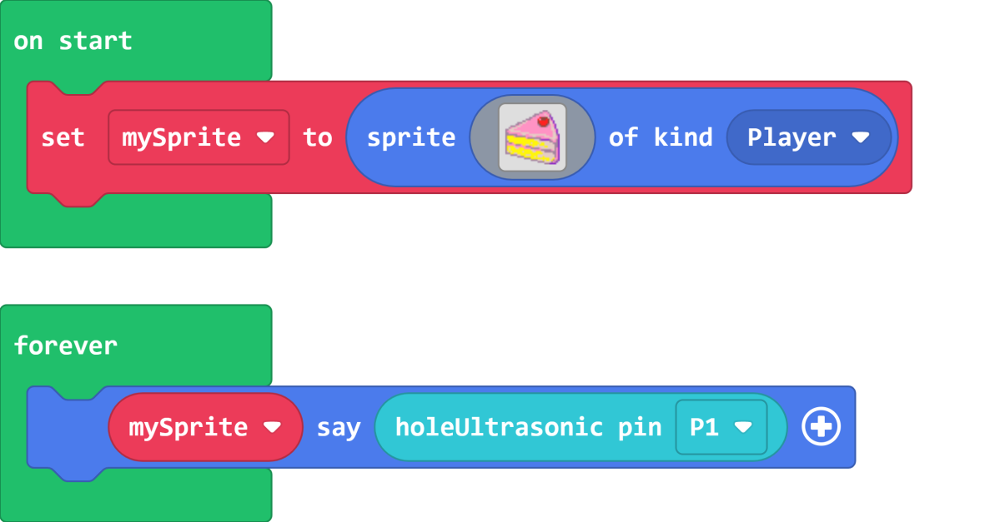

[Sample Code Link](https://makecode.com/_fC6XoUHHR79p)

### Controlling the RGB LED(only for V2)：

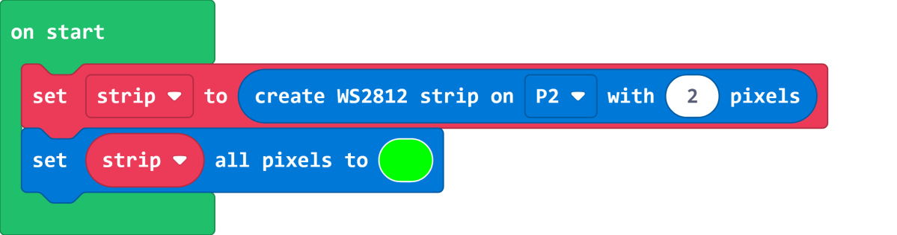

[Sample Code Link](https://makecode.com/_hs3LykMzV78o)

## Extension Version and Updates

There may be updates to extensions periodically, please refer to the following link to update/downgrade your extension.

[Makecode Extension Update](../Makecode/makecode_extensionUpdate)

## KittenBlock Coding Tutorial

### Load Robotbit extension

#### Reading the distance:

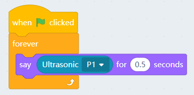

### Controlling the RGB LED(only for V2)：

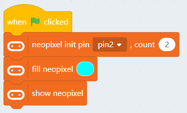

## Mu Editor Coding Tutorial

#### Reading the distance:

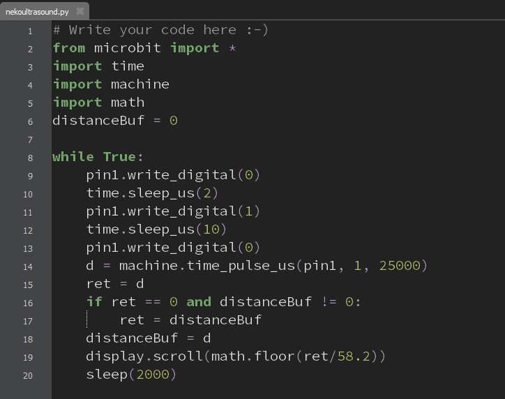

    The logic works by writing a broadcast signal then measuring the time taken for the signal to bounce back to the sensor, multiplying this time by the speed of sound gives us the distance.
