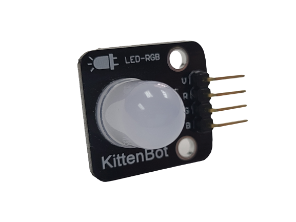
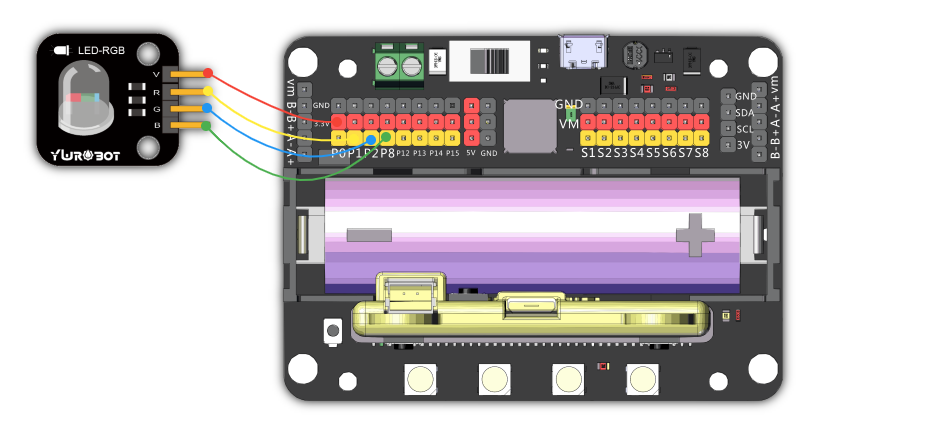
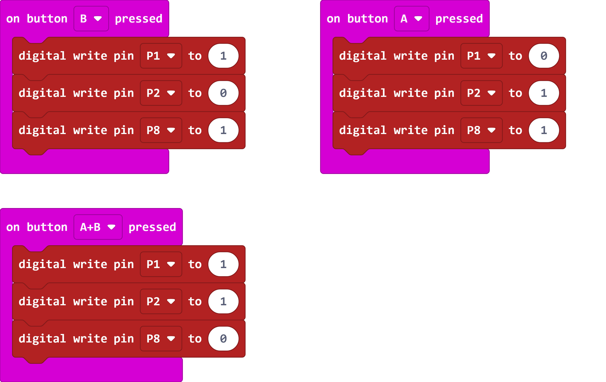
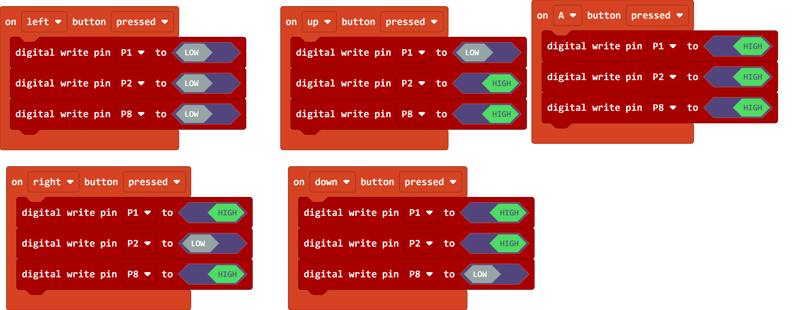
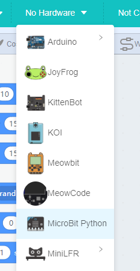
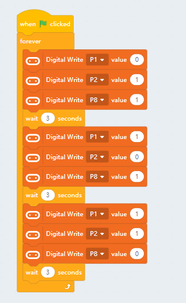

# RGB LED Module

This is a single RGB LED. 

## Specification

- Voltage: 3V~5V
- Type: Digital Module
- Interface: 3 Pin Dupont Cable

## Wiring Diagram

## MakeCode Coding Tutorial

### This module can be used with Microbit and Meowbit.

#### Controlling the LED

### Microbit:

[Sample Code Link](https://makecode.microbit.org/_Tq7Y963gW1fA)

### Meowbit:

[Sample Coding Link](https://makecode.com/_C13AgeUHz0M3)

## KittenBlock Coding Tutorial

### Load the Robotbot extension

#### Controlling the LED

