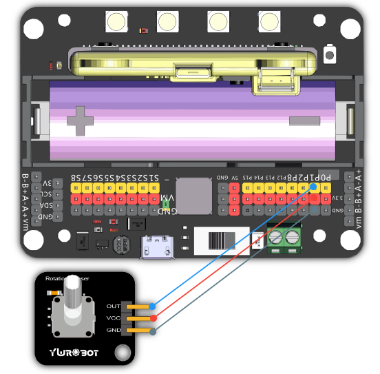

# Moisture Sensor

This is a moisture sensor that can measure the moisture of soil and returns an analog value.

The range of the return value is 0-1023, a higher value means the humidity is higher.

## Specification

- Voltagw: 3.3V~5V
- Type: Analog Module
- Interface: 3Pin PH2.0

## Wiring Diagram

    This is an analog module, it can only use P0-P2.(Remove the buzzer jumper when P0 is in use.)

### Robotbit Shield

Connect the sensor to Robotbit Shield's 3Pin port.

### Robotbit

Connect the sensor to Robotbit's pin and 3V pin.

## MakeCode Coding Tutorial

### This module can be used with Microbit and Meowbit.

#### Reading the soil moisture value

### Microbit:

### Meowbit:

## KittenBlock Coding Tutorial

### Load the Robotbit extension

#### Reading the soil moisture value

## Mu Editor Coding Tutorial

#### Reading the soil moisture value

