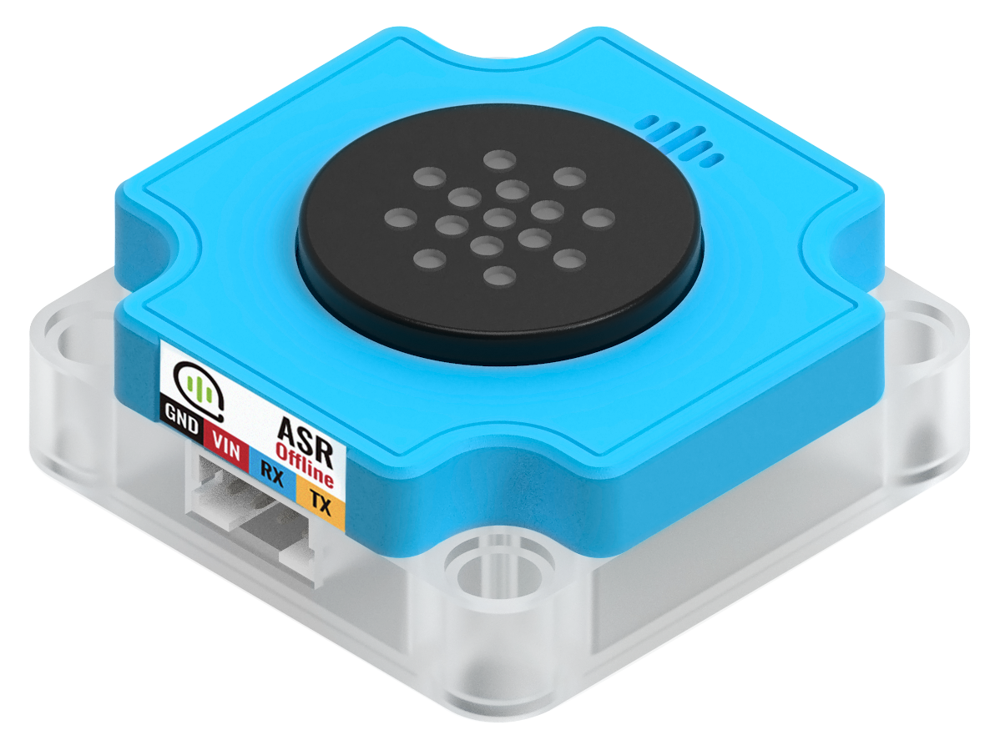
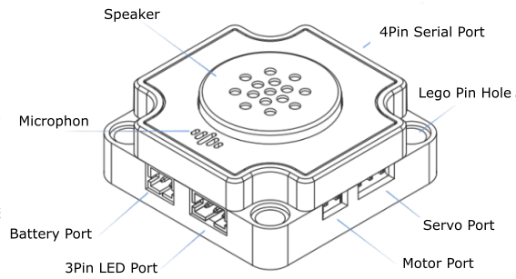
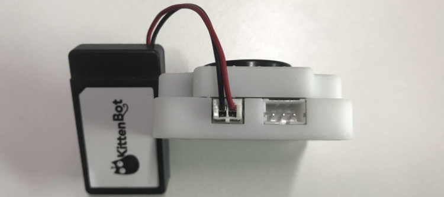
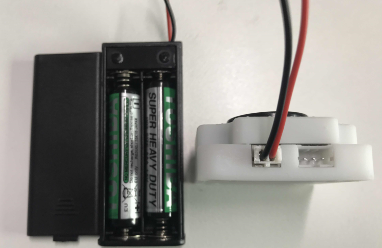
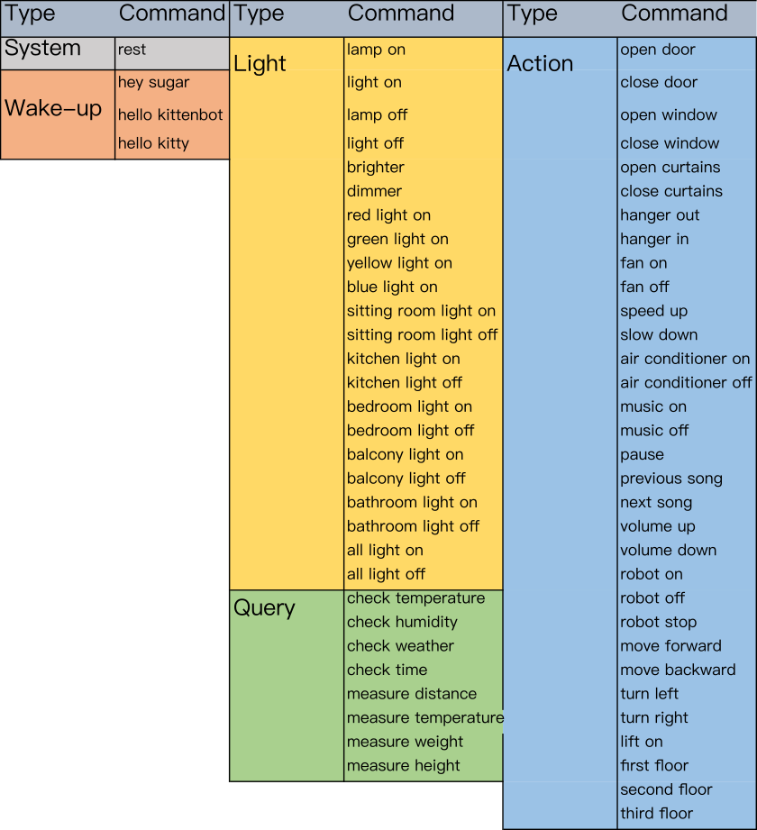
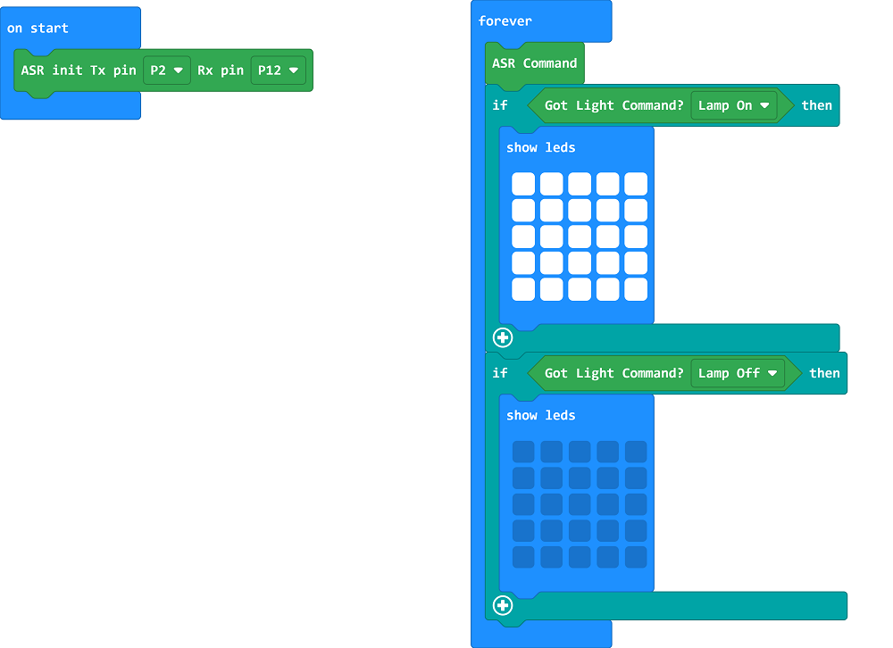
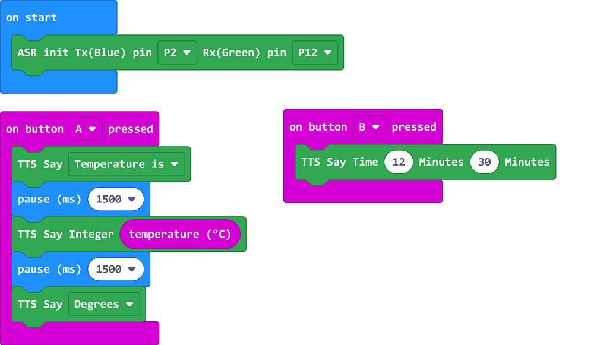
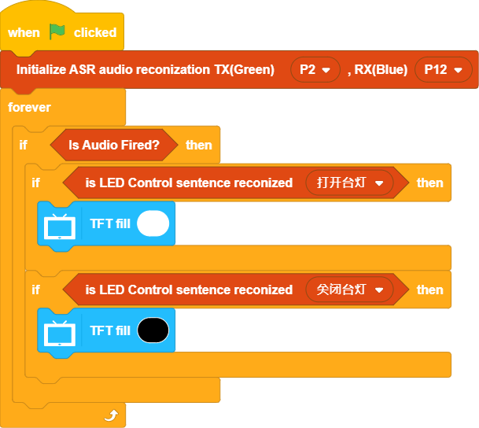
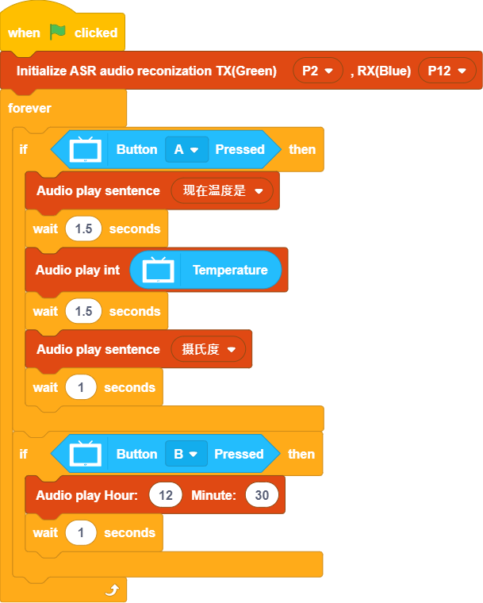

# Sugar ASR Voice Recognition Module

This is a Voice Recognition Module built for STEM education needs.

The module has an integrated microphone and speaker, creating an all-in-one voice recognition module. The module also has integrated LED, 3Pin Port, Servo Port and Motor Port, they can be controlled with the plug and play function of this module, meaning this module can be used as a standalone device without any programming.

Combining with Futureboard or Micro:bit coding, more voice commands can be used, unlocking the full functionality of the module including simple TTS functions.

The module is protected by a hard plastic casing to improve aesthetics as well as compatibility with plastic building bricks, allowing the module to be easily integrated into various use cases.

## Specifications

- Voltage: 3.3V~5V(5V is recommended)
- Current: 400mA~600mA
- Dimensions: 40x40x17mm
- Connection Port: 4Pin PH2.0 Serial Port
- Onboard resources: Speaker, Microphone, Red & Green LED, 3PIN Sugar LED Port, Motor Port, Servo Port, 3.7V Battery Connector
- Supported Micro Controller: Micro:bit, FutureBoard, Arduino

## Detail Breakdown

## Usage 1: Plug-and-Play Instructions

Th ASR Voice Recognition module can be used without any programming, simply connect a 3V battery box or 3.7V battery to use the module individually.

### Operations Manual

### 1. The module will read out the firmware version after powering on.

### 2. Wake up the module by saying one of these awake commands, the module replies 'Uh huh' when a wake-up command is heard.

Wake-up Commands:
1. Hey Sugar
2. Hello KittenBot
3. Hello Kitty

### 3. Say the following commands to control onboard resources, module replies 'OK' when a command is heard.

These Commands can be used to control onboard resources:

Light Controls:
1. Lamp On / Light On
   - Controls 3Pin Sugar Port
2. Lamp Off / Light Off
    - Controls 3Pin Sugar Port
3. Brighter
    - Controls 3Pin Sugar Port
4. Dimmer
    - Controls 3Pin Sugar Port
5. Red Light On
    - Turns on built-in red LED
6. Green Light On
    - Turns on built-in green LED
7. Yellow Light On
    - Turns on built-in yellow LED
8. All Light Off
   - Turns off all lights

Actions:
1. Open Door / Open Window / Open Curtains / Hanger Out
    - Controls Servo Port
2. Close Door / Close Window / Close Curtains / Hanger In
    -  Controls Servo Port
3. Fan On
    - Controls Motor Port
4. Fan Off
    - Controls Motor Port
5. Speed Up
    - Controls Motor Port
6. Slow Down
    - Controls Motor Port
    
### 4. After idling for 10 seconds, the module will go into sleep mode after saying "Uh oh", use a wake-up command to wake the module

## Usage 2: Programming

## Programming Instructions

### Microbit MakeCode

### Import ASR Extension

ASR Extension: https://github.com/kittenbothk/pxt-KittenASR

### [Importing Extensions](../../Makecode/powerBrickMC)

### Complete Commands List

### Voice Recognition Sample Program

[Sample Program](https://makecode.microbit.org/_F68D6iWFUMvi)

Program Instructions:

Say Lamp On or Lamp Off, the LEDs on the Micro:bit will light up correspondingly.

### TTS Sample Program

[Sample Program](https://makecode.microbit.org/_YzeeikHkPApz)

      Note: Adding a pause between TTS commands will prevent the speech overlapping.

Program Instructions:

Press A or B to make the module speak the corresponding text.

### FutureBoard KittenBlock Programming Instructions

### Voice Recognition Sample Program

Program Instructions:

Say Lamp On or Lamp Off, the screen will light up correspondingly.

### TTS Sample Program

Program Instructions:

Press A or B to make the module speak the corresponding text.