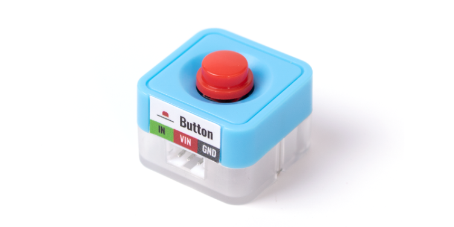
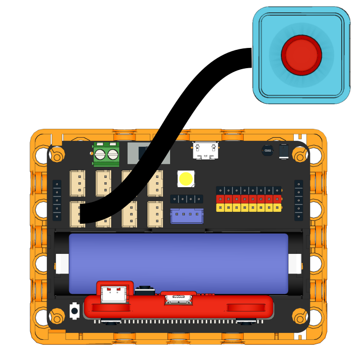
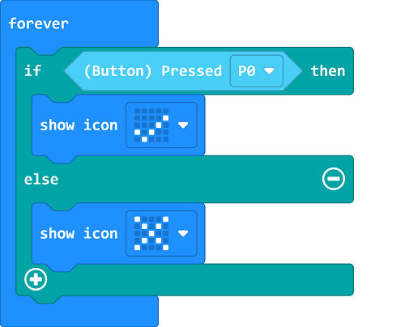
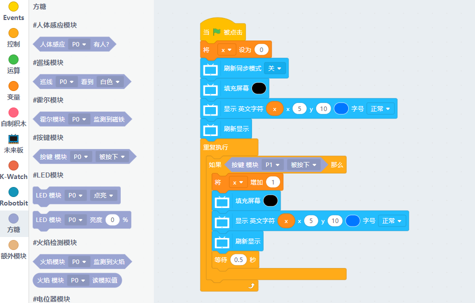

# Sugar Button Module

This is a button module in the Sugar series, the pin holes on the back allow compatibility with plastic building bricks.

## Product Specifications

- Dimensions: 24 x 24 x 19 mm
- Weight: 5.1g
- Type: Digital Signal

## Wiring

Connect the module to Robotbit Edu with a 3Pin cable.

## Programming Tutorial

## MakeCode Programming Tutorial

### Import Sugar Extension

### Search for sugar in the search bar (Kittenbot products has been verified by Microsoft)

### Extension URL

Sugar extension: https://github.com/KittenBot/pxt-sugar

### [Importing Extensions](../../Makecode/powerBrickMC)

[Sample Program](https://makecode.microbit.org/_HmsVHVfWzADt)

### Kittenblock Programming Tutorial

### MicroPython Programming Tutorial

    Button(pin)
    value()

- value(): Returns button status

### Sample Program

    from future import *
    from sugar import *
    import time
    
    #Available: P0, P1, P2, P3, P8, P13, P14, P15, P16
    button = Button('P1')
    
    x = 0
    screen.sync = 0
    screen.fill(0)
    screen.text(x, x = 5, y = 5)
    screen.refresh()
    while True:
      if button.value() == 0:
        x += 1
        screen.fill(0)
        screen.text(x, x = 5, y = 5)
        screen.refresh()
        sleep(0.5)