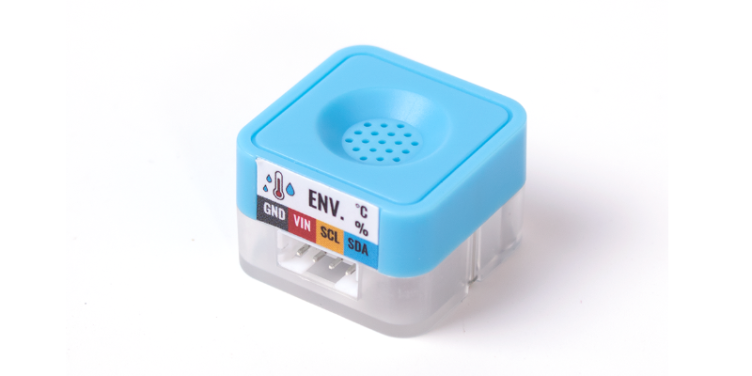
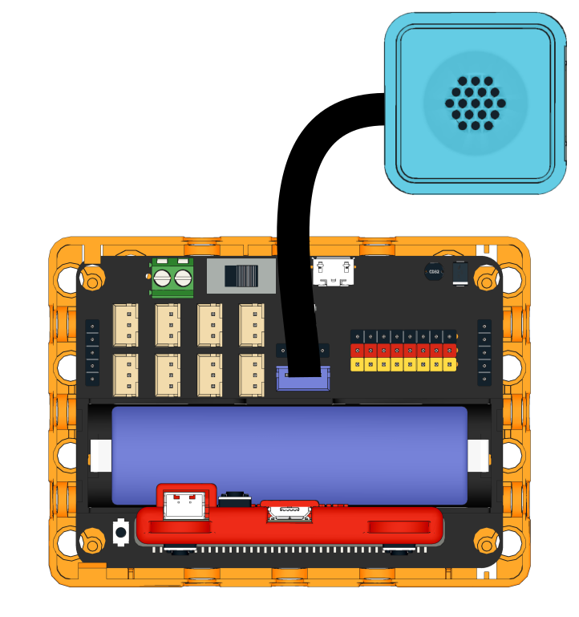
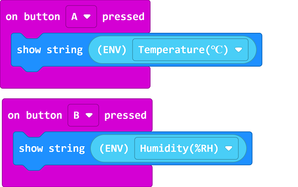
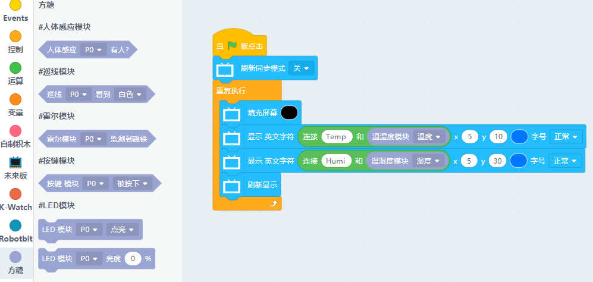

# Sugar Environment Sensor Module

This is an environment sensor in the Sugar series, it has a greater degree of accuracy compared to the common DHT11 module. The pin holes on the back allow compatibility with plastic building bricks.

## Product Specifications

- Dimensions: 24 x 24 x 23 mm
- Weight: 4.6g
- Type: I2C
- Temperature Range: -40~85°C
- Humidity Range: 0~100%

## Wiring

Use a 4Pin cable to connect the module to the 4Pin I2C Port on the Robotbit Edu.

## Programming Tutorial

## MakeCode Programming Tutorial

### Import Sugar Extension:

### Search for sugar in the search bar (Kittenbot products has been verified by Microsoft)

### Extension URL

Sugar extension: https://github.com/KittenBot/pxt-sugar

### [Importing Extensions](../../Makecode/powerBrickMC)

[Sample Program](https://makecode.microbit.org/_9fKT8i6wkbCX)

### Kittenblock Programming Tutorial

### MicroPython Programming Tutorial

    ENV()
    update()

- update(): Returns a list containing the temperature nad humidity.

Sample Program

    from future import *
    from sugar import *
    
    env = ENV()
    screen.sync = 0
    
    while True:
      screen.fill((0, 0, 0))
      screen.text(str("Temp ")+str(env.update()[0]), x = 5, y = 10)
      screen.text(str("Humi ")+str(env.update()[1]), x = 5, y = 30)
      screen.refresh()