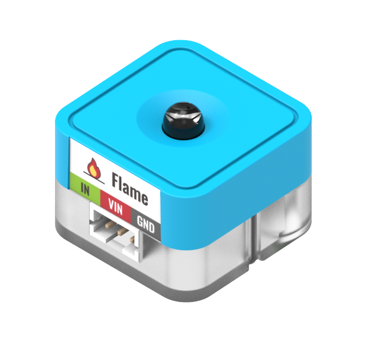

# Sugar Flame Sensor Module

This is a flame sensor in the Sugar sensor series. The pin holes on the back allow compatibility with plastic building blocks.

## Product Specifications

- Dimensions: 24 x 24 x 23 mm
- Weight: 6.7g
- Type: Analog Signal

## Wiring

Connect the module to Robotbit Edu with a 3Pin cable.

## Programming Tutorial

## MakeCode Programming Tutorial

### Import Sugar Extension

### Search for sugar in the search bar (Kittenbot products has been verified by Microsoft)

### Extension URL

Sugar extension: https://github.com/KittenBot/pxt-sugar

### [Importing Extensions](../../Makecode/powerBrickMC)

[Sample Program](https://makecode.microbit.org/_K7dMPuETch1M)

### Kittenblock Programming Tutorial

### MicroPython Programming Tutorial

    Flame(pin)
    value()

- value(): Returns the analog reading

Sample Program

    from future import *
    
    from sugar import *
    
    flame_P0 = Flame('P0')
    
    x = 0
    
    screen.sync = 0
    while True:
      screen.fill((0, 0, 0))
      screen.text(flame_P0.value(),5,10,2,(0, 119, 255))
      screen.refresh()

