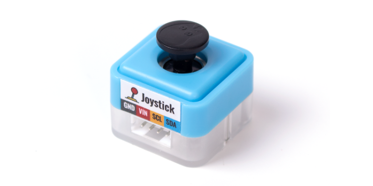
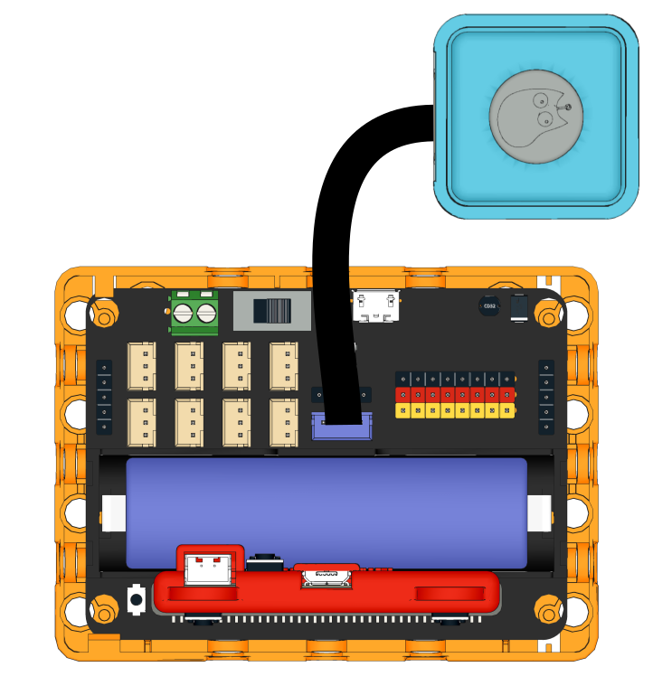
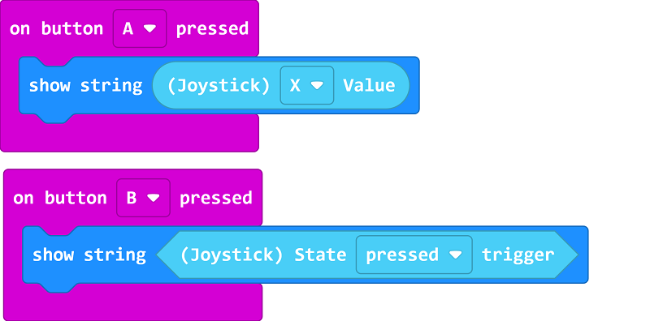

# Sugar Joystick Module

This is a joystick module in the Sugar sensor series, it can detect joystick positions and trigger status. The pin holes on the back allow compatibility with plastic building blocks.

##  Product Specifications

- Dimensions: 24 x 24 x 23 mm
- Weight: 7g
- Type: I2C
  - X: -255~255
  - Y: -255~255
  - 按鍵: 0~1

## Wiring

Use a 4Pin cable to connect the module to the 4Pin I2C Port on the Robotbit Edu.

## Programming Tutorial

## MakeCode Programming Tutorial

### Import Sugar Extension

### Search for sugar in the search bar (Kittenbot products has been verified by Microsoft)

### Extension URL

Sugar extension: https://github.com/KittenBot/pxt-sugar

### [Importing Extensions](../../Makecode/powerBrickMC)

[Sample Program](https://makecode.microbit.org/_CcJ5YTdF2795)

### Kittenblock Programming Tutorial

### MicroPython Programming Tutorial

    JoyStick()
    value(dir)
    state()

- dir: X/Y
- state(): Returns none when trigger is not pressed, returns pressed/left/right/up/down when pressed.

Sample Program

    from future import *
    from sugar import *
    
    joystick = JoyStick()
    screen.sync = 0
    
    while True:
        screen.fill((0, 0, 0))
        screen.text(str("X: ")+str(joystick.value('x')), x = 5, y = 10)
        screen.text(str("Y: ")+str(joystick.value('y')), x = 5, y = 30)
        if joystick.state() == 'pressed':
            screen.text("Pressed", x = 5, y = 50)
        screen.refresh()