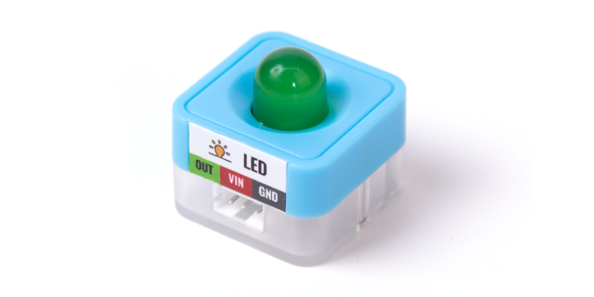
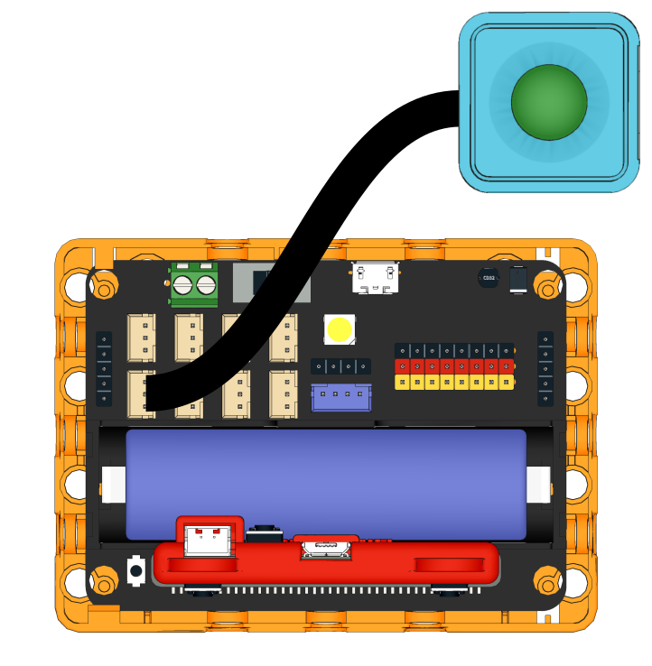
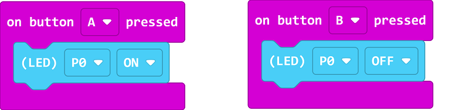
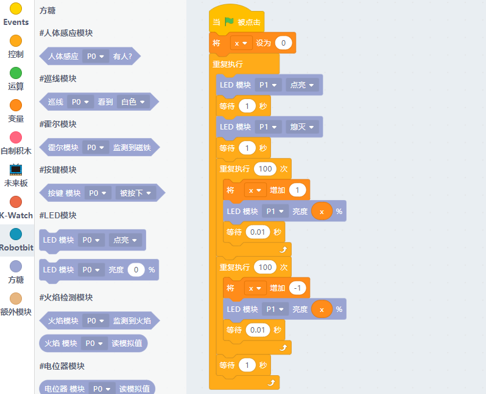

# Sugar LED Module

This is a LED module in the Sugar sensor series, the pin holes on the back allow compatibility with plastic buidling bricks.

## Product Specifications

- Dimension: 24 x 24 x 23 mm
- Weight: 5.6g
- Type: Digital

## Wiring

Use a 3Pin cable to connect the module to Robotbit Edu

## Programming Tutorial

## MakeCode Programming Tutorial

### Import Sugar Extension

### Search for sugar in the search bar (Kittenbot products has been verified by Microsoft)

### Extension URL

Sugar extension: https://github.com/KittenBot/pxt-sugar

### [Importing Extensions](../../Makecode/powerBrickMC)

[Sample Program](https://makecode.microbit.org/_eMMAjyh8PUFy)

### Kittenblock Programming Tutorial

### MicroPython Programming Tutorial

    LED(pin)
    state(sta)

- state(sta): 1 for on, 2 for off

Sample Program

    from sugar import *
    import time
    
    # P0、P1、P2、P3、P8、P13、P14、P15、P16
    led = LED('P1')

    led.state(1)
    time.sleep(1)
    led.state(0)
    time.sleep(1)

---

    brightness(val)

brightness(val): A percentage(0-100)

Sample Program

    from sugar import *
    import time

    # P0、P1、P2、P3、P8、P13、P14、P15、P16
    led = LED('P1')
    
    for i in range(100):
        led.brightness(i)
        time.sleep_ms(5) 
    for i in range(100, -1, -1):
        led.brightness(i)
        time.sleep_ms(5)