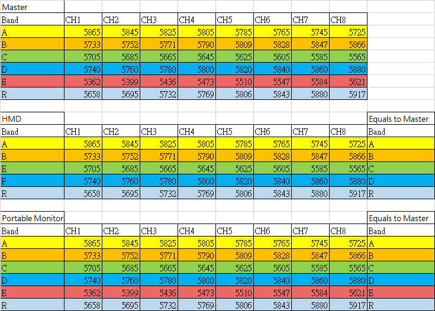

# Sugar Lens FPV Module

Sugar Lens is a FPV Camera Module in the Sugar series, it can be used with a receiver such as HMD, Portable Displays or USB Receivers to display the image in real time.

The module has built-in pin holes for plastic building bricks, enabling the module to be easily mounted to robots or remote control cars. The camera can be turned on or off via coding.

## Product Specifications

- Dimensions: 24 x 24 x 32 mm
- Weight: 11g
- Connection Port: 3Pin PH2.0
- Frequency Range: 5300MHz~5900MHz
- Channels: 8 channels in 5 bands
- Supported Receiver: Head Mounted Display Unit, Portable Displays, USB Receiver(for PC or Android)

## Product Showcase

## Wiring Diagram

Connect the module to a Robotbit Edu with a 3Pin cable.

## MakeCode Programming Tutorial

### Search Robotbit in the extension browser(Robotbit is approved by Microsoft)

### Extension Github page: https://github.com/kittenbothk/pxt-SensorPlus

### [Adding Extensions](../Makecode/powerBrickMC)

Use the Micro:bit buttons to turn or off the FPV camera.

[Sample Program](https://makecode.microbit.org/_JMrYPzC3uigE)

## Operation Instructions

On top of the Sugar Lens module, there is a small black button, that button can be used to access the camera's various settings.

### 1. During normal operation, the blue and red LEDs are lit continuously.

### 2. Long press the button to access the settings.

### 3. When the red light is flashing once, the camera is in the channel settings. The number of blue LED flashes corresponds to the channel, e.g., in the following example, the blue LED flashes 3 times, meaning the camera is now in channgel 3. Press the button to change the channel (from 1 to 8).

### 4. To go to the next setting, long press the button again, when the red LED flashes twice, the camera is now in the band settings. The number of blue LED flashes corresponds to the band, e.g., in the following example, the blue LED flashes once, meaning the camera is now in band A. Press the button to change the band (from A to E).

### 5. Long press the button again to go to the final setting. When the red LED flashes three times, the camera is now in the video flip settings. The number of blue LED flashes corresponds to the mode, e.g., in the following example, the blue LED flashes once, meaning the video is not flipped. Press the button to change between modes.

### 6. Long press the button again to exit the settings.

## Sugar Lens Receivers Details

Several types of receivers are available for Sugar Lens.

### 1. Head Mounted Display Unit

#### Product Specifications:

- Screen Size: 4.3 inches
- Resolution: 800*480
- Port: USB Charging
- Battery Life: ~2 hours
- Functions: Automatic Channel Searching, Screen Recording, Adjustable Brightness and Contrast, AV Out

### Usage Instructions

#### Install the antennas

#### Turn on the power

#### Press the SearCH button to begin searching for the strongest channel

#### Press the REC button to begin recording, press again to stop. (SD Card is required)

#### (Advanced) Switch to the next band by pressing the Band+ button

#### (Advanced) Switch to the next channel by pressing the CH+ button

#### (Advanced) Press the Menu button to go to the settings

### 2. Portable Monitor

#### Product Specifications

- Screen Size: 5 inches
- Resolution: 800*480
- Port: USB Charging Port
- Battery Life: ~2 hours
- Functions: Automatic Channel Searching, Adjustable Brightness and Contrast, AV Out

### Usage Instructions

#### Install the antenna

#### Turn on the power

#### Short press the menu key to start channel searching

#### (Advanced) Press the -(minus) key to change the band

#### (Advanced) Press the +(plus) key to change the channel

#### (Advanced) Long press the menu key to enter the settings

### 3. USB Receiver

#### Product Specifications

- Port: USB
- Function: Displays video feed on PC/Android phone

### Usage Instructions

#### Install the antennas

#### Long press any key to begin searching for channel

#### Press left or right key to fine tune the frequencies

### Using on PC

#### Connect the receiver to the PC using the USB cable

#### Search for "Camera"

#### If there is already a webcam, press this button to switch to the receiver

#### The video feed will be displayed in real time

### Using on Android Phone

#### Download APK

[Download APK(Right Click->Save as)](./images/fuav.apk)

#### Install the APK

#### Connect the receiver to the phone using the USB cable

#### Open Skydroid FPV app

## Sugar Lens and receivers channel reference table

Refer to this graph for the detailed channels and bands guide for the Sugar Lens and receiver.

There are some differences in how the HMD and the portable monitor marks the band, please be careful when using.

    Notice: Please note that Band E(Red) can only be viewed on the portable monitor.

