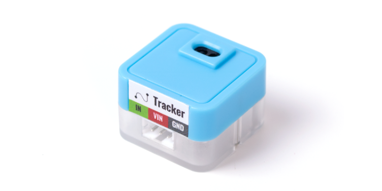
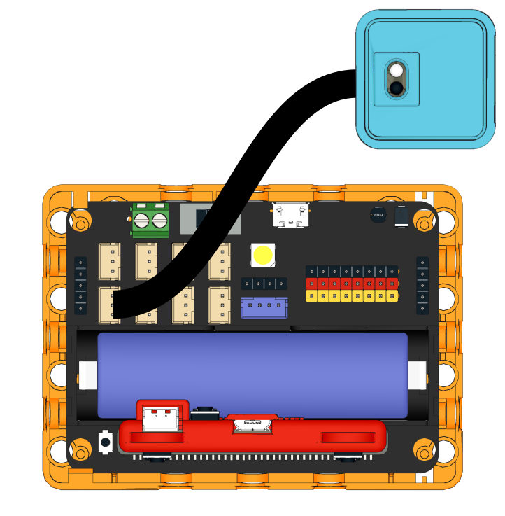
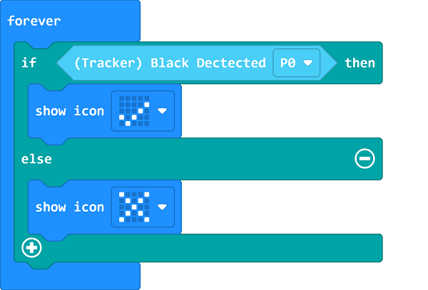
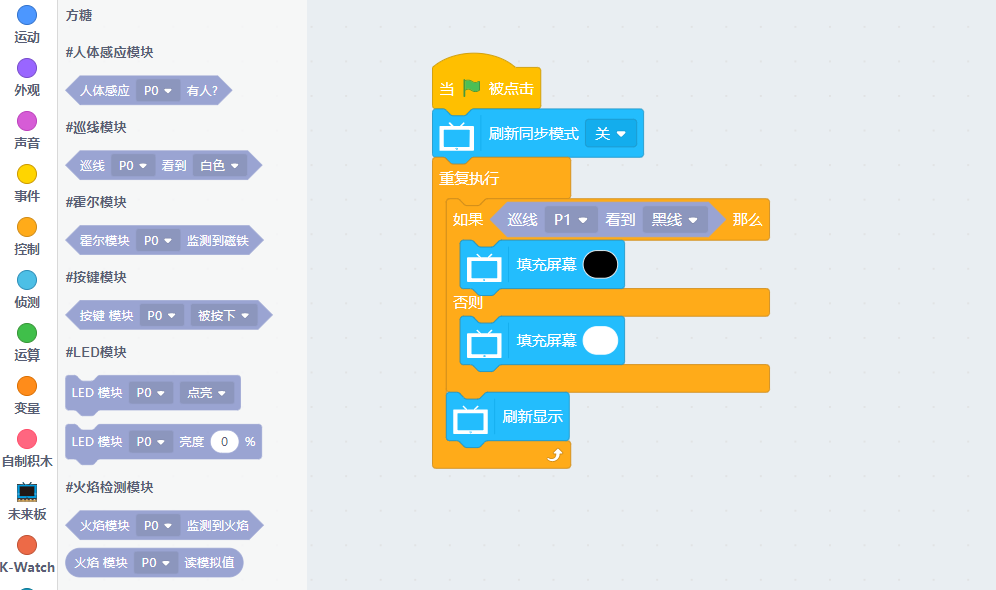

# Sugar Line Sensor Module

This is an infrared line sensor module in the Sugar sensor series. The holes on the back allow compatibility with plastic building bricks.

## Product Specifications

- Dimensions: 24 x 24 x 16 mm
- Weight: 5g
- Type: Digital
- Sensing Range: 1~14mm

## Wiring

Use a 3Pin cable to connect the module to Robotbit Edu.

## Programming Tutorial

## MakeCode Programming Tutorial

### Import Sugar Extension

### Search for sugar in the search bar (Kittenbot products has been verified by Microsoft)

### Extension URL

Sugar extension: https://github.com/KittenBot/pxt-sugar

### [Importing Extensions](../../Makecode/powerBrickMC)

[Sample Program](https://makecode.microbit.org/_achdEoCzK8DV)

### Kittenblock Programming Tutorial

### MicroPython Programming Tutorial

    Tracker(pin)
    value()

- value(): Returns Tracker Status

Sample Program

    from future import *
    from sugar import *
    
    tracker = Tracker('P1')
    
    screen.sync = 0
    while True:
        if tracker.value() == 1:
            screen.fill(0)
        else:
            screen.fill(255)
        screen.refresh()