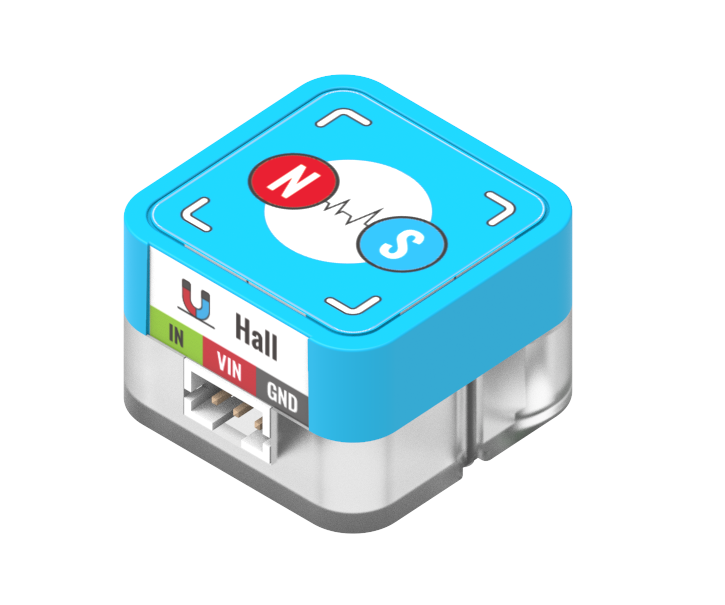
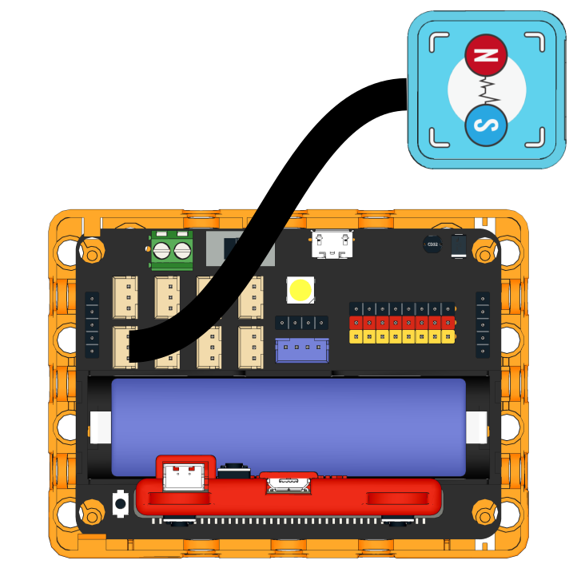
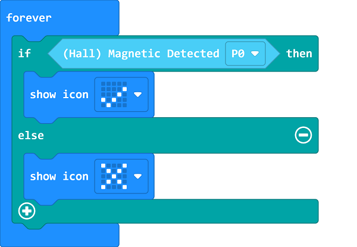
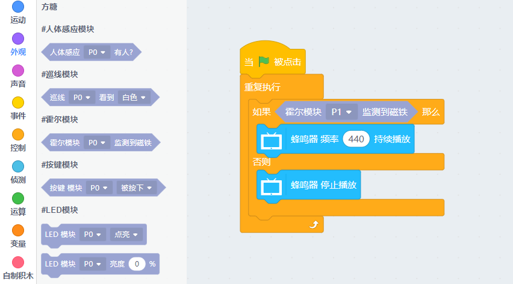

# Sugar Magnet Sensor Module

This is a magnet sensor module in the Sugar sensor series. The pin holes on the back allow compatibility with plastic building bricks.

## Product Specifications

- Dimension: 24 x 24 x 16 mm
- Weight: 4.7g
- Type: Digital

## Wiring

Use a 3Pin cable to connect the module to Robotbit Edu.

## Programming Tutorial

## MakeCode Programming Tutorial

### Import Sugar Extension

### Search for sugar in the search bar (Kittenbot products has been verified by Microsoft)

### Extension URL

Sugar extension: https://github.com/KittenBot/pxt-sugar

### [Importing Extensions](../../Makecode/powerBrickMC)

[Sample Program](https://makecode.microbit.org/_FkxHJCWpLTCk)

### Kittenblock Programming Tutorial

### MicroPython Programming Tutorial

    Hall(pin)
    value()

- value(): Returns sensor status

Sample Program

    from future import *
    from sugar import *
    
    hall = Hall('P1')
    
    while True:
        if hall.value():
            buzzer.tone(440, -1)
        else:
            buzzer.stop()