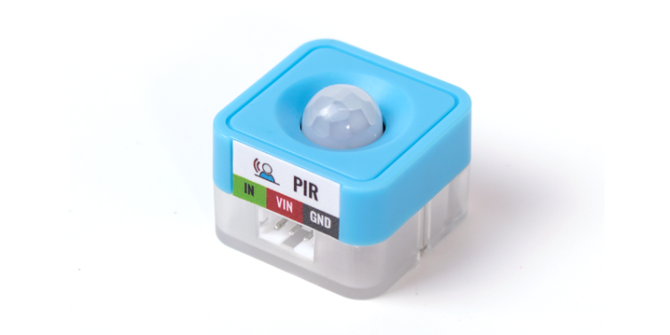
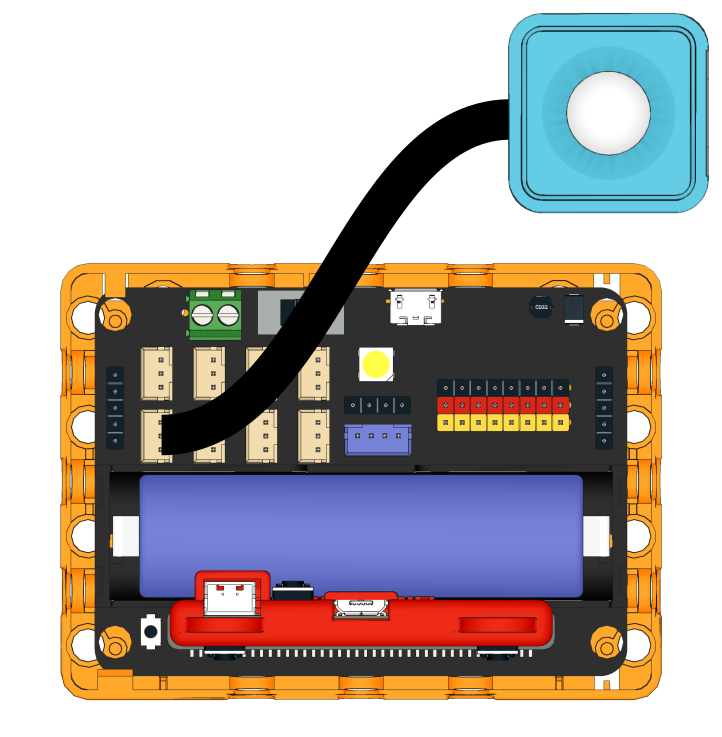
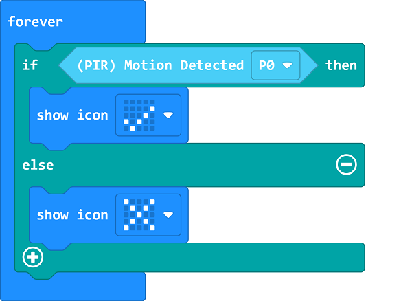
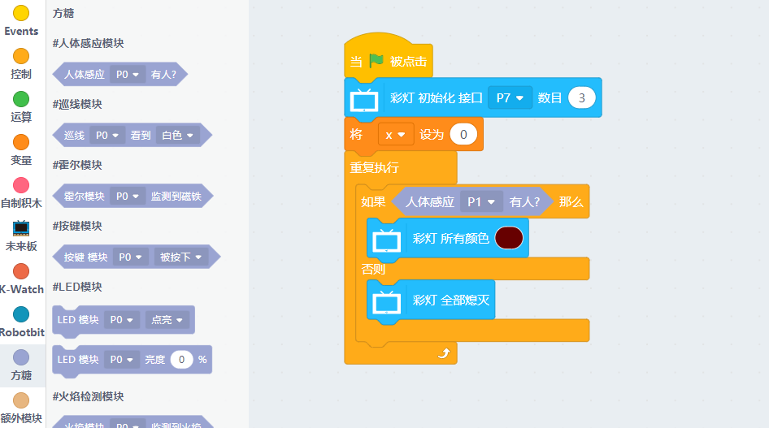

# Sugar PIR Sensor Module

This is a PIR sensor module in the Sugar sensor series. The pin holes on the back allow compatibility with plastic building bricks.

## Product Specifications

- Dimensions: 24 x 24 x 19 mm
- Weight: 5.6g
- Type: Digital
- Sensing Radius: 5m

## Wiring

Use a 3Pin cable to connect the module to Robotbit Edu.

## Programming Tutorial

## MakeCode Programming Tutorial

### Import Sugar Extension

### Search for sugar in the search bar (Kittenbot products has been verified by Microsoft)

### Extension URL

Sugar extension: https://github.com/KittenBot/pxt-sugar

### [Importing Extensions](../../Makecode/powerBrickMC)

[Sample Program](https://makecode.microbit.org/_D5XF7hEPf489)

### Kittenblock Programming Tutorial

### Micropython Programming Tutorial

    PIR(pin)
    value()

- value(): Returns sensor status

Sample Program

    from future import *
    from sugar import *
    
    pir = PIR('P1')
    
    neopix=NeoPixel("P7",3)
    
    while True:
        if pir.value():
            neopix.setColorAll((103, 0, 0))
        else:
            neopix.setColorAll((0,0,0))