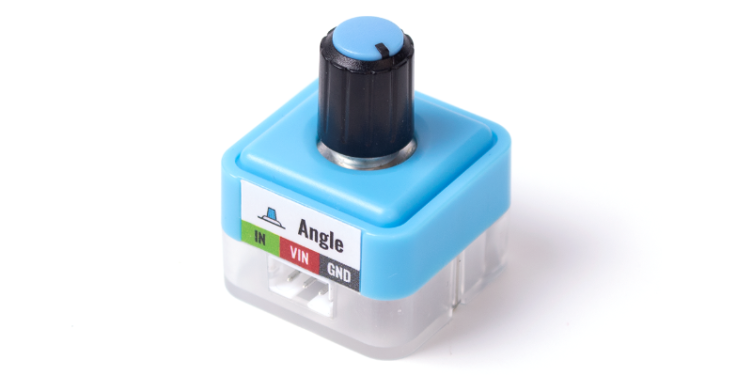
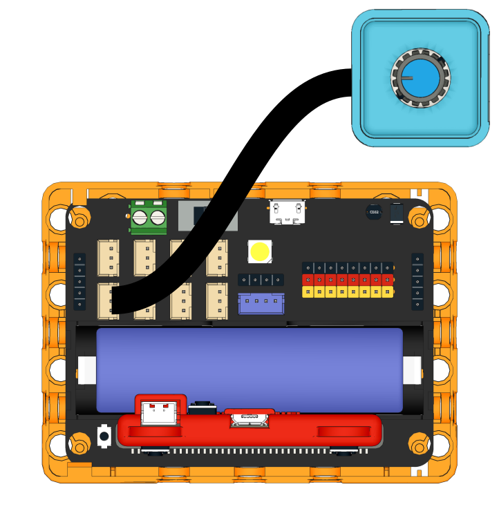
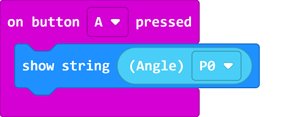
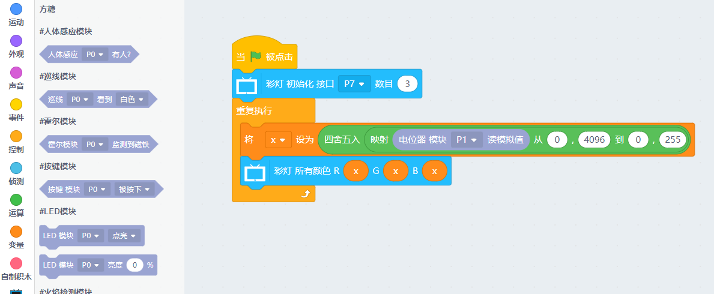

# Sugar Potentiometer Module

This is a potentiometer module in the Sugar sensor series, the pin holes on the back allow compatibility with plastic building bricks.

## Product Specifications: 

- Dimensions: 24 x 24 x 23 mm
- Weight: 6.7g
- Type: Analog
- Degree of Movement: 270

## Wiring

Use a 3Pin cable to connect the module to Robotbit Edu.

## Programming Tutorial

## MakeCode Programming Tutorial

### Import Sugar Extension

### Search for sugar in the search bar (Kittenbot products has been verified by Microsoft)

### Extension URL

Sugar extension: https://github.com/KittenBot/pxt-sugar

### [Importing Extensions](../../Makecode/powerBrickMC)

[Sample Program](https://makecode.microbit.org/_ACjLxwW4W3AW)

### Kittenblock Programming Tutorial

### MicroPython Programming Tutorial

    Rotation(pin)
    value()

- value(): Returns sensor value

Sample Program

    from future import *
    from sugar import *
    
    rotation = Rotation('P1')
    
    x = 0
    
    # 区间映射公式，不需要了解太详细，直接套用就可以了
    def valmap(x, in_min, in_max, out_min, out_max):
        return int((x-in_min) * (out_max-out_min) / (in_max-in_min) + out_min)
    
    neopix=NeoPixel("P7",3)
    while True:
        x = (round(valmap(rotation.value(), 0, 4096, 0, 255)))
        neopix.setColorAll((x,x,x))
