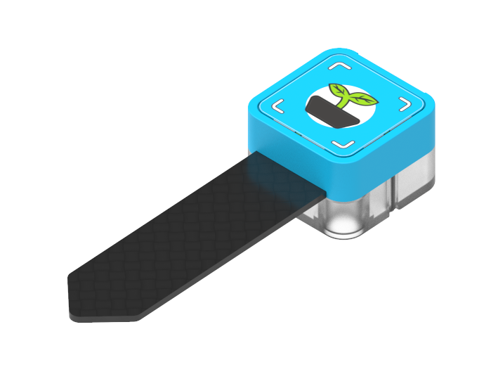
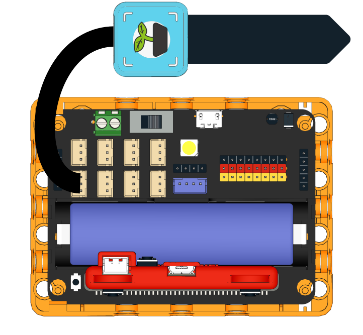
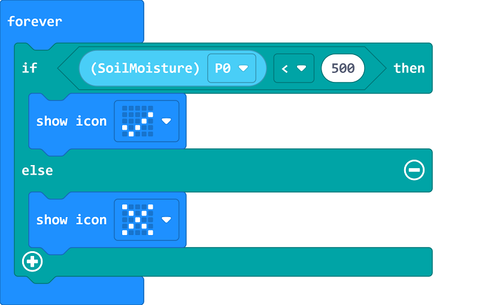
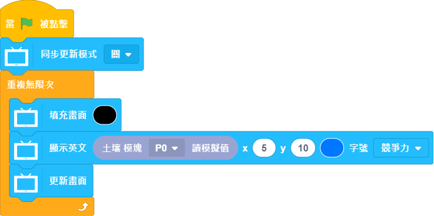

# Sugar Soil Moisture Sensor Module

This is a soil moisture sensor module in the Sugar sensor series, the pin holes on the back allow compatibility with plastic building bricks.

## Product Specifications

- Dimensions: 24 x 24 x 23 mm
- Weight: 6.7g
- Type: Analog

## Wiring 

Use a 3Pin cable to connect the module to Robotbit Edu.

## Programming Tutorial

## MakeCode Programming Tutorial

### Import Sugar Extension

### Search for sugar in the search bar (Kittenbot products has been verified by Microsoft)

### Extension URL

Sugar extension: https://github.com/KittenBot/pxt-sugar

### [Importing Extensions](../../Makecode/powerBrickMC)

[Sample Program](https://makecode.microbit.org/_PwHH488U7FVd)

### Kittenblock Programming Tutorial

### MicroPython Programming Tutorial

    Moisture(pin)
    value()

- value(): Returns sensor value

Sample Program

    from future import *
    
    from sugar import *
    
    moisture_P0 = Moisture('P0')
    
    x = 0
    
    screen.sync = 0
    while True:
      screen.fill((0, 0, 0))
      screen.text(moisture_P0.value(),5,10,2,(0, 119, 255))
      screen.refresh()

