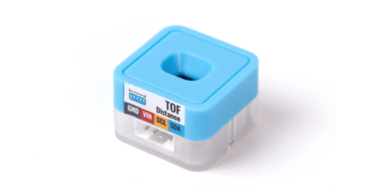
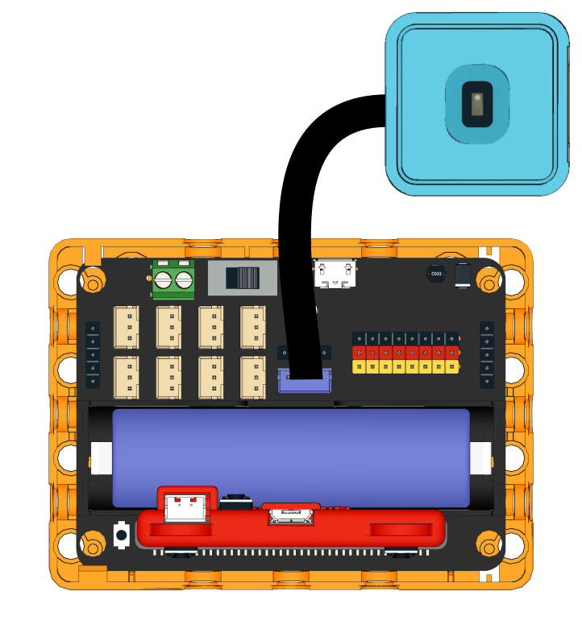
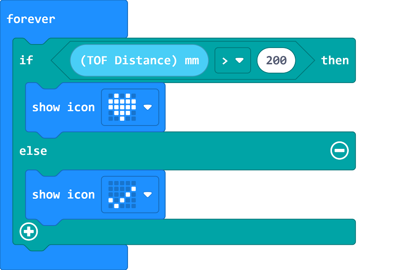
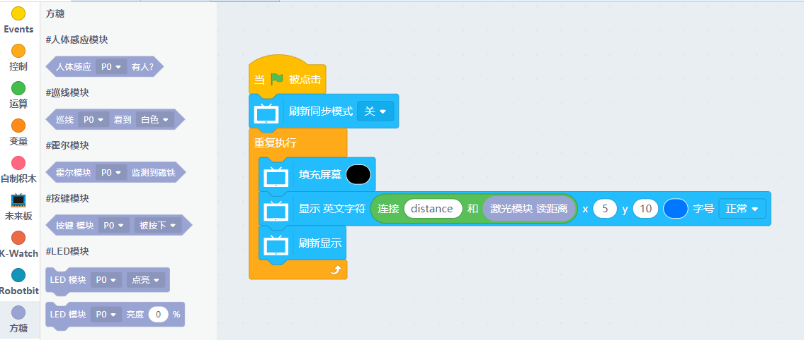

# Sugar TOF Distance Sensor

This is a TOF(Time of Flight) Distance sensor in the Sugar sensor series, the pin holes on the back allow compatibility with plastic building bricks.

## Product Specifications

- Dimensions: 24 x 24 x 23 mm
- Weight: 4.6g
- Type: I2C
- Sensing Range: 20~1200mm

## Wiring

Use a 4Pin cable to connect to the I2C Port on Robotbit Edu.

## Programming Tutorial

## MakeCode Programming Tutorial

### Import Sugar Extension

### Search for sugar in the search bar (Kittenbot products has been verified by Microsoft)

### Extension URL

Sugar extension: https://github.com/KittenBot/pxt-sugar

### [Importing Extensions](../../Makecode/powerBrickMC)

[Sample Program](https://makecode.microbit.org/_2mxPAzH4FcqV)

### Kittenblock Programming Tutorial

### MicroPython Programming Tutorial
  
    TOFDistance()
    value()

- value(): Returns distance(20-1200mm)

Sample Program

    from future import *
    from sugar import *
    
    distance = TOFDistance()
    screen.sync = 0
    
    while True:
        screen.fill((0, 0, 0))
        screen.text(str("distance ")+str(distance.value()),x = 5, y = 10)
        screen.refresh()