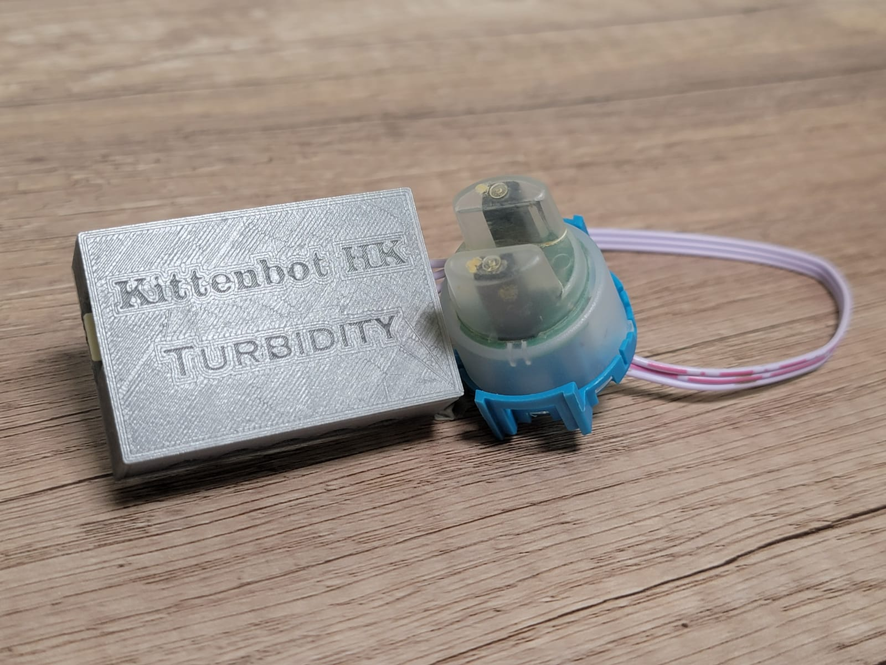
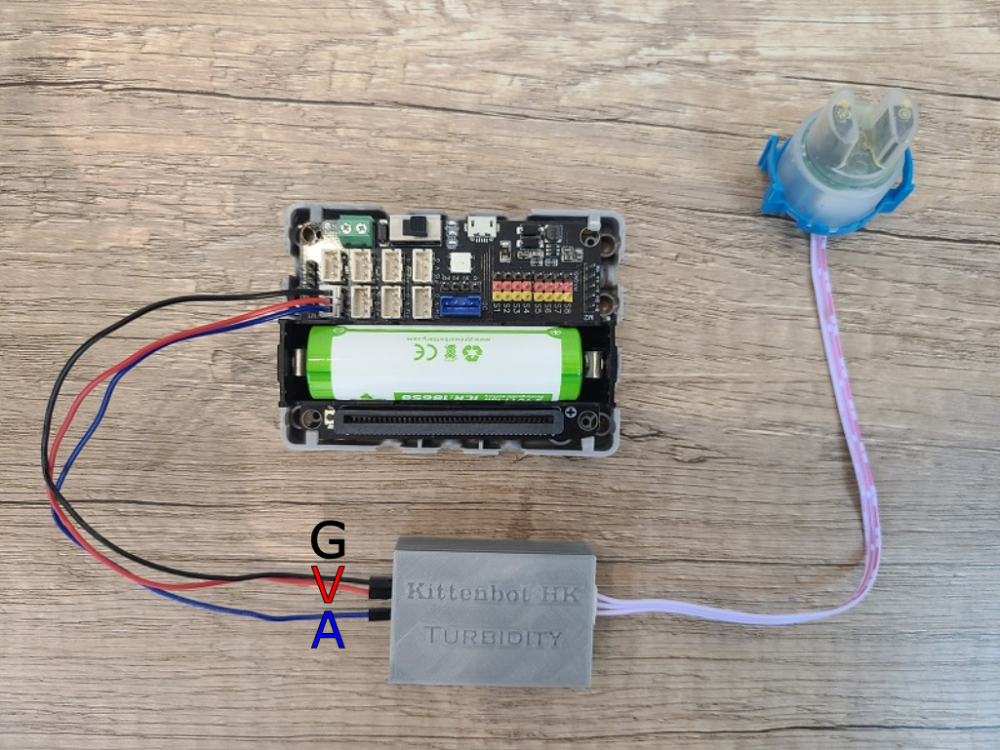
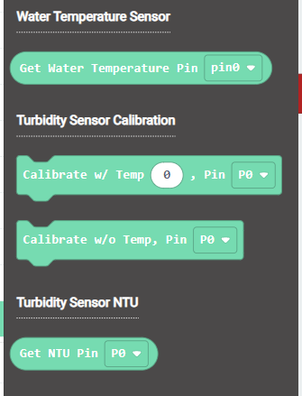
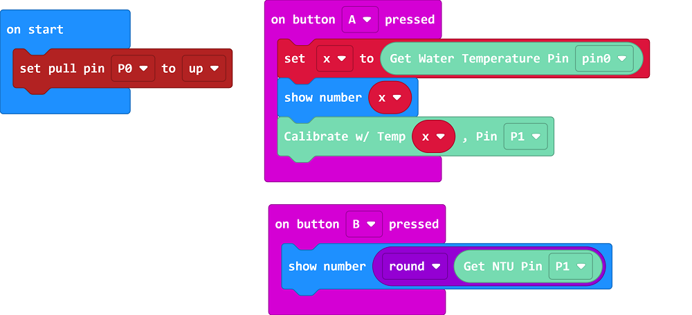
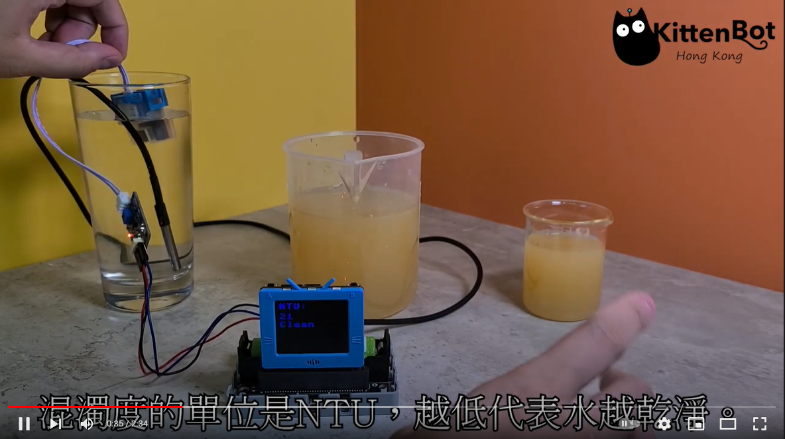
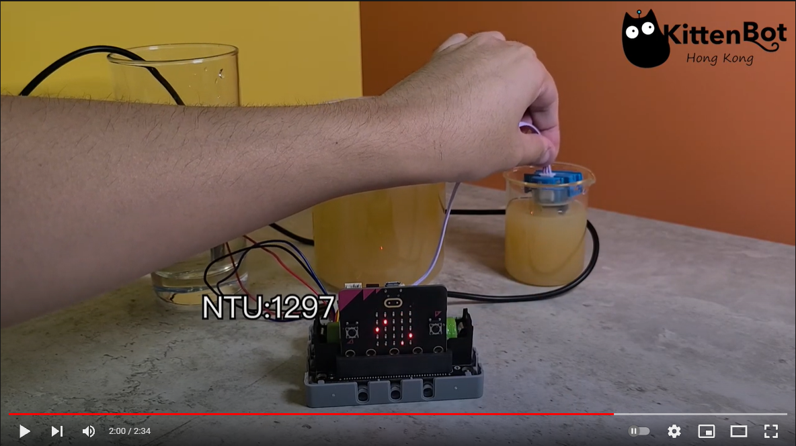

# Water Turbidity Sensor

This water turbidity sensor can measure water quality by measuring turbidity.

## Product Specifications

- Voltage: 3V~5V
- Port: 3Pin PH2.0
- Temperature range: 5°C~85°C
- Weight: 30g

## Wiring

Connect the sensor to the GPIO port of Robotbit Edu.

    Water Turbidity Sensor is recommended to use with Water Temperature Sensor, the figure below omits the water temperature sensor for clarity.

## MakeCode Programming Tutorial

### Import MakeCode Extension for Turbidity Sensor: https://github.com/kittenbothk/pxt-KittenTurbidity

### [Importing Extensions](../Makecode/powerBrickMC)

### Programming Blocks for Turbidity Sensor:

### Sample Program

    Using a water temperature sensor to calibrate the turbidity sensor will result in more accurate readings.
    Caution: The Turbidity Sensor is not waterproof, do not immerse the entire sensor into the water.

[Sample Program](https://makecode.microbit.org/_WjmH6zahVTUe)

## Extension Version and Updates

There may be updates to extensions periodically, please refer to the following link to update/downgrade your extension.

[Makecode Extension Update](../../../Makecode/makecode_extensionUpdate)

## Demonstration Video

### FutureBoard

### Micro:bit

