# All in 1 Water Pump

All in 1 Water Pump (HKBM8015A)

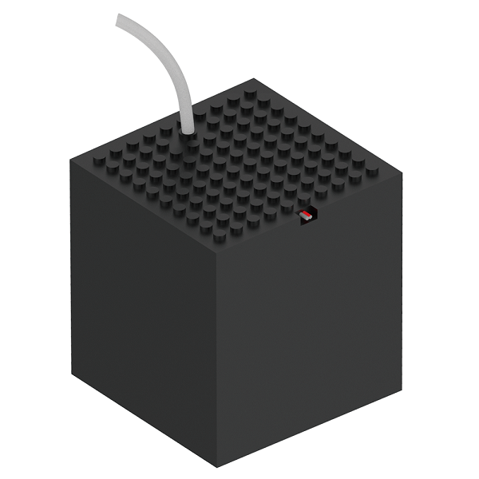

This is a submersible pump and water tank combo, it is suitable for smart irrigation or hand washer projects.

## Specifications

- Voltage: 3.3V~6V
- Dimensions: 86.5X86.5X98mm
- Current: 120mA(3.3V)
- Max flow rate: 80L/h
- Hydraulic head: 0.35M
- Weight: 140g
- Tube lengrh: 60cm
- Interface: 2Pin Dupont Cable

## Wiring Diagram

Connect the pump module to the motor pins on the Robotbit or Armourbit.

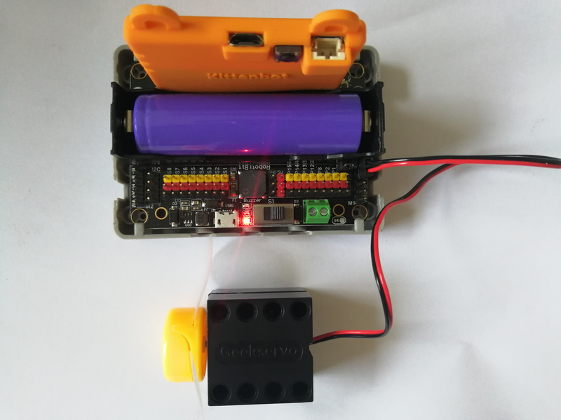

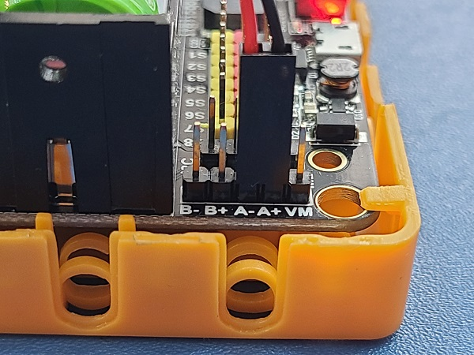

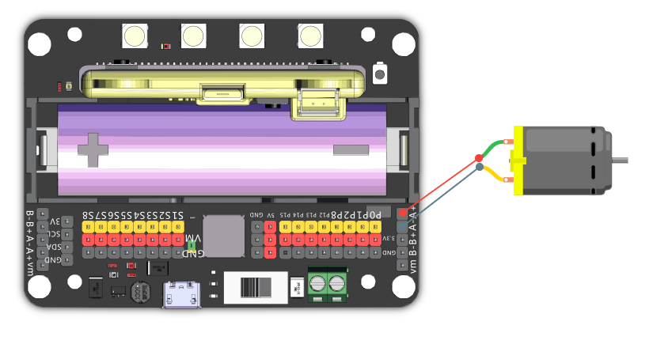

    Reversing the connection is ok.

## MakeCode Coding Tutorial

### This module can be used with Microbit and Meowbit.

### ArmourBit

---

### Load Powerbrick extension: https://github.com/KittenBot/pxt-powerbrick

### [Loading Extensions](../Makecode/powerBrickMC)

### Motor blocks:

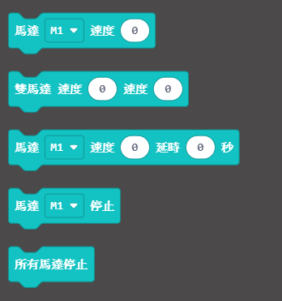

## Controlling the motor:

[Sample Code Download](https://bit.ly/PowerbrickM11_01Hex)

[Sample Code Link](https://makecode.microbit.org/_RYHivyayYL4q)

### Robotbit

---

### Load Robotbit extension: https://github.com/KittenBot/pxt-robotbit

### [How to load extension?](../Makecode/powerBrickMC)

### Motor blocks:

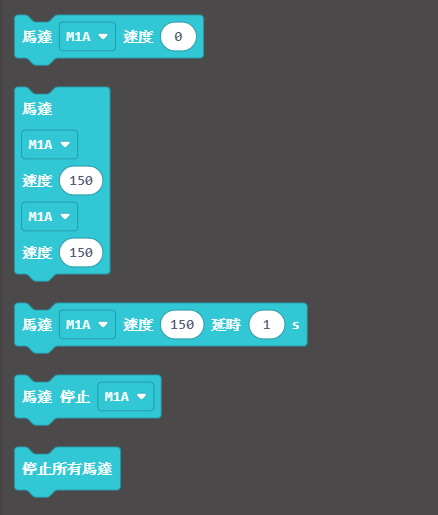

### Controlling the motor

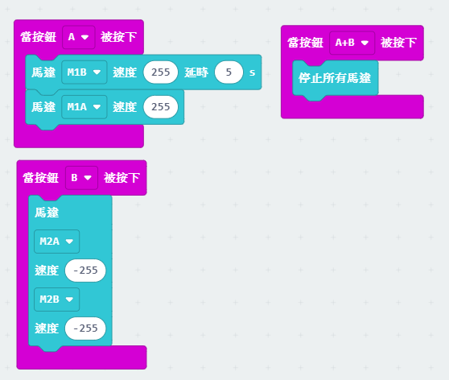

[Sample Code Link](https://makecode.microbit.org/_33HMywgx9H97q)

### Meowbit:

### Load Robotbit expansion: https://github.com/KittenBot/meow-robotbit

### Motor Blocks:

## Controlling the motor

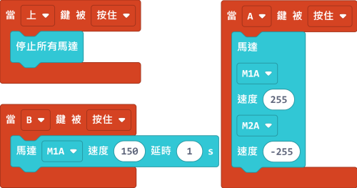

[Sample Code Link](https://makecode.com/_2z0C8v6XAC5y)

## Extension Version and Updates

There may be updates to extensions periodically, please refer to the following link to update/downgrade your extension.

[Makecode Extension Update](../Makecode/makecode_extensionUpdate)

## KittenBlock Coding Tutorial

### Armourbit

---

### Load Powerbrick Extension

Select Powerbrick from the hardware column.

### Motor blocks

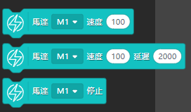

### Controlling the motor

### Robotbit

---

### Load Robotbit Extension

Select Micro:bit from the hardware column.

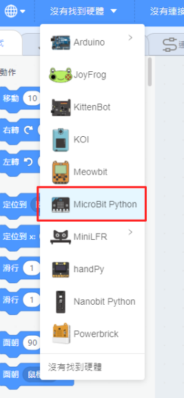

### Motor blocks

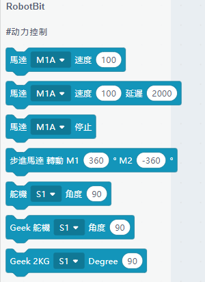

### Controlling the motor

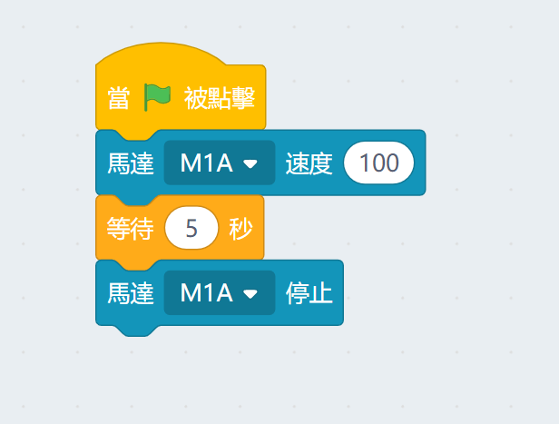

## FAQ

1：Why is there no reaction when I click the blocks?

Make sure you have connected the Micro:bit correctly and flash the firmware again.

