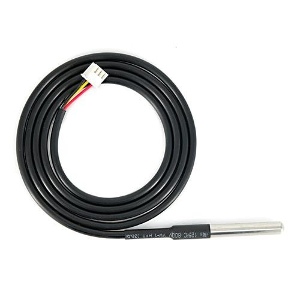
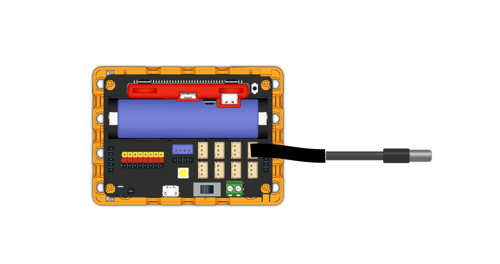
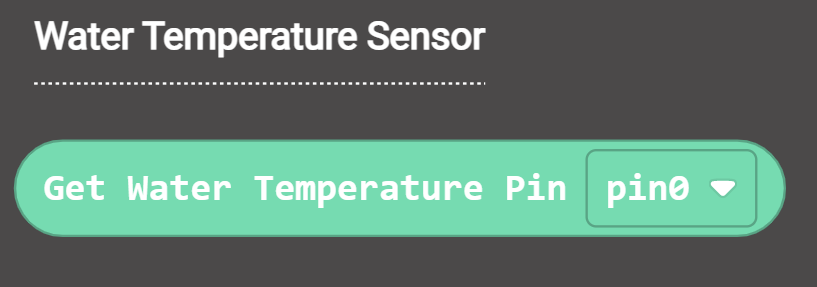
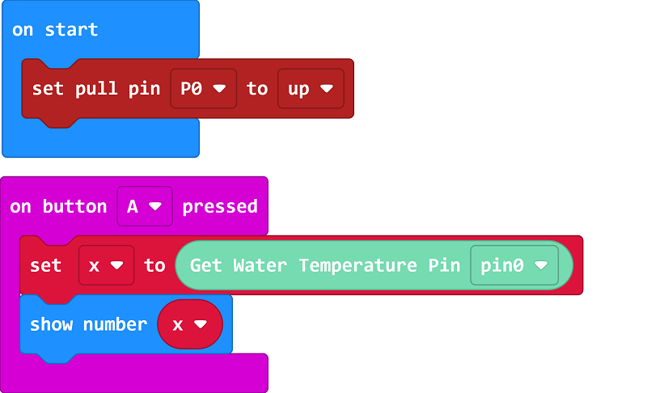
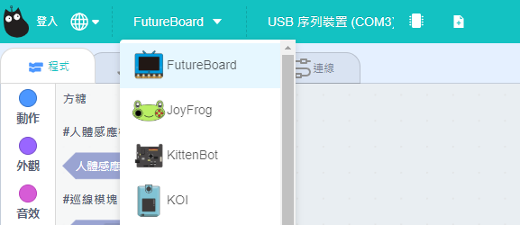
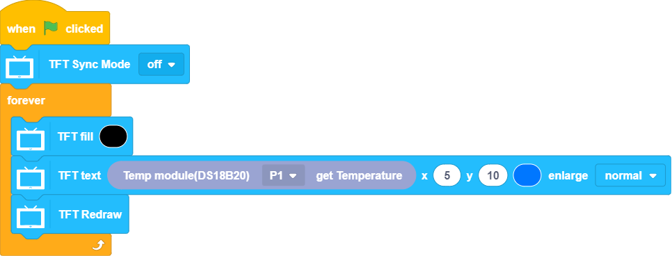

# Water Temperature Sensor

This water temperature sensor can measure the temperature of liquids.

## Product Specification

- Voltage: 3V~5V
- Connector: 3Pin PH2.0
- Measuring Range: -55°C~125°C

## Wiring

Connect the module to the GPIO port of Robotbit Edu.

## MakeCode Programming Tutorial

### Import Turbidity Sensor Extension for MakeCode: https://github.com/kittenbothk/pxt-KittenTurbidity

### [Importing Extensions](../Makecode/powerBrickMC)

### Programming Blocks for Water Temperature Sensor

### Sample Program

    The Water Temperature Sensor pin resistance need to be set to high.

[Sample Program](https://makecode.microbit.org/_CA4EcbK879x2)

## Extension Version and Updates

There may be updates to extensions periodically, please refer to the following link to update/downgrade your extension.

[Makecode Extension Update](../Makecode/makecode_extensionUpdate)

## FutureBoard KittenBlock Programming Tutorial

### Select FutureBoard from the Hardware Menu

### Blocks for Water Temperature Sensor

### Water Temperature Sensor Programming

