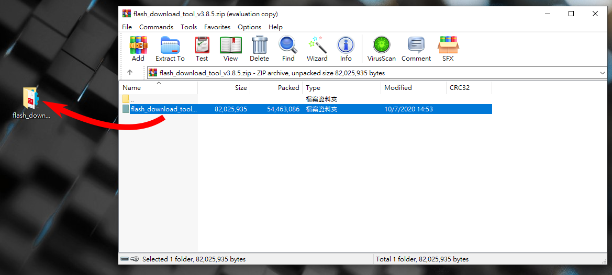
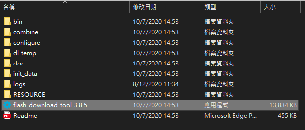
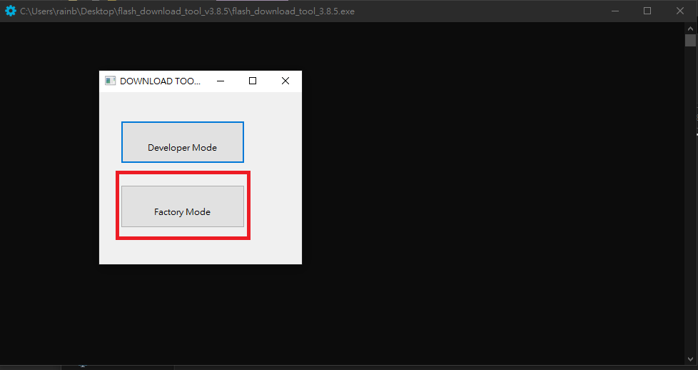
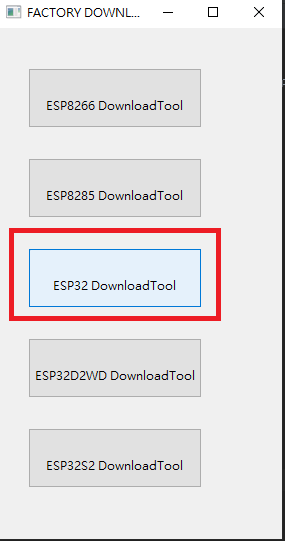
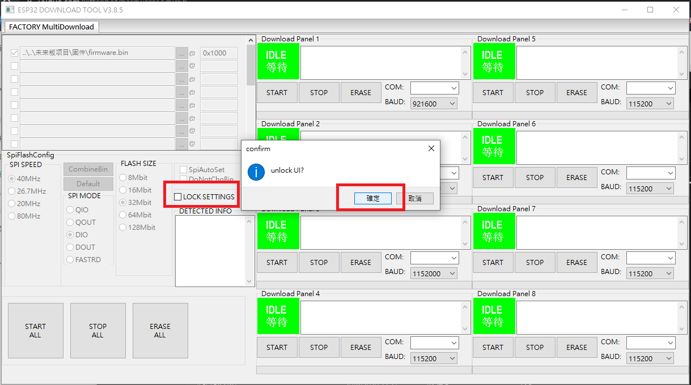
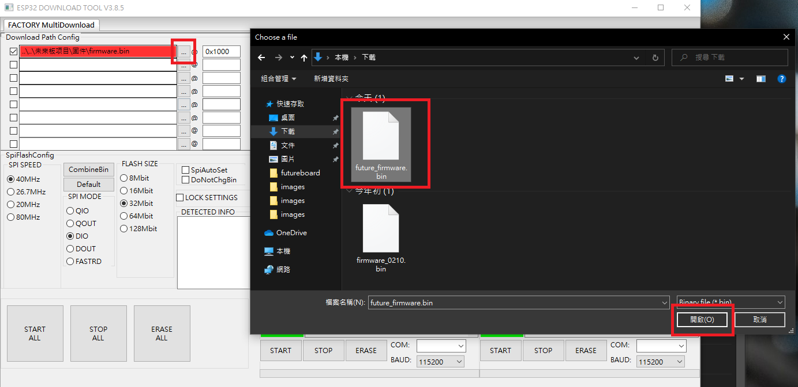
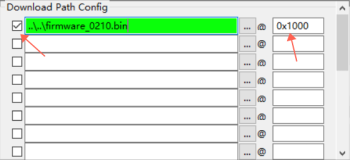
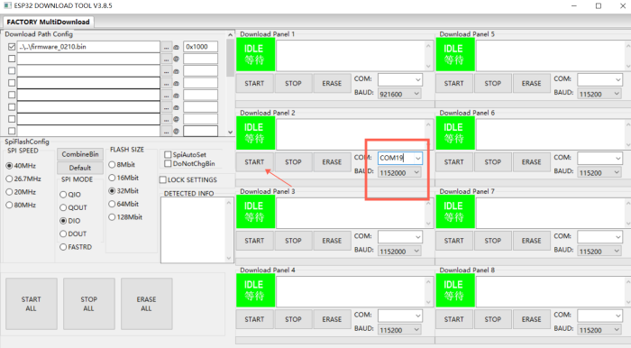
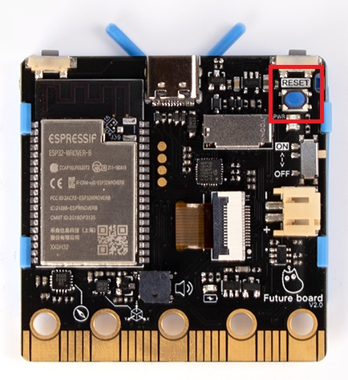

# Firmware Updates

Kittenbot may periodically release firmware updates for the Futureboard to improve functionality and stability.

## Updating the firmware of Futureboard

Download the firmware flashing tool.

[Flashing Tool Download](https://drive.google.com/file/d/1_M4EzolaJWpYXts_FwUIqH8pZWqy-fye/view?usp=sharing)

Unzip the file.

Open flash_download_tool_3.8.5.exe.

Choose Factory Mode.

Select ESP32 Download Tool.

Unlock the UI.

Select the firmware file ending with .bin.

Make sure the memory address is 0x1000 and the check box is ticked.

Select the port where the Futureboard is connected and use a baud rate of 1152000, press start and wait.

Press the reset switch on the back of the Futureboard.

If the Futureboard says a reset is required, please refer to [Futureboard Reset](./reset.md).