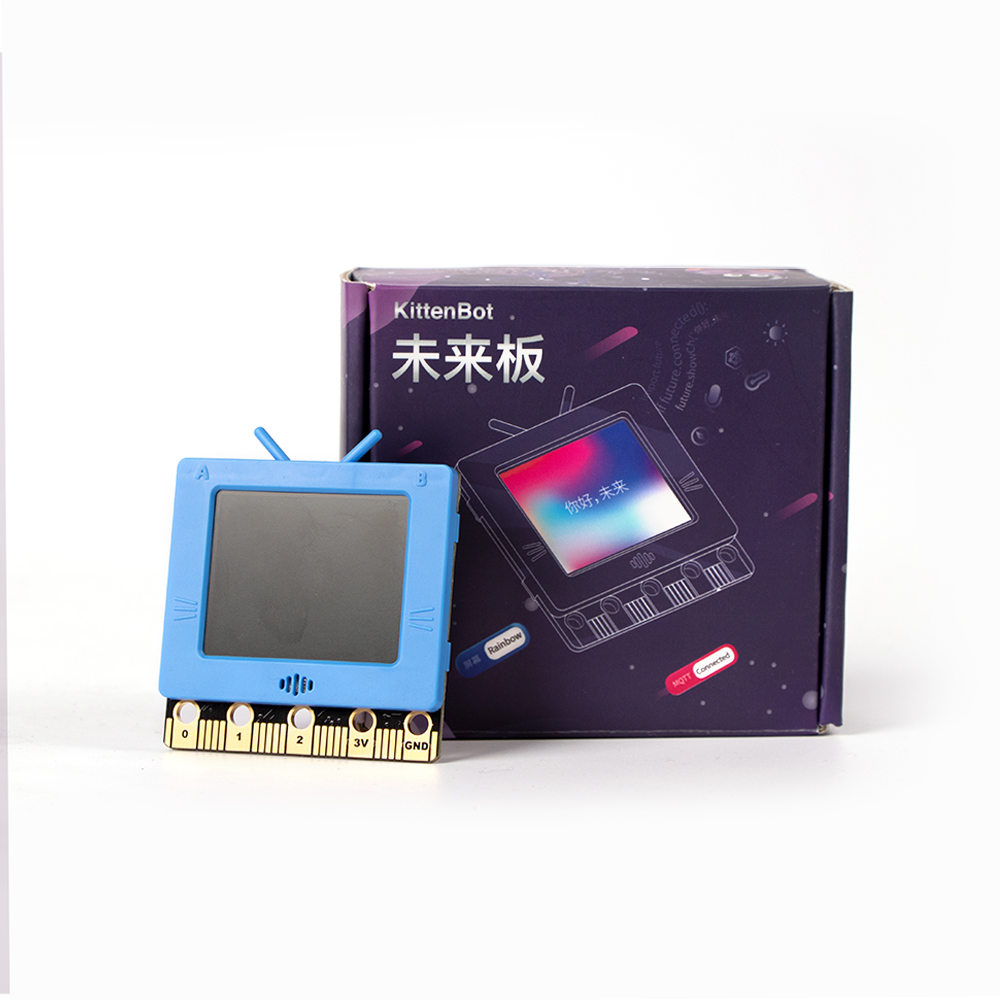
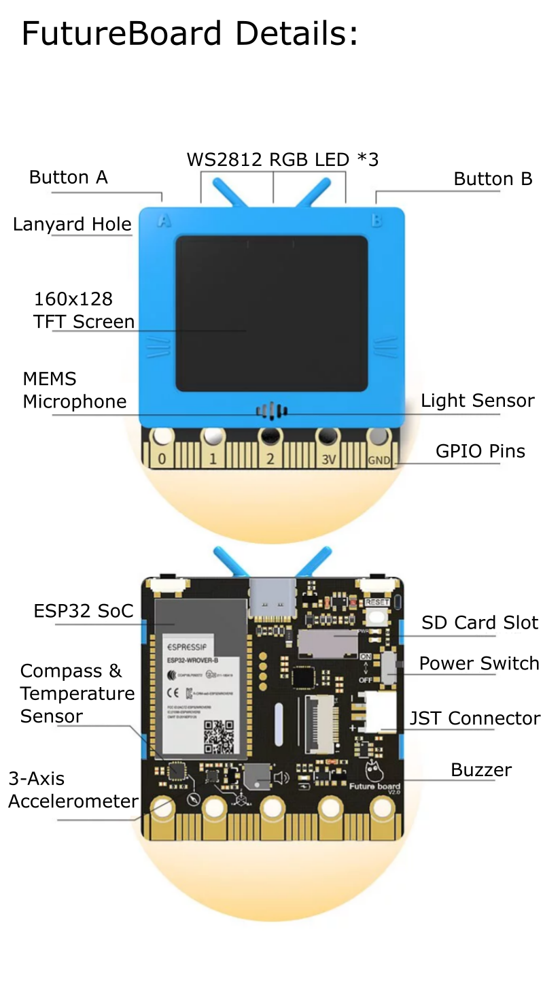
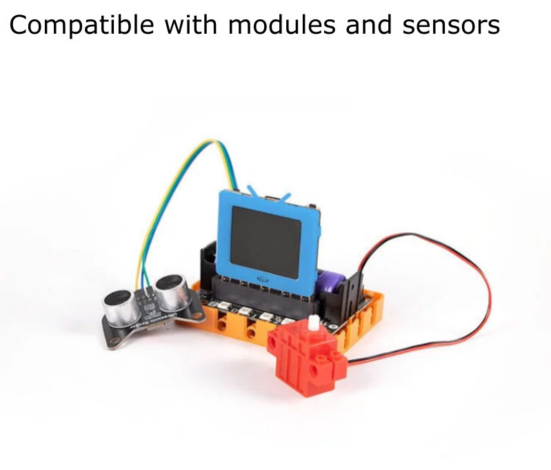
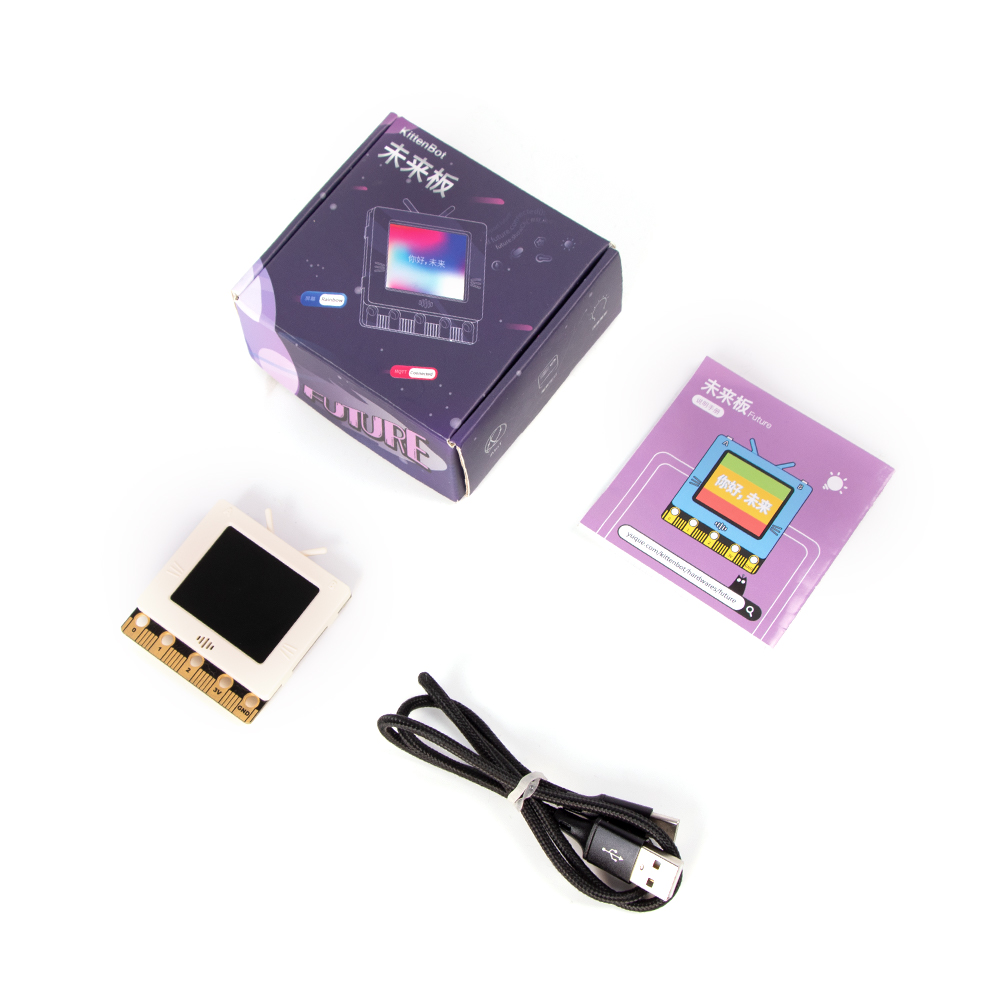
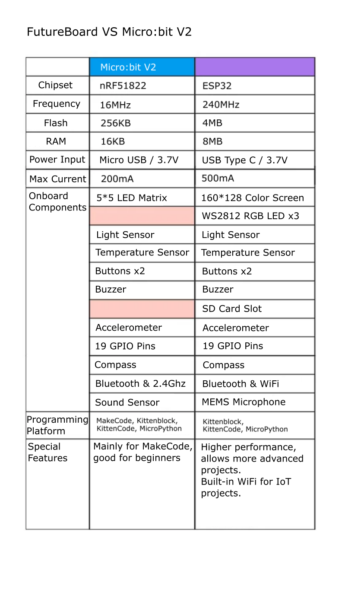
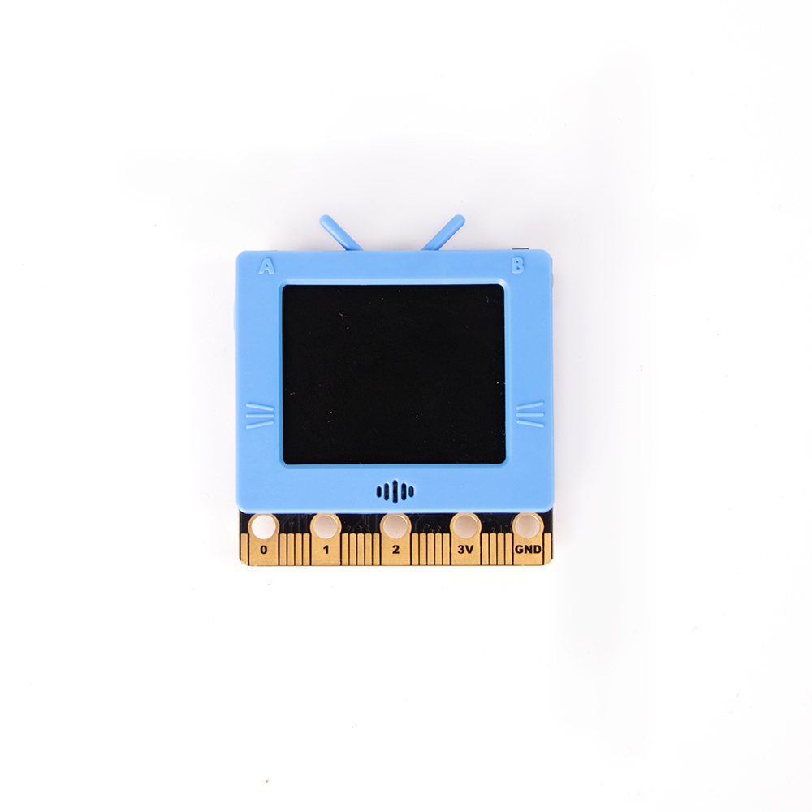
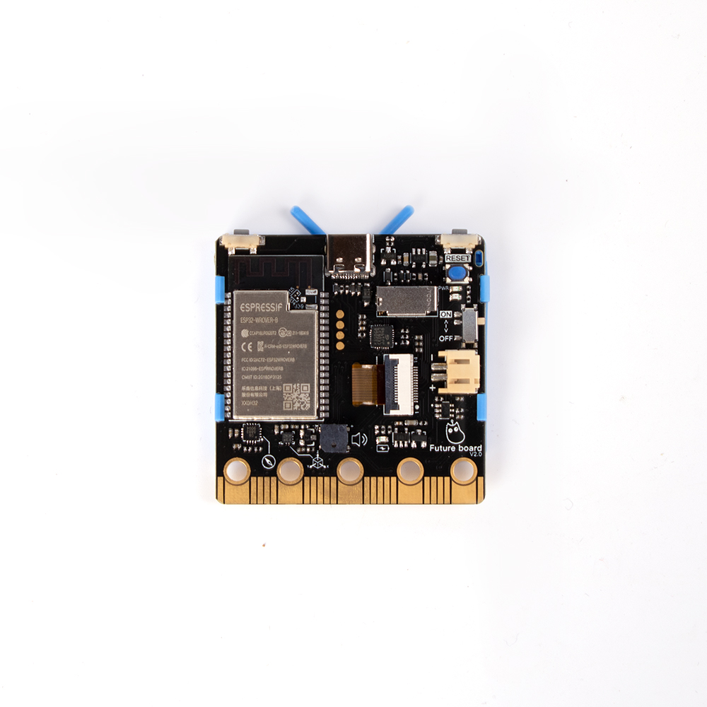
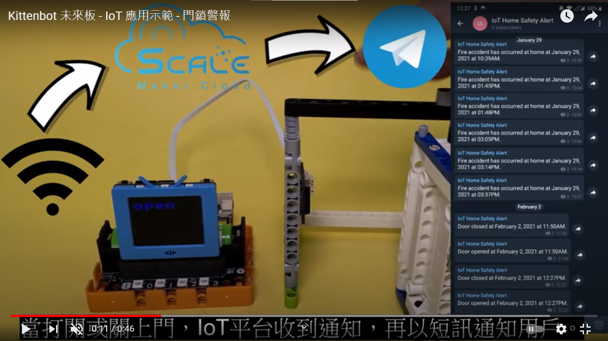

# FutureBoard Details

As the name suggests, FutureBoard is a main control board designed for STEM education in the future. It has many built-in sensors just like the Micro:bit, but unlike the Micro:bit, FutureBoard features a TFT screen capable of displaying full colors. This allows students to display information in real-time and to unlock even more potential for more interesting coding projects.

As STEM education shifts its focus towards AI and IoT, FutureBoard is equipped to satisfy these requirements.  Based on the ESP32 chipset, FutureBoard is able to connect to the Wifi for IoT projects, catering to the trend for the current STEM Education development. FutureBoard retains the design for the edge connectors from the BBC Micro:bit, allowing for easy expandability and compatibility with existing sensors and modules, bridging the past and the future. 

FutureBoard will be a great companion for STEM education.

## Suitable Users

- Schools and Training Institutes
- Makers and anyone interested in coding

## Special Features

- Supports graphical coding, easier for beginners to learn.
- Supports MicroPython coding, allowing for more advanced learning.
- Has a full color TFT screen.
- Supports Voice Recognition of Cantonese, English or Mandarin, making AI more accessible.
- The speaker and RGB light strip can add sounds and lights to your projects.
- The specially designed FutureOS GUI allows storing and choosing of Python files to run.
- Built-in Wifi means IoT projects are easy to do.
- The ABS plastic shell is aesthetically pleasing and can protect the components.
- The edge connectors are identical with the Micro:bit, allowing schools to use the existing modules.
- Built-in wireless 2.4GHz radio allows communication between devices.
- Built-in charging circuit and the 3.7 Lithium Battery allows the FutureBoard to run by itself.
- Equipped with a USB Type C connector for ease of connection.
- Pocket sized and comes with lanyard hole for portability.
- Supports wireless flashing of programs.

## Specifications

- Size: 51.6x51.6x11mm
- Weight: 22.6g
- Chipset: EPS32-WROVER-B
- Frequency: 240MHz
- Flash Memory: 4M
- RAM: 8M
- Connectors: USB Type C / 3.7v JST
- Card Slot: MicroSD (Class 10 or above recommended)
- Screen Type: TFT Full Color
- Resolution: 160x128
- Screen Size: 1.8 inches
- GPIO: 19Pin

## Onboard Components

- 160x128 TFT Screen
- 2 Programmable Buttons
- Buzzer
- Ambient Light Sensor
- Temperature Sensor
- Magnetic Sensor
- I2S Microphone
- 3-Axis Accelerometer
- 19 GPIO Pins
- 3 RGB LEDs
- WiFi and Bluetooth Connectivity
- USB Type C Port
- JST Battery Port
- SD Card Slot

## Package Contents

- Futureboard with 128MB SD Card
- USB Type C Cable
- Lanyard

## FutureBoard vs Micro:bit

## Product Showcase

## Programming Platforms

- Kittenblock
- KittenCode
- MicroPython

## FutureBoard Demonstrations Playlist:

