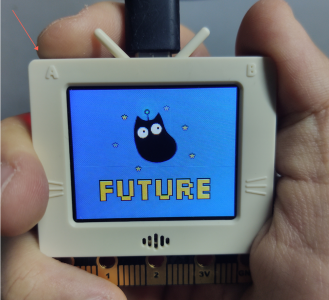
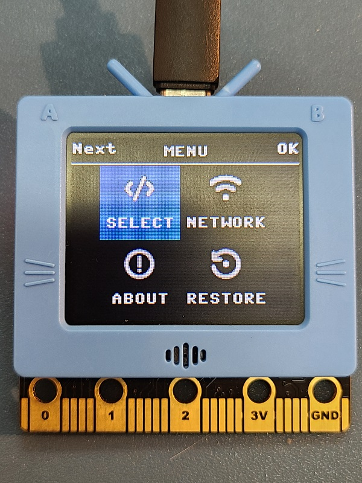
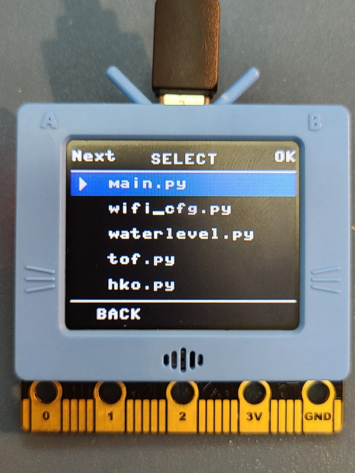
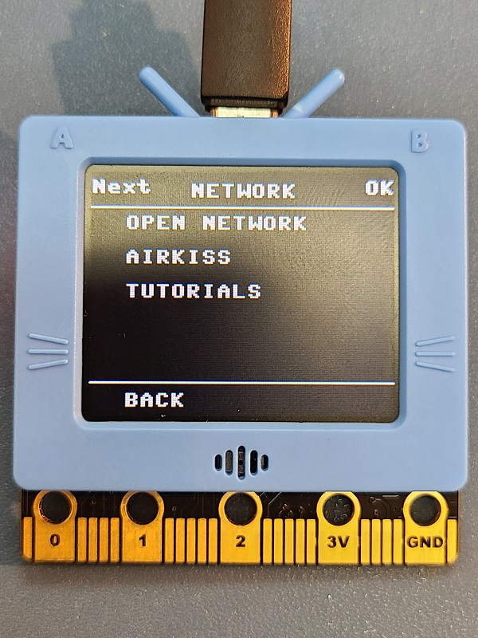
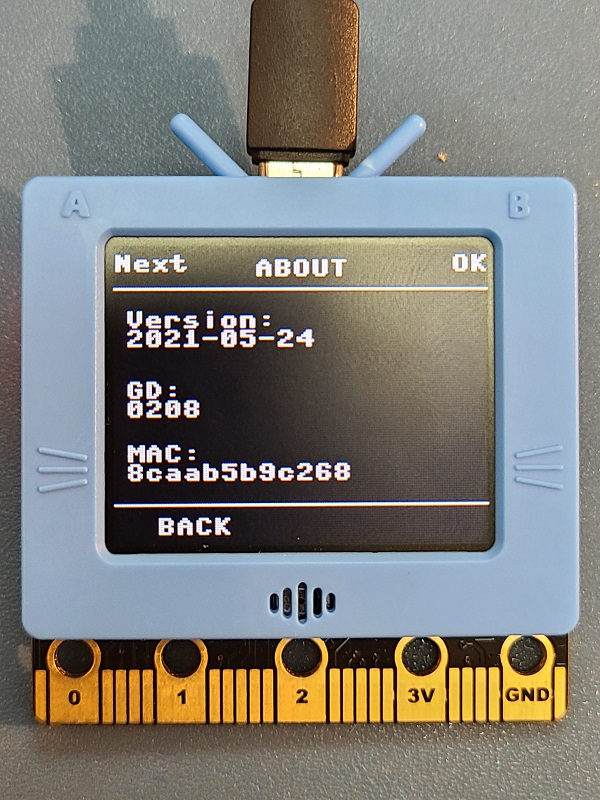
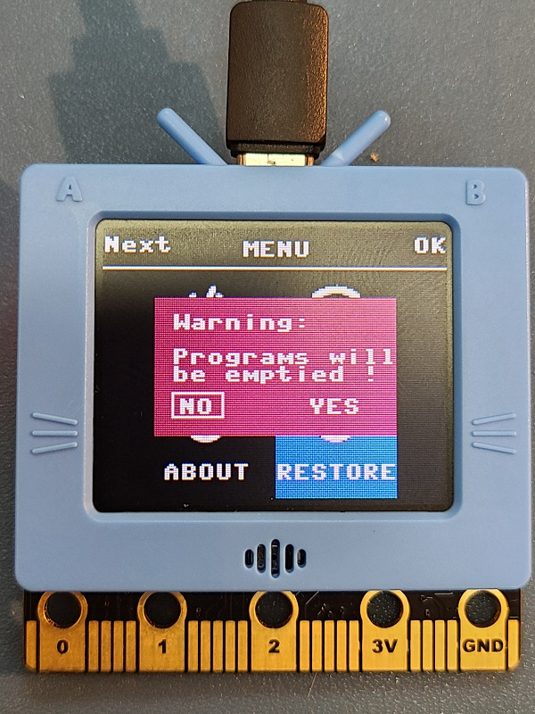

# FutureOS Operation Guide

FutureOS is the GUI developed for FutureBoard, its main function is to provide an interface to select which .py file to run.

FutureOS Functions:

- Storing and selecting .py files from the SD Card.
- 1-Click Airkiss
- Checking Firmware Version
- Factory Reset

## Entering FutureOS

By default, FutureBoard runs main.py if it is found.

FutureOS can be entered by pressing A during the opening animation.

## FutureOS Functions

Press A to go to the next option, press B to confirm.

### Select

Select and run the .py files from the SD Card.

### Network

Various Networking options are here.

### About

Check the firmware version and MAC Address here.

### Factory Reset

Factory Reset and clear all files on SD Card.

